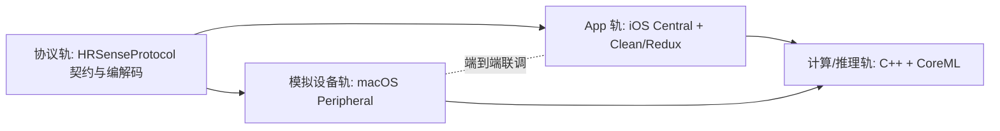

# 01 · 里程碑路线图（概念轨道）

> 本文是**高层路线（概念轨道视角）**。**可执行的落地计划（含每个 milestone 的验收标准）以 [`11-delivery-plan.md`](11-delivery-plan.md) 为准**——那是后续执行与验收的"标杆文档"。二者一致，本文侧重"怎么并行/依赖"，doc 11 侧重"做到什么算过"。

采用**双轨并行**推进：**协议轨（共享）**先行冻结契约，随后 **模拟设备轨（macOS）** 与 **App 轨（iOS）** 并行开发，在若干**联调节点**收敛。

> 范围更新：结合目标 JD，除 HR 外新增 **实时波形(ECG/PPG)高吞吐、可观测性、后台 BLE、本地存储、睡眠结构** 等工作流（见 `09` 分析、`spec 0003/0004`、`docs/10`）。下方里程碑总览已并入。

## 0. 轨道与依赖关系

**核心原则**：协议契约（`HRSenseProtocol` + `03-ble-gatt-protocol.md`）是两端的唯一真相来源。任何一端要改协议，先改契约与文档，再改实现。

---

## 阶段 M0 · 基础设施与契约冻结（前置）

**目标**：把"约定"固化下来，让两端能独立开发。

- [ ] 建立仓库结构（`Packages/ HRSenseApp/ HRSenseSimulator/ Compute/`）。
- [ ] 冻结 v1 协议：GATT Profile（UUID 分配）+ 帧格式 + 命令表（见 `03`）。
- [ ] 创建 `HRSenseProtocol` Swift Package 的 **接口草案**（类型 / 编解码 API 签名，可先空实现）。
- [ ] 约定日志/抓包规范（便于联调对齐字节流）。

**产出**：可被双轨引用的协议契约与包骨架。

---

## 阶段 M1 · 协议编解码（共享包）

**目标**：`HRSenseProtocol` 能独立编解码，脱离蓝牙即可单测。

- [ ] 实现帧编解码：分帧 / 分片重组 / 序号 / CRC。
- [ ] 实现命令层：opcode + TLV payload 编解码、版本/能力协商报文。
- [ ] 实现应用数据模型：心率 / RR / 电量 / 传感器状态。
- [ ] 覆盖单元测试：正常帧、分片、乱序、CRC 错误、截断。

**产出**：经测试的协议库，供两端直接依赖。

---

## 阶段 M2 · macOS 模拟设备 MVP（模拟轨）

**目标**：模拟器能广播、被连接、并按协议推送心率。

- [ ] `CBPeripheralManager`：发布自定义 GATT 服务、广播。
- [ ] 接入 `HRSenseProtocol`：把生成的数据编码成帧并通过 notify 下发。
- [ ] 基础数据生成：可配置固定/正弦心率。
- [ ] 简易控制 UI（SwiftUI）：启停广播、连接状态、当前心率。

**产出**：一个能"当作真机用"的最小模拟外设。

---

## 阶段 M3 · App BLE 接入层（App 轨） · 🔗 联调节点 1

**目标**：iOS App 能连接模拟器、发现服务、订阅并正确解码数据。

- [ ] `CBCentralManager`：扫描 / 连接 / 发现服务与特征 / 订阅 notify。
- [ ] 接入 `HRSenseProtocol` 解码，得到心率数据流。
- [ ] 版本 / 能力协商握手跑通。
- [ ] **联调**：App ↔ 模拟器 端到端跑通实时心率。

**产出**：无硬件条件下的第一次端到端连通。

---

## 阶段 M4 · App 展示层 Clean + Redux（App 轨）

**目标**：把数据流接入 Redux，完成实时展示与状态管理。

- [ ] 定义 State / Action / Reducer / Middleware（BLE Effects）。
- [ ] Domain 层 UseCase + Data 层 Repository（封装 BLE 数据源）。
- [ ] Presentation：实时心率、连接状态、趋势图。
- [ ] 断连 / 重连 / 错误状态在 State 中的表达与 UI 呈现。

**产出**：具备完整展示与稳健状态机的 App 主流程。

---

## 阶段 M5 · 计算层 + CoreML 推理（计算/推理轨）

**目标**：在实时数据上做指标计算与端上推理。

- [ ] 接入 C++ 计算库（HRV / 滤波 / 特征提取），桥接到 Swift（详见 spec）。
- [ ] 特征 → CoreML 模型 → 推理结果，接入 Redux（作为 Effect）。
- [ ] 推理结果展示与状态管理。
- [ ] 模型 / 计算的性能与功耗初步评估。

**产出**：从原始心率到推理结论的完整链路。

---

## 阶段 M6 · 健壮性与故障注入（双轨）

**目标**：验证异常路径，提升鲁棒性。

- [ ] 模拟器故障注入：丢包、延迟、乱序、突然断连、电量骤降、非法帧。
- [ ] App 侧：分片重组边界、重连退避、订阅恢复、状态一致性。
- [ ] 场景回放：用录制/合成数据集回归。
- [ ] 端到端自动化测试（模拟器脚本化驱动）。

**产出**：可重复验证的稳健端到端系统。

---

## 阶段 M7 · 真实硬件迁移（后置）

**目标**：拿到硬件后，最小改动切换到真机。

- [ ] 用真机比对协议实现，处理差异（MTU、时序、广播字段等）。
- [ ] 通过版本 / 能力协商吸收差异，App 上层尽量无感。
- [ ] 保留模拟器作为 CI / 回归 / 离线开发工具。

**产出**：模拟器 → 真机的平滑切换。

---

## 关键路径与并行建议

- **关键路径**：M0 → M1 →（M2 与 M3 并行）→ M4 → M5。
- **可并行**：协议冻结后，模拟器（M2）与 App 接入（M3 前期骨架）可同时起步。
- **风险前移**：分片/重组、重连、版本协商建议在 M2/M3 就打通最小闭环，避免堆到 M6。

## 里程碑总览

> 下表为**概念总览**；执行编号与验收标准以 [`11-delivery-plan.md`](11-delivery-plan.md) 为准（两者节点一一对应）。

| 里程碑 | 轨道 | 交付核心 | 依赖 |
| --- | --- | --- | --- |
| M0 | 共享 | 协议契约冻结 + 仓库骨架 | — |
| M1 | 共享 | `HRSenseProtocol` 编解码 + 单测（日志基线起步）| M0 |
| M2 | 模拟 | macOS Peripheral MVP（HR）| M1 |
| M3 | App | iOS BLE 接入 + 重连（联调1，HR）| M1, M2 |
| M4 | App | Clean + Redux 展示 | M3 |
| M5 | 双轨 | **实时波形(ECG/PPG)高吞吐**（BLE 深度优化，spec 0003）| M3 |
| M6 | 双轨 | **OTA/DFU 升级全流程**（JD 核心，[07](07-ota-dfu.md)）| M3 |
| M7 | App | **可观测性**：日志/崩溃/监控（[docs/10](10-observability.md)）| M4 |
| M8 | 计算/推理 | C++ 计算 + CoreML（HR/HRV/压力）| M4 |
| M9 | App | **本地存储 + 可视化 + 睡眠结构**（spec 0004 / 0002）| M5, M8 |
| M10 | App | **后台 BLE + 状态恢复**（`04` §5A）| M4 |
| M11 | 双轨 | 健壮性总验收：故障注入 + 端到端自动化 | M5–M10 |
| M12 | 后置 | 真机迁移 | 硬件到位 |
