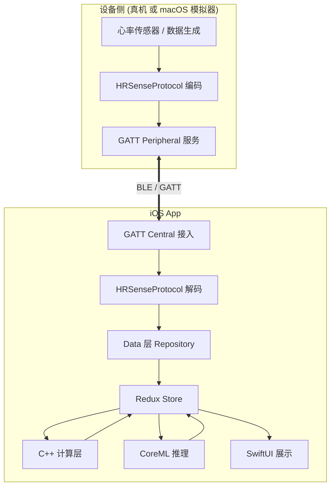
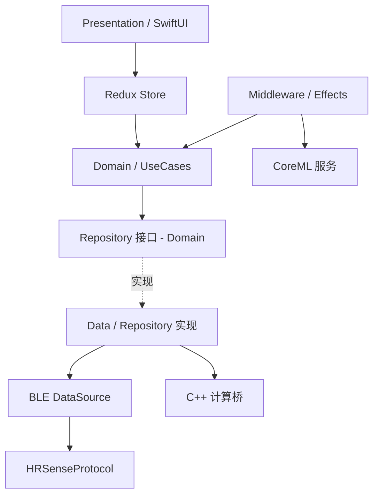
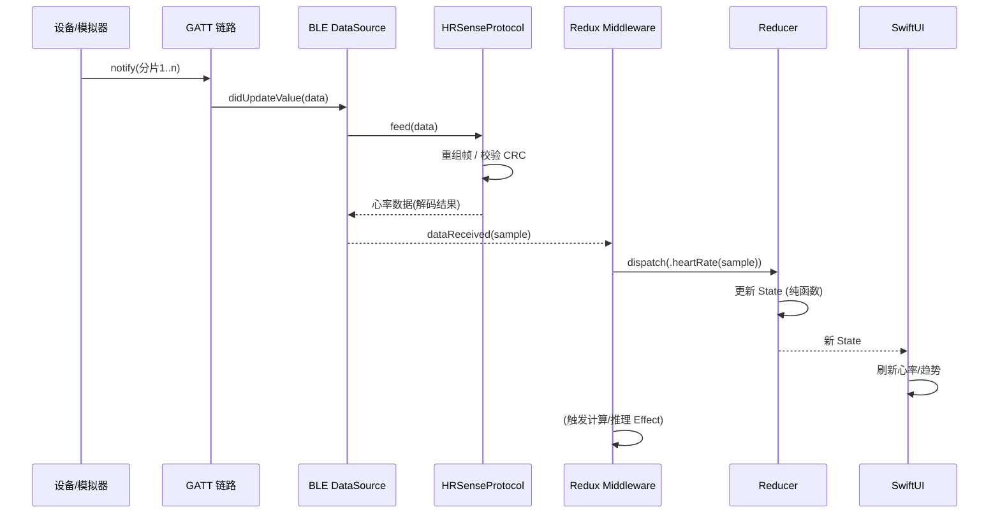

# 02 · 整体架构

## 1. 系统上下文

两端通过 **BLE GATT** 通信，之上跑**同一套** `HRSenseProtocol`（共享 Swift Package）。这是本架构最重要的对称性：**设备侧编码用什么，App 侧就用同一份解码**。

## 2. 组件划分

| 组件 | 归属 | 职责 |
| --- | --- | --- |
| `HRSenseProtocol` | 共享 Package | 帧编解码、分片重组、命令/数据模型、版本协商 |
| GATT Central | App | 扫描、连接、服务发现、订阅、写入 |
| GATT Peripheral | 模拟器/真机 | 广播、发布服务、notify 下发、接收写入 |
| Data 层 | App | 把 BLE 事件流封装为领域数据源，Repository 抽象 |
| Domain 层 | App | 实体 + UseCase（业务规则，纯净、可测） |
| Redux Store | App | 单一状态树 + 单向数据流 + 副作用编排 |
| C++ 计算层 | App | HRV / 滤波 / 特征提取等重计算 |
| CoreML | App | 端上推理 |
| Presentation | App | SwiftUI 视图，消费 State，派发 Action |
| 场景引擎 | 模拟器 | 数据生成 / 回放 / 故障注入 |

## 3. 分层与依赖方向

**依赖倒置**：Domain 定义 Repository 接口，Data 层实现之。上层（Presentation/Domain）不依赖 BLE / CoreBluetooth 等具体技术，便于用模拟器/假数据替换与测试。

## 4. 端到端数据流（实时心率）

## 5. 关键横切关注点

- **线程模型**：CoreBluetooth 回调在指定队列；协议解码可在后台队列；Redux dispatch 到 State 更新需明确主线程消费给 UI。约定"BLE/解码在后台，Store reduce 串行，UI 在主线程"。
- **背压与节流**：高频 notify 时对 UI 更新做节流/降采样，避免主线程压力（原始数据仍进计算管线）。
- **错误与连接状态**：连接、断连、重连、协议错误统一建模进 State（见 `04`）。
- **可测试性**：协议、Domain、Reducer 均为纯逻辑，可脱离蓝牙单测；模拟器提供集成测试环境。
- **可观测性**：分层日志（BLE 字节流 / 帧 / 命令 / 状态迁移），联调时可对齐两端。

## 6. 技术选型（当前建议）

| 领域 | 选型 | 备注 |
| --- | --- | --- |
| BLE | CoreBluetooth | Central(iOS) + Peripheral(macOS) |
| 协议库 | Swift Package | 纯 Swift，无平台耦合，双端共享 |
| App 架构 | Clean + 自建 Redux | 也可评估 TCA，但先自建轻量 Redux（见 `04`） |
| UI | SwiftUI | App 与模拟器 UI 均可用 |
| 计算 | C++ | 通过桥接（spec 定方案） |
| 推理 | CoreML | 端上，Effect 触发 |
| 依赖管理 | SwiftPM | 统一用 SPM 管理本地包 |

> 后续每个组件的细化设计进入各自文档或 `docs/specs/`。
