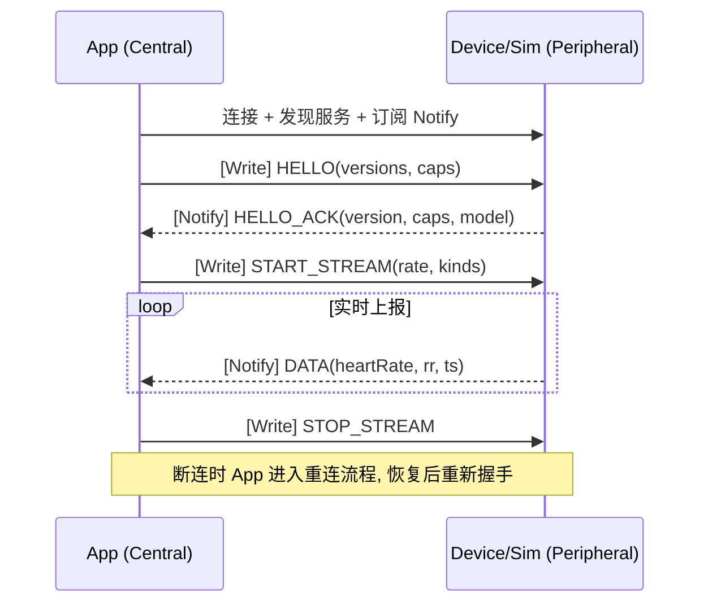
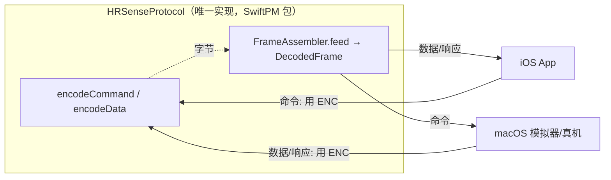

# 03 · 自定义协议栈与 GATT Profile（v1 冻结）

> 本文档是 App 与设备/模拟器之间的**契约**。任何改动应先改此文档与 `HRSenseProtocol` 包，再改两端实现。
> 以下 UUID、字段、opcode 均已**冻结**。以下定义即为 v1 实现契约。

## 1. 为什么要"自定义协议栈"

标准 BLE Heart Rate Service（`0x180D`）只能表达固定的心率格式，无法承载：私有命令、版本/能力协商、可靠传输（重传/去重）、大于 MTU 的数据分片、多类型传感器数据的统一封装等。

因此在 GATT 之上自建一套分层协议：**GATT 只作"管道"**，真正的语义由上层协议定义。

## 2. 协议分层模型

```
┌─────────────────────────────────────────────┐
│ L4 应用数据层  心率 / RR / 电量 / 传感器状态   │  ← 业务数据模型 (TLV)
├─────────────────────────────────────────────┤
│ L3 会话/命令层 opcode + req/resp + 版本协商    │  ← 命令语义
├─────────────────────────────────────────────┤
│ L2 分帧/可靠传输 分片重组 / seq / ACK / CRC    │  ← 可靠性 & MTU 适配
├─────────────────────────────────────────────┤
│ L1 GATT 传输层  自定义 Service / Characteristic│  ← 管道 (write/notify)
├─────────────────────────────────────────────┤
│ L0 链路/物理层  BLE (CoreBluetooth 提供)       │  ← 系统负责
└─────────────────────────────────────────────┘
```

`HRSenseProtocol` 包实现 **L2–L4**（纯编解码，无蓝牙依赖）；App/模拟器各自实现 **L1**（把 L2 的字节写入/读出 GATT 特征）。

## 3. L1 · GATT Profile

### 3.1 Service 与 Characteristic（UUID · v1 已定）

统一使用 128-bit 自定义 UUID，采用同一 **Base**、仅改第 2 个 16-bit 分组（`Short ID`）区分（Nordic 风格），便于识别与扩展。

- **Base**：`48525330-XXXX-4B8E-9F2A-1D3C5E7B9A10`（`XXXX` 为 Short ID）

| 名称 | 类型 | 属性 | Short ID | 完整 UUID |
| --- | --- | --- | --- | --- |
| **HRSense Service** | Service | — | `0001` | `48525330-0001-4B8E-9F2A-1D3C5E7B9A10` |
| **Data / Notify** | Characteristic | Notify | `0002` | `48525330-0002-4B8E-9F2A-1D3C5E7B9A10` |
| **Control / Write** | Characteristic | Write / WriteWithoutResponse | `0003` | `48525330-0003-4B8E-9F2A-1D3C5E7B9A10` |
| **Info** | Characteristic | Read | `0004` | `48525330-0004-4B8E-9F2A-1D3C5E7B9A10` |
| **OTA Data** | Characteristic | Write Without Response | `0005` | `48525330-0005-4B8E-9F2A-1D3C5E7B9A10`（固件镜像块，见 [07](07-ota-dfu.md)）|

> 分片方向：设备→App 走 Notify 特征；App→设备走 Write 特征。两个方向各自独立做分帧/重组。
> 说明：以上 UUID 为随机分配的私有标识（非蓝牙 SIG 标准），v1 冻结使用；如需重排可整体替换 Base，但两端必须同步。

### 3.2 广播（Advertising）

- 广播包含 HRSense Service UUID + Local Name。
- ⚠️ macOS 模拟器注意：`CBPeripheralManager` 广播字段受限（主要支持 Local Name 与 Service UUIDs），厂商自定义广播数据支持有限——因此**不要把关键信息塞进广播**，一律走连接后的 GATT 读取（Info 特征）。

### 3.3 MTU

- 连接后协商 ATT MTU（iOS 通常可到 ~185+，取决于对端）。
- 协议层**不假设** MTU 大小，一律按 L2 分片；有效负载按 `min(协商MTU, 配置上限) - 头部` 切片。

## 4. L2 · 分帧与可靠传输

### 4.1 分片（Fragment）格式

每个写入 GATT 的分片：

```
+--------+--------+------------------+
| Byte 0 | Byte 1 |   Payload ...    |
+--------+--------+------------------+
  FragHdr  seq      分片数据
```

`FragHdr`（1 字节）位定义（v1 冻结）：

| 位 | 名称 | 含义 |
| --- | --- | --- |
| bit7 | START | 是否为一帧的首个分片 |
| bit6 | END | 是否为一帧的末个分片（START=END=1 表示单分片帧）|
| bit5..0 | FRAG_IDX | 分片序号（帧内递增，用于检测丢片） |

`seq`（1 字节）：**帧序号**（0–255 循环），用于去重与 ACK 关联。

> 单分片帧：`START=1, END=1`，直接携带完整帧。多分片：首片 `START=1,END=0`，中间片均 0，末片 `END=1`。

### 4.2 帧（Frame）格式

分片重组后得到一个完整 **Frame**：

```
+--------+--------+---------- ... ----------+--------+--------+
| Ver    | Type   |        Frame Body       |   CRC16 (LE)    |
+--------+--------+---------- ... ----------+--------+--------+
  1 byte   1 byte          变长                    2 bytes
```

| 字段 | 说明 |
| --- | --- |
| `Ver` | 协议版本（v1 = `0x01`），用于兼容判断 |
| `Type` | 帧类型：`0x01` 命令(L3) / `0x02` 数据(L4) / `0x03` ACK / `0x04` 事件 |
| `Frame Body` | 由 Type 决定的载荷（见 L3/L4）|
| `CRC16` | 对 `Ver..Body` 的 CRC16，小端存放（见 4.2.1）|

#### 4.2.1 CRC16 算法（v1 已定）

采用 **CRC-16/CCITT-FALSE**，参数：

| 参数 | 值 |
| --- | --- |
| 多项式 Poly | `0x1021` |
| 初始值 Init | `0xFFFF` |
| 输入反转 RefIn | 否 |
| 输出反转 RefOut | 否 |
| 输出异或 XorOut | `0x0000` |
| 覆盖范围 | 帧的 `Ver` 起、至 `Frame Body` 末（不含 CRC 自身）|
| 存放字节序 | 小端（低字节在前）|

参考实现（伪码）：
```
crc = 0xFFFF
for b in bytes(Ver..Body):
    crc ^= (b << 8)
    repeat 8 times:
        crc = (crc << 1) ^ 0x1021 if (crc & 0x8000) else (crc << 1)
    crc &= 0xFFFF
# 校验样例(ASCII "123456789") 结果应为 0x29B1
```

### 4.3 可靠性策略

- **去重**：接收端记录最近 seq，重复 seq 丢弃。
- **ACK（可选，按通道需要）**：关键命令走"需响应写入"，或用 `Type=0x03 ACK` 帧回执 seq。心率数据流默认**不可靠**（notify 本身不保证），靠高频重发容忍偶发丢包；关键控制命令走可靠路径。
- **超时/重传**：仅命令通道启用；数据通道不重传（实时性优先）。
- **重组保护**：分片超时未收齐（缺片/乱序）→ 丢弃半成品帧并记日志。

> v1 建议：数据下行**尽量单分片**（心率样本很小），把分片/重传复杂度集中在少量大命令上。

## 5. L3 · 会话 / 命令层（`Type=0x01`）

### 5.1 命令帧 Body

```
+--------+--------+------------------+
| OpCode | Flags  |  TLV Params ...  |
+--------+--------+------------------+
```

- `OpCode`（1B）：命令码。
- `Flags`（1B）：bit7=req/resp（0=请求, 1=响应），bit6=需要ACK，bit5..0=保留（置0）。
- `TLV Params`：`Tag(1B) Len(1B) Value(Len)` 序列。

### 5.2 命令表（v1）

| OpCode | 名称 | 方向 | 说明 |
| --- | --- | --- | --- |
| `0x01` | HELLO / 版本协商 | App→Dev | 携带 App 支持的协议版本、能力位图 |
| `0x81` | HELLO_ACK | Dev→App | 返回设备协议版本、能力、型号/固件 |
| `0x02` | GET_INFO | App→Dev | 请求设备信息 |
| `0x82` | INFO | Dev→App | 型号 / 固件 / 电量 / 传感器列表 |
| `0x03` | START_STREAM | App→Dev | 开始上报（可带采样率、数据类型集）|
| `0x04` | STOP_STREAM | App→Dev | 停止上报 |
| `0x05` | SET_CONFIG | App→Dev | 配置项（采样率、上报间隔等）|
| `0x0F` | ERROR | Dev→App | 错误码 + 描述 |
| `0x20–0x2F` | OTA 请求 | App→Dev | 固件升级命令段（见 [07](07-ota-dfu.md)）|
| `0xA0–0xAF` | OTA 响应 | Dev→App | 固件升级响应段（见 [07](07-ota-dfu.md)）|

> OpCode 分段约定：`0x00–0x0F` 通用控制，`0x80–0x8F` 通用响应，`0x20–0x2F`/`0xA0–0xAF` OTA，其余保留。

### 5.3 版本 / 能力协商（关键）

连接建立后握手：
```
App → Dev: HELLO { protoVersions:[1], capabilities: bitmap }
Dev → App: HELLO_ACK { protoVersion:1, capabilities, model, fw }
```
- 双方取**协议版本交集**中的最高版本。
- `capabilities` 位图声明可选能力（如 RR 间期、体动、多传感器）。
- **迁移意义**：真机与模拟器只需在 `HELLO_ACK` 里如实声明，App 上层按能力自适应，从而把差异收敛在协议层。

#### 5.3.1 capabilities 位图（v1 已定）

**4 字节（u32）、小端**。设备在 `HELLO_ACK` 中声明自身支持项；App 在 `HELLO` 中声明自身可消费项，双方按交集工作。

| Bit | 名称 | 含义 |
| --- | --- | --- |
| 0 | `HEART_RATE` | 基础心率（bpm），**必备，恒为 1** |
| 1 | `RR_INTERVALS` | RR 间期（HRV 输入）|
| 2 | `BATTERY` | 电量上报 |
| 3 | `SENSOR_CONTACT` | 佩戴/接触状态 |
| 4 | `MOTION` | 体动/加速度 |
| 5 | `CONFIGURABLE_RATE` | 支持 `SET_CONFIG` 调采样率 |
| 6 | `RELIABLE_DATA` | 数据通道支持序列确认（可靠上行）|
| 7 | `DEVICE_EVENTS` | 主动事件帧（`Type=0x04`）|
| 8 | `BATCH_SAMPLES` | 批量样本上报 |
| 9 | `OTA_DFU` | 支持固件升级（见 [07](07-ota-dfu.md)）|
| 10 | `WAVEFORM` | 支持高频波形流（ECG/PPG，见 [spec 0003](specs/0003-waveform-high-throughput.spec.md)）|
| 11–31 | 保留 | 置 0，向前兼容（未知位忽略）|

> 示例：支持心率+RR+电量+接触+可调采样率 → `0b0010_1111` = `0x0000002F`。

## 6. L4 · 应用数据层（`Type=0x02`）

### 6.1 数据帧 Body（TLV）

```
+----------+----------------------+
| DataKind | TLV Records ...      |
+----------+----------------------+
```

- `DataKind`（1B）：数据大类。取值：`0x01` 心率/RR 样本、`0x02` **波形块**（高吞吐，见 [spec 0003](specs/0003-waveform-high-throughput.spec.md)）、`0x03` 设备状态、`0x04` 批量样本。
- TLV Records：字段以 `Tag/Len/Value` 表达，向前兼容（未知 Tag 跳过）。

### 6.2 字段字典（v1）

| Tag | 字段 | 类型 | 单位 / 说明 |
| --- | --- | --- | --- |
| `0x01` | timestamp | u32 | 设备时基毫秒 / 或相对偏移 |
| `0x02` | heartRate | u8/u16 | bpm |
| `0x03` | rrIntervals | u16[] | 每个 RR 间期，单位 ms |
| `0x04` | battery | u8 | 电量百分比 |
| `0x05` | sensorStatus | u8 | 佩戴/接触/信号质量位图 |
| `0x06` | sampleSeq | u32 | 样本序号（丢样检测）|
| `0x10–0x15` | 波形字段 | — | waveformType/sampleRate/blockSeq/startTs/sampleBits/samples（见 [spec 0003](specs/0003-waveform-high-throughput.spec.md) §3.1）|

### 6.3 波形高吞吐（`DataKind=0x02`，见 spec 0003）

- 波形（ECG/PPG，高频采样）以**批量采样块**承载：一帧 = 一个采样块（N 点），`blockSeq` 做连续性/丢块检测。
- 通道策略（与 §8 数据通道一致）：**Notify + best-effort + blockSeq 统计**；块负载按 **MTU 动态计算**、尽量塞满以摊薄帧头。
- 完整字段、吞吐优化、背压/降采样、可视化与度量指标见 **[spec 0003](specs/0003-waveform-high-throughput.spec.md)**。
- 需能力位：`capabilities` **bit10 `WAVEFORM`**（见 §5.3.1）。

### 6.4 L4 载荷编码：自定义 TLV vs Protobuf（可选）

> 说明本项目"自定义协议栈"与业界常用 **Protobuf** 的关系（JD 点名 Protobuf）。二者不冲突：**分层可组合**。

- **L2 分帧/可靠传输层保持不变**（分片、seq、CRC——见 §4）；变化的只是 **L4 应用数据的负载编码**。
- **v1 默认**：L4 用**自定义 TLV**（字节紧凑、无依赖、适合 MCU）。
- **可选 Protobuf 承载**：把 L4 的 `Frame Body` 定义为一段 **Protobuf 序列化字节**（`.proto` 与固件/算法共享 schema，生成 Swift/嵌入式代码）。
  - 适用：字段多、演进快、跨端团队协作，Protobuf 的**向前/后兼容**与代码生成优势明显。
  - 跨端含义：若未来需要与 **Android** 共用应用层消息模型，优先共享 `.proto` schema；iOS / Android / FW 共同遵守同一份字段契约，而 **BLE GATT + L2 分帧/可靠传输** 仍保持本协议定义。
  - 取舍：Protobuf 有一定体积/解析开销，MCU 侧需 nanopb 等轻量实现。
- **协商方式**：在 `HELLO`/`capabilities` 增一位 `PROTOBUF_PAYLOAD` 声明支持；`Frame` 的 `Type` 可用一个取值区分"TLV 负载 / Protobuf 负载"，实现**两种编码共存**。
- **落点**：`.proto` schema 放 `proto/` 目录（见 `08`）；此为**可选实现**，v1 以 TLV 为准。

#### 6.2.1 时间戳基准（v1 已定）

- **由设备侧生成**，`timestamp` 为 **u32 毫秒**，表示相对 **`START_STREAM` 被接受那一刻（t0）** 的偏移（stream 起点 = 0）。
- **App 侧映射**：在收到 `START_STREAM` 的确认/首帧时记录本地墙钟 `localT0`，则样本真实时间 ≈ `localT0 + timestamp(ms)`。
- **回绕**：u32 毫秒约 49.7 天回绕；单次连接远不会触及。检测到 `timestamp` 回退即视为新计时段。
- **重连**：每次 `START_STREAM` 重置 t0，App 同步刷新 `localT0`。
- 选此方案的理由：无需设备 RTC / 双端时钟同步，实现最简、跨模拟器与真机一致。

## 7. 典型交互时序



## 8. 冻结状态与待办

### v1 冻结项
- [x] Service / Characteristic 的 128-bit UUID（见 3.1，含 OTA Data 0005）。
- [x] CRC16 算法：CRC-16/CCITT-FALSE（见 4.2.1）。
- [x] `capabilities` 位图定义（见 5.3.1，含 bit9 OTA_DFU）。
- [x] 时间戳基准：设备侧相对 `START_STREAM` 的 u32 毫秒偏移（见 6.2.1）。
- [x] **全局字节序**：所有多字节字段一律 **小端 (little-endian)**（含 CRC、能力位图、TLV 数值、OTA 偏移等）。
- [x] **数据通道可靠性**：采用**尽力而为 (best-effort)**——心率/RR 走 notify 不做逐样本 ACK；用 `sampleSeq`(6.2 Tag 0x06) 做**丢样检测/统计**。`RELIABLE_DATA` 能力位默认 **关闭**，预留给未来需要严格不丢样的场景。
- [x] **上行命令可靠性**：所有 App→设备命令使用 **Write With Response**（ATT 层确认）；语义层面，取数类命令回专用响应帧（如 `HELLO_ACK`/`INFO`），其余回 **ACK 帧**（`Type=0x03`，携带 `seq/opcode/status`）。命令超时 **2s**、重试 **最多 3 次**，仍失败则上报错误。

> 说明：以上为**模拟用途**下采用的常见做法，已固化以保证端到端流程可跑通。

### 真机校订（拿到真机后）
- [ ] 与真实硬件协议的字段/字节序/时序对齐（本 v1 已自洽，真机到位后按其规格校订，差异经能力协商吸收）。

## 9. `HRSenseProtocol` 共享包：一份编解码，两端共用

> 这就是"**同一套 protocol，一边编码、一边解码**"的所在——协议的编解码逻辑抽成**唯一的一个 Swift Package `HRSenseProtocol`**（实现本文 L2–L4），**App 与 macOS 模拟器都依赖它**。它是整套设计的对称支点。

### 9.1 为什么只有一份实现
如果 App 和模拟器各写各的编解码，很容易出现"设备编的字节 App 解不出"的**协议漂移**。把编解码收敛到一个包后：
- 设备侧 `encode` 产生的字节，App 侧 `decode` 一定能对上（因为是同一份代码、同一张字节表）。
- 改协议只改这一个包 + 本文档，两端自动同步。
- 编解码可**脱离蓝牙单独单元测试**（给字节 → 出模型 / 给模型 → 出字节）。

### 9.2 谁编码、谁解码（方向对称）
"一个编码一个解码"其实是**双向对称**的：每条链路，一端 `encode`、另一端 `decode`；而**两端各自都同时用到编码和解码**（因为通信是双向的）。

| 通道 | 发送端（encode） | 接收端（decode） |
| --- | --- | --- |
| 命令 App→设备（HELLO/START_STREAM/OTA…） | **App** `encodeCommand` | **模拟器/设备** `FrameAssembler.feed → .command` |
| 数据 设备→App（心率/RR…） | **模拟器/设备** `encodeData` | **App** `FrameAssembler.feed → .data` |
| 响应/ACK/事件 设备→App | **模拟器/设备** `encode(ack/event)` | **App** `FrameAssembler.feed → .ack/.event` |

- **App 侧**：编码命令(上行) + 解码数据/响应(下行)。
- **模拟器/设备侧**：解码命令(上行) + 编码数据/响应(下行)。
- 两侧调用的是**同一个包的同一批函数**，只是使用方向不同。



### 9.3 对外接口（v1 接口规划）

```swift
// 编码：业务模型 -> GATT 分片序列（按 MTU 分片；两端方向不同但同一实现）
func encodeCommand(_ cmd: Command, seq: UInt8, mtu: Int) -> [Data]
func encodeData(_ sample: DeviceSample, seq: UInt8, mtu: Int) -> [Data]

// 解码：喂入分片，重组后产出完整帧/业务模型
final class FrameAssembler {
    func feed(_ fragment: Data) -> [DecodedFrame]  // 可能一次产出 0..n 帧
}

enum DecodedFrame {
    case command(Command)     // 设备侧收到（App 发来的命令）
    case data(DeviceSample)   // App 侧收到（设备发来的数据）
    case ack(seq: UInt8)      // App 侧收到（命令回执）
    case event(DeviceEvent)   // App 侧收到（主动事件）
}
```

> 相关落点：README 核心决策 #2、`02-architecture.md` §1（对称性）与组件表、`05-simulator-macos.md`（模拟器接入同一包）。
> 注：以上为 v1 接口规划，用于说明分层边界；真正签名在实现阶段确定。
