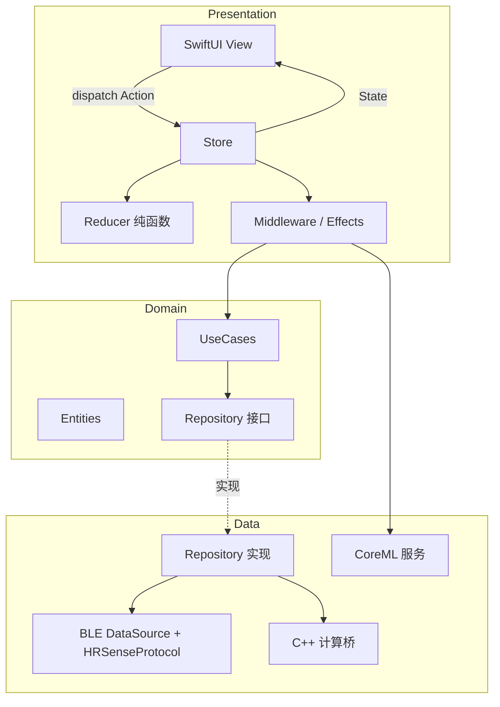
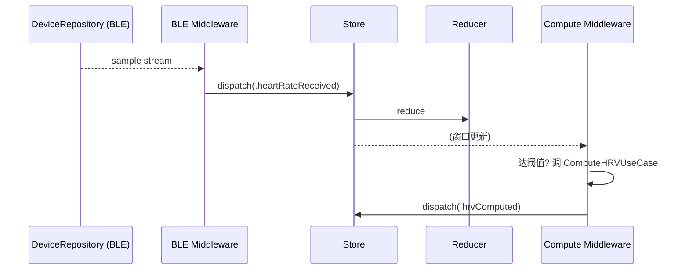
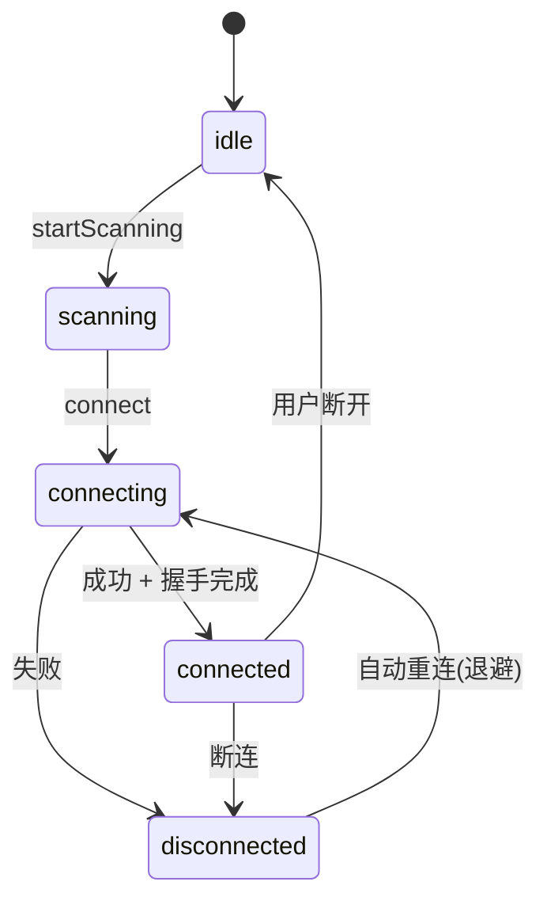

# 04 · App 侧：Clean Architecture + Redux

## 1. 总体思路

- **Clean Architecture** 负责**纵向分层**（Domain / Data / Presentation）与依赖倒置，保证业务规则独立于框架与设备。
- **Redux** 负责 **Presentation 内的状态管理**：单一状态树、单向数据流、纯函数 Reducer、副作用集中在 Middleware（Effects）。
- 两者结合点：**Middleware 调用 Domain 的 UseCase，UseCase 通过 Repository 接口访问 Data 层（BLE / 计算 / 推理）**。



## 2. 分层职责

### 2.1 Domain（最内层，纯 Swift，无框架依赖）
- **Entities**：`HeartRateSample`、`RRInterval`、`DeviceInfo`、`ConnectionState`、`HRVMetrics`、`InferenceResult` 等。
- **UseCases**：`StartMonitoringUseCase`、`ComputeHRVUseCase`、`RunInferenceUseCase`、`ConnectDeviceUseCase` 等。封装业务规则，可脱离蓝牙单测。
- **Repository 接口**：`DeviceRepository`（连接/订阅/命令）、`ComputeRepository`、`InferenceRepository`。

### 2.2 Data（实现细节）
- `DeviceRepositoryImpl`：桥接 CoreBluetooth + `HRSenseProtocol`，把 BLE 事件转为领域数据流（如 `AsyncStream<DeviceSample>`）。
- `BLECentralDataSource`：`CBCentralManager` 封装（扫描/连接/发现/订阅/写入）。
- `ComputeRepositoryImpl`：调用 C++ 计算桥。
- `InferenceRepositoryImpl`：封装 CoreML。

### 2.3 Presentation（Redux）
- `AppState` / `Action` / `Reducer` / `Middleware` / SwiftUI `View`。
- View 只读 State、只派发 Action，不含业务逻辑。

## 3. Redux 设计

### 3.1 State（草案）

```swift
struct AppState: Equatable {
    var connection: ConnectionState          // .idle/.scanning/.connecting/.connected/.disconnected(reason)
    var device: DeviceInfo?
    var live: LiveState                       // 当前心率、最近样本窗口
    var metrics: MetricsState                 // HRV 等计算结果
    var inference: InferenceState             // 最近推理结果 + 状态
    var ota: OTAState                         // 固件升级状态 (见 07)
    var error: AppError?
}

struct LiveState: Equatable {
    var currentHeartRate: Int?
    var recentSamples: [HeartRateSample]      // 有界窗口 (用于趋势图/计算)
    var lastUpdated: Date?
}
```

> State 必须是可 `Equatable` 的值类型，便于 SwiftUI diff 与快照测试。样本窗口保持**有界**（环形缓冲思路），防止无限增长。

### 3.2 Action（草案）

```swift
enum Action {
    // 生命周期 / 连接
    case startScanning
    case deviceDiscovered(DeviceInfo)
    case connect(DeviceID)
    case connectionStateChanged(ConnectionState)

    // 数据流 (来自 BLE Effect)
    case heartRateReceived(HeartRateSample)
    case deviceEvent(DeviceEvent)

    // 计算 / 推理 (来自 Effect)
    case hrvComputed(HRVMetrics)
    case inferenceCompleted(InferenceResult)

    // 错误
    case errorOccurred(AppError)
}
```

### 3.3 Reducer（纯函数）
- `(State, Action) -> State`，**不做 IO / 不产生副作用**。
- 例：`heartRateReceived` → 更新 `live.currentHeartRate`、追加到有界窗口、更新时间戳。
- 计算/推理的**触发**不在 Reducer，而在 Middleware。

### 3.4 Middleware / Effects（副作用集中地）
所有异步与 IO 都在这里，并调用 Domain UseCase：

- **BLE Middleware**：监听 `DeviceRepository` 的数据流，把样本转成 `heartRateReceived` 派发；处理 `connect/startScanning` 等命令 Action。
- **Compute Middleware**：当窗口积累到阈值，调用 `ComputeHRVUseCase`，产出 `hrvComputed`。
- **Inference Middleware**：特征就绪后调用 `RunInferenceUseCase`，产出 `inferenceCompleted`。
- **节流**：对高频 `heartRateReceived` 做 UI 侧节流（计算管线仍拿全量）。



## 4. 线程 / 并发模型

- CoreBluetooth 回调在专用队列 → `HRSenseProtocol` 解码可在后台。
- Store 的 reduce **串行**执行（Actor 或串行队列）保证状态一致。
- State → UI 在**主线程**消费（SwiftUI）。
- 建议用 `async/await` + `AsyncStream` 打通 Data 层到 Middleware 的数据流。

## 5. 连接状态机（在 State 中显式建模）



- 重连采用**指数退避**；重连成功后**重新握手 + 恢复订阅**。
- 断连原因（超时/主动/协议错误）进入 `ConnectionState`，供 UI 呈现。

## 5A. 后台 BLE 与状态恢复（对应 JD 后台任务）

> JD 明确要求"后台任务处理（特别是与 BLE 相关的）"。这是 CoreBluetooth 的难点，单列固化。

### 5A.1 后台运行
- **Background Mode**：App 外壳开启 `UIBackgroundModes: bluetooth-central`（见 `08` entitlements/Info.plist）。
- 后台可继续接收 **notify**、完成连接/断连事件；但**扫描受限**（后台扫描必须带 `withServices` 过滤、速率降低、不支持某些广播字段）。
- **省电**：后台降低 UI 更新与非必要计算；波形等高频场景在后台按需降级（见 spec 0003 背压）。

### 5A.2 状态保存与恢复（State Preservation & Restoration）
- `CBCentralManager(delegate:queue:options:)` 设置 **`CBCentralManagerOptionRestoreIdentifierKey`**；实现 **`willRestoreState`** 恢复已连接/正在连接的 peripheral 与订阅。
- 系统在蓝牙事件（如设备重新出现）时**唤醒 App**，据恢复的上下文继续（重连/重订阅/必要时重握手）。
- **重握手判定**：恢复后若无法确认会话有效（如 t0 失效），按 `03` 重新 `HELLO`/`START_STREAM`。

### 5A.3 与 Redux 的衔接
- 恢复流程由 `ConnectionMiddleware` 驱动：`willRestoreState` → 派发恢复类 Action → 重建连接子状态。
- 后台/前台切换作为 Action 进入 State，驱动节流与降级策略。

### 5A.4 已固化 & 待真机验证
- [x] 采用 `bluetooth-central` 后台模式 + `restoreIdentifier` + `willRestoreState`。
- [x] 后台降级：降低 UI/计算频率，波形按背压降级。
- [ ] 后台唤醒/耗电表现需**真机后台实测**（模拟器可构造"长静默+突发数据"场景配合验证）。

## 6. 架构选型（已定）：自建轻量 Redux · TGReduxKit

- **决策**：采用**自建轻量 Redux**，基于开源库 **TGReduxKit**（而非 TCA）。
- **库信息**：
  - 仓库：[`tangzzz-fan/TGReduxKit`](https://github.com/tangzzz-fan/TGReduxKit)
  - 许可证：**MIT**
  - 定位：专为 **SwiftUI（iOS 17+）** 设计的轻量、高性能 Redux 状态管理框架，基于 **Swift Observation** 框架实现响应式更新。
  - 集成：SwiftPM。
- **理由**：概念少、可控、依赖轻；与 SwiftUI + Observation 原生贴合；MIT 许可证对商用友好。
- **约束/注意**：
  - iOS 17+ 基线（依赖 Observation）；若需支持更低版本需重新评估。
  - 第三方库更新节奏/成熟度需持续关注，必要时可自行 fork 或替换（Redux 概念简单，迁移成本可控）。
  - 本文档中的 State/Action/Reducer/Middleware 设计与具体库 API 解耦，以便在库能力不足时平滑替换。
- **备选（未采用）**：The Composable Architecture (TCA)——功能更全但概念与依赖更重，当前不引入。此取舍记入后续 ADR。

## 7. 可测试性

| 层 | 测试方式 |
| --- | --- |
| `HRSenseProtocol` | 纯单测（字节流 in/out） |
| Reducer | 纯单测（给 State+Action 断言 State） |
| UseCase | 用假 Repository 单测 |
| Middleware/Effects | 用假 Repository + 断言派发的 Action 序列 |
| 端到端 | 连 macOS 模拟器做集成测试（见 `05`） |

> **错误路径怎么测**：App 侧**不设**运行时故障注入。链路/设备类错误由**模拟器故障注入**覆盖；App 内部/系统类错误用**协议单测（喂坏字节）+ 假 Repository/DataSource**覆盖。完整对照见 [`05-simulator-macos.md` §10 覆盖矩阵](05-simulator-macos.md)。

## 8. 已固化决策（HR 配套 App 推荐做法）

> 以下沿用"心率设备配套 App"的常见推荐做法固化，减少后续摇摆。

### 8.1 架构选型
- [x] 自建轻量 Redux · TGReduxKit（见第 6 节）。

### 8.2 Store / 并发模型
- [x] **单一全局 Store**（`@Observable`，由 TGReduxKit 驱动 SwiftUI 刷新）。
- [x] **Reduce 在 MainActor 串行执行**（状态供 UI 消费，保证一致与可预测）。
- [x] **副作用在 async Middleware**：BLE 回调/协议解码在后台队列，产出的 Action 通过 `await MainActor` 派发；重计算/推理在后台执行，仅结果回主线程。

### 8.3 有界样本窗口与降采样
- [x] **环形缓冲**，容量有界：
  - 心率(HR)：保留最近 **10 分钟**（约 600 点 @1Hz）用于趋势/展示。
  - RR 间期：保留最近 **5 分钟**（HRV 标准短时窗，见 spec 0002）。
- [x] **UI 更新节流**：趋势图刷新 **≤2Hz**；折线图**降采样到 ~120 点**。原始全量数据仍进计算/推理管线，不受节流影响。

### 8.4 Middleware 与 UseCase 边界
- [x] **每个关注点一个 Middleware**：`ConnectionMiddleware` / `BLEStreamMiddleware` / `ComputeMiddleware` / `InferenceMiddleware` / `OTAMiddleware`。
- [x] **职责边界**：Middleware 负责编排、线程调度、订阅生命周期、节流；**UseCase 封装单一业务规则**（纯净、可单测）；Middleware 调 UseCase，UseCase 经 Repository 接口访问 Data 层。Reducer 只做纯状态迁移。

### 8.5 错误模型 `AppError`（固化枚举）
```swift
enum AppError: Equatable {
    case bluetoothUnauthorized          // 未授权蓝牙
    case bluetoothPoweredOff            // 蓝牙关闭
    case deviceNotFound                 // 扫描不到设备
    case connectionTimeout              // 连接超时
    case connectionLost                 // 连接中断
    case handshakeFailed(reason: String)// 版本/能力协商失败
    case commandTimeout(opcode: UInt8)  // 命令 2s x3 后仍失败
    case protocolError(detail: String)  // 帧/CRC/非法字段
    case decodeError                    // 解码失败
    case computeFailed                  // C++ 计算异常
    case inferenceFailed                // 推理异常
    case modelLoadFailed                // 模型加载失败
    case otaFailed(phase: String)       // OTA 各阶段失败(见 07)
}
```
- [x] 错误统一进入 `AppState.error` 并驱动 UI 呈现；连接类错误联动重连状态机（第 5 节）。
