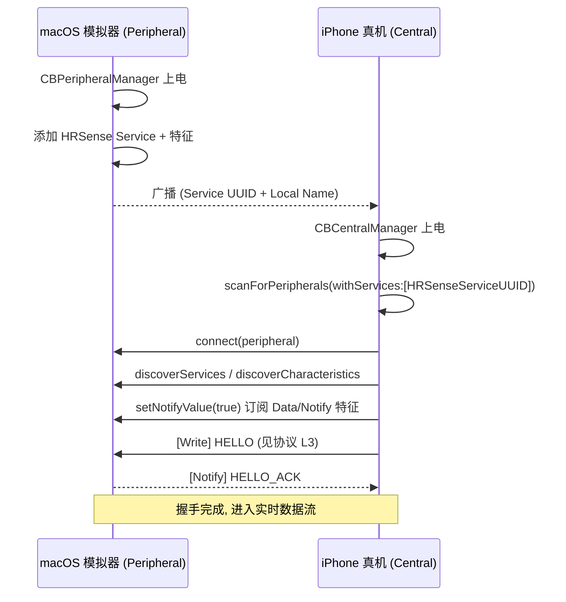
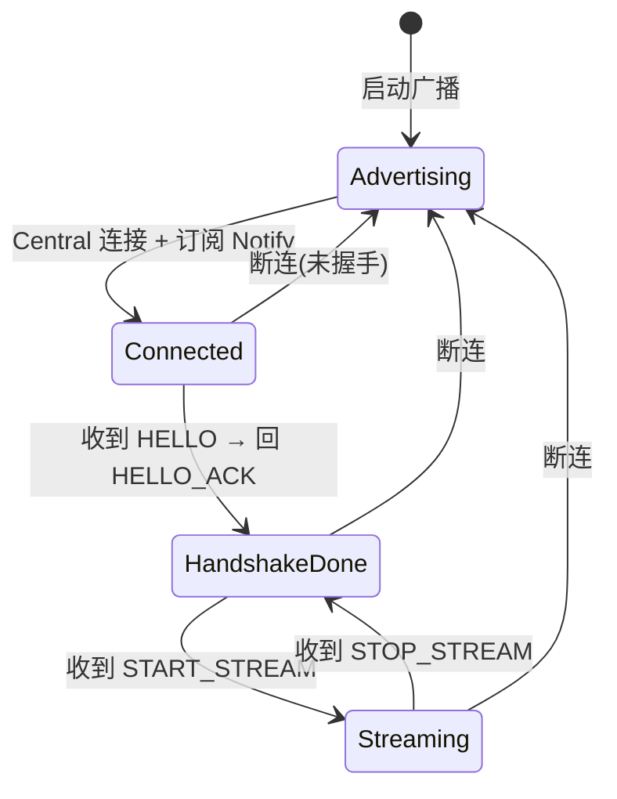
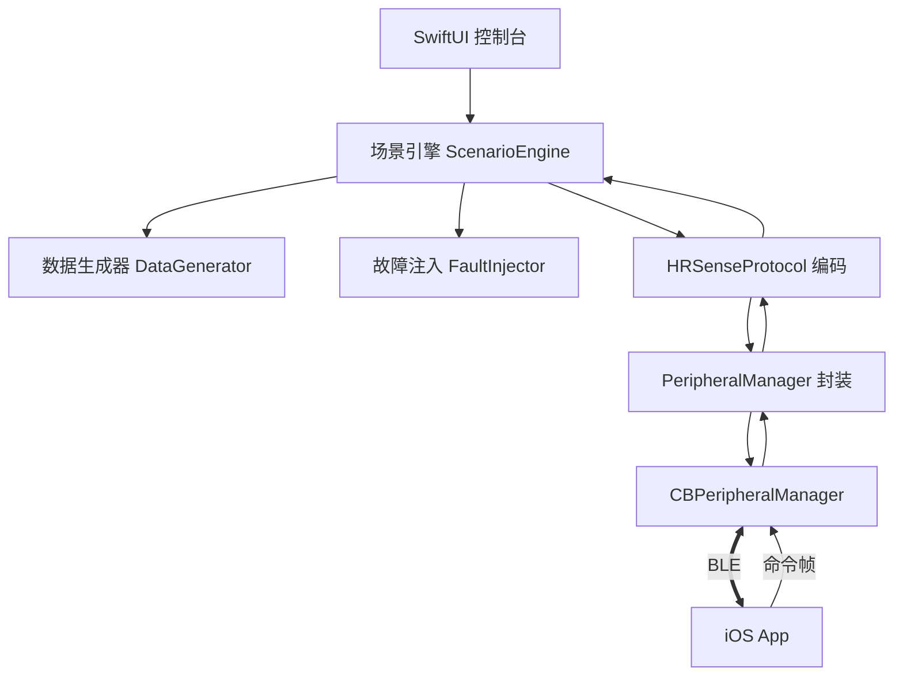

# 05 · macOS 模拟设备

## 1. 目标

在没有实体硬件的情况下，用一台 macOS 扮演 **BLE 外设（Peripheral）**，行为尽量贴近真实设备：广播、被 iOS App 连接、按 `HRSenseProtocol` 上报心率、响应命令，并能**注入各种异常**用于健壮性测试。

> 模拟器是长期资产：即便日后有了真机，它仍作为 **CI / 回归 / 离线开发** 工具保留。

## 2. 为什么用 macOS + CoreBluetooth

- macOS 的 `CBPeripheralManager` 可以发布**自定义 GATT 服务**并广播，是最接近真实外设的方案。
- 与 App 同在 Apple 生态，**共享 `HRSenseProtocol` 包**，两端编解码天然一致。
- 无需额外硬件（如专用 BLE dongle）即可形成端到端闭环。

### 约束与注意
- macOS 广播能力有限（Local Name + Service UUIDs 为主），**关键信息不要放广播**，走连接后 Info 特征读取（与 `03` 一致）。
- iOS 与 macOS 需为**两台设备**（或一台 mac + 一台 iPhone/iPad）；同机的模拟器(iOS Simulator) **不支持真实蓝牙**，因此 iOS 端联调需真机。
- 需要蓝牙权限（macOS 的 Bluetooth 权限）。

## 2.1 iOS 如何与 macOS 模拟器连接（联调环境）

**核心事实**：BLE 通信走真实无线电，不经过 Wi-Fi/局域网/USB。因此需要两台开着蓝牙的物理设备：一台 Mac（外设）+ 一部 iPhone/iPad **真机**（中心）。**iOS 模拟器无法使用真实蓝牙**，所以 iOS 端必须用真机调试。

### 硬件/前置条件
- 一台 Mac（跑 `HRSenseSimulator`，扮演 Peripheral）。
- 一部 iPhone/iPad **真机**（跑 `HRSenseApp`，扮演 Central），通过 USB/无线连 Xcode 部署。
- 两端蓝牙均开启；彼此在 BLE 有效范围内（数米内）。
- **不需要在系统设置里配对**：BLE GATT 连接由 App 内的 CoreBluetooth 直接发起，普通数据无需系统级配对（除非将来对特征启用加密/绑定）。

### 权限配置
- **macOS（模拟器）**：`Info.plist` 加 `NSBluetoothAlwaysUsageDescription`；App Sandbox 若开启需勾选 Bluetooth 权限。首次运行系统会弹蓝牙授权。
- **iOS（App）**：`Info.plist` 加 `NSBluetoothAlwaysUsageDescription`；首次扫描时系统弹授权。

### 连接握手流程

对应两端职责：
- **macOS**：`CBPeripheralManager` → `add(service)` → `startAdvertising([CBAdvertisementDataServiceUUIDsKey: [服务UUID], CBAdvertisementDataLocalNameKey: "HRSense-Sim"])`；在 `didReceiveWrite`/订阅回调里驱动数据下发。
- **iOS**：`CBCentralManager(scanForPeripherals:withServices:[服务UUID])`（按 Service UUID 过滤，避免扫到无关设备）→ `connect` → 发现服务/特征 → 订阅 Notify → 走协议握手。

### 常见排障
- 扫不到设备：确认 Mac 已 `startAdvertising`、iOS 扫描的 Service UUID 与 3.1 一致、双方蓝牙已授权且开启。
- 连上但没数据：确认已 `setNotifyValue(true)`，且模拟器在收到订阅/`START_STREAM` 后才推送。
- 前后台：iOS 后台运行 BLE 需相应 Background Modes（如后续需要后台采集再评估）。
- 调试利器：可先用 **LightBlue / nRF Connect** 之类通用 BLE 工具连接 macOS 模拟器，验证广播与 GATT 表，再切到自研 App。

## 2.2 模拟能力覆盖与握手可测性（答疑）

### 结论先行
- **当前设计已覆盖完整的模拟设备功能**：设备状态、设备命令、流数据三者都在设计范围内。
- **macOS 外设机制完全可以测试 handshake（握手）及任意请求/响应类交互**——这是本设计的关键点，下面解释原因。

### 为什么握手可测（关键澄清）
一个常见误解是"外设(Peripheral)只能广播 + 单向推流，无法做交互握手"。实际上 **GATT 是双向的**：

| 方向 | GATT 机制 | CoreBluetooth API（macOS 外设侧） |
| --- | --- | --- |
| App → 设备（命令/HELLO） | 对 **Control/Write** 特征 `write` | `peripheralManager(_:didReceiveWrite:)` 收到请求 |
| 设备 → App（响应/HELLO_ACK/数据） | 对 **Data/Notify** 特征 `notify` | `updateValue(_:for:onSubscribedCentrals:)` 主动下发 |

因此握手 `HELLO → HELLO_ACK`、命令 `START_STREAM → (数据流)`、`GET_INFO → INFO`、错误 `→ ERROR` 等**请求/响应语义都能在 macOS 外设上完整实现与测试**，与真机行为一致。模拟器只是把"收到 write → 按协议解码 → 组织响应帧 → notify 回去"这套逻辑跑在 Mac 上。

### 三类能力如何落地

| 能力 | 由谁承担 | 说明 |
| --- | --- | --- |
| **设备状态** | ScenarioEngine 内部状态 + `HELLO_ACK`/`INFO`/`battery`/`sensorStatus` | 维护"未连接/已连接/已握手/流传输中"等状态，并可通过 INFO/事件对外暴露 |
| **设备命令** | `didReceiveWrite` → `HRSenseProtocol` 解码 → 命令处理（见第 7 节） | 支持 HELLO/GET_INFO/START/STOP/SET_CONFIG，未知命令回 ERROR |
| **流数据** | DataGenerator → 编码 → notify 下发 | 收到 START_STREAM 后按采样率推送心率/RR 等 |

### 设备侧状态机（模拟器内部）

### 这套机制下"测不了/需注意"的边界（都不影响握手）
- 需要**两台物理设备**（Mac + iOS 真机），iOS 模拟器无真实蓝牙。
- **广播负载受限**（Local Name + Service UUID），关键信息走连接后 Info 特征，不走广播。
- **MTU / 时序**与真实硬件可能有差异，最终以真机校订（协议层已用能力协商吸收差异）。
- iOS **后台 BLE** 行为需专门验证（前台联调不受影响）。

> 一句话：外设机制不但能测握手，反而是**验证握手/命令/响应最合适**的方式——因为模拟器就是"另一端协议实现"，与真机对称。

## 2.3 从 HR 到 ECG/PPG：模拟器需要的改动（JD 对齐）

JD 的重点是**实时波形(ECG/PPG)高吞吐**，而非仅 HR bpm。这意味着模拟器要从"心率发生器"升级为"**波形优先的信号源**"。需要的改动：

| 改动点 | 说明 | 落点 |
| --- | --- | --- |
| **波形成为一等能力** | 声明 `capabilities` **bit10 `WAVEFORM`**；`waveform` 从"附加模式"提升为主数据模式 | `03` §5.3.1 / §6.3 |
| **波形发生器** | 合成 ECG(PQRST) / PPG(脉搏波)，采样率/幅度/噪声可配 | §4 数据模式 + §9.6 |
| **HR/RR 派生** | 从合成波形**派生**心率/RR（更贴近真机"波形为源、指标为算"的链路），或波形+HR 同发；由 `START_STREAM` 的数据类型集选择 | 本节 + §7 |
| **高吞吐下发** | `DataKind=0x02` 批量采样块、MTU 动态填满、连续 notify | spec 0003 |
| **命令扩展** | `START_STREAM/SET_CONFIG` 支持选择数据类型集(波形/HR/RR)、采样率、块大小 | §7 / `03` §5 |
| **吞吐/丢样面板** | 展示块速率、有效码率、丢块，用于量化 BLE 深度优化 | §9.6 |
| **波形故障注入** | 高频丢块/延迟/乱序/块内截断 | §9.6 |

> 结论：**需要修改**，但方向已在 `spec 0003` + §4/§9.6 覆盖。核心是"波形优先 + HR 由波形派生 + 高吞吐通道 + 可量化统计"。真机迁移时，模拟器的这套波形链路正好对齐真机"传波形、端上算指标"的形态。

## 3. 组件结构

| 组件 | 职责 |
| --- | --- |
| PeripheralManager 封装 | 发布 GATT 服务、广播、notify 下发、接收 write |
| ScenarioEngine | 驱动整体行为：产数据、执行命令、触发故障 |
| DataGenerator | 生成心率/RR 等样本（多模式） |
| FaultInjector | 丢包、延迟、乱序、断连、非法帧等 |
| HRSenseProtocol | 与 App 完全一致的编解码 |
| 控制台 UI | 可视化 + 手动干预 |

## 4. 数据生成器（DataGenerator）

支持多种模式，尽量覆盖真实分布与边界：

| 模式 | 说明 |
| --- | --- |
| 静息 (resting) | 低心率、低波动（60–75 bpm）|
| 运动 (exercise) | 心率随"强度曲线"上升/下降 |
| 合成 RR | 由心率反推带噪声的 RR 间期序列（供 HRV 测试）|
| 异常 (anomaly) | 骤升/骤降、丢拍、异常值（供推理/告警测试）|
| 录制回放 (replay) | 回放录制/CSV 数据集，保证可重复回归 |
| 手动 (manual) | UI 滑杆直接设定当前心率 |
| **波形 (waveform)** | 合成 **ECG(PQRST 模板+基线漂移+噪声) / PPG(脉搏波)**，高频采样，用于高吞吐验证（见 [spec 0003](specs/0003-waveform-high-throughput.spec.md)）|

- 采样率、上报间隔可配置，并**响应** App 的 `START_STREAM/SET_CONFIG` 命令。
- 时间戳按 `03` 约定（相对连接起点毫秒偏移优先）。

## 5. 故障注入（FaultInjector）

用于验证 App 的健壮性路径（对应 `01` 的 M6）：

| 故障 | 效果 | 验证点 |
| --- | --- | --- |
| 丢包 (drop) | 按概率丢弃 notify | App 容忍偶发丢样 |
| 延迟 (latency) | 随机延迟下发 | 节流/时序处理 |
| 乱序 (reorder) | 打乱分片/帧顺序 | seq 去重 / 重组保护 |
| 分片错误 | 缺片 / 超时未收齐 | 半成品帧丢弃逻辑 |
| CRC 错误 | 故意破坏 CRC | 校验失败处理 |
| 非法帧 | 未知 Type/OpCode/Tag | 向前兼容 / 容错 |
| 突然断连 | 主动断开连接 | 重连退避 + 重新握手 |
| 电量骤降 | battery 快速下降 | 低电量 UI / 逻辑 |

- 故障可**手动触发**（UI 按钮）或**脚本化**（用于自动化端到端测试）。

## 6. 控制台 UI（SwiftUI）

- 广播开关 / 连接状态 / 已连接的 Central。
- 当前数据模式选择 + 参数（心率、采样率）。
- 手动心率滑杆。
- 故障注入面板（各故障开关/概率/触发按钮）。
- 实时日志：字节流 / 帧 / 命令（与 App 侧对齐便于联调）。

## 7. 命令处理（对应协议 L3）

模拟器需正确响应 `03` 中定义的命令：
- `HELLO` → 回 `HELLO_ACK`（声明协议版本、能力位图、型号/固件）。
- `GET_INFO` → 回 `INFO`。
- `START_STREAM / STOP_STREAM` → 启停数据推送。
- `SET_CONFIG` → 调整采样/上报参数。
- 未知 OpCode → 回 `ERROR`（用于测试 App 的错误路径）。

> **能力声明**是迁移真机的关键抓手：模拟器如实声明支持的数据类型，App 上层据此自适应。真机上线时只需保证 `HELLO_ACK` 的语义一致。

## 8. 与真机的一致性策略

- **共享协议包**：编解码零差异。
- **能力协商**：把差异表达为能力位图，而非硬编码分支。
- **录制真机数据**：拿到硬件后录制真实数据流，导入模拟器 replay，用于回归 App 行为。
- **契约测试**：对 `HRSenseProtocol` 做黄金样例（golden bytes）测试，模拟器与（未来）真机都必须通过。

## 9. 已固化决策

### 9.1 数据集与录制/回放格式
- [x] **CSV**（人类可读、易编辑、Create ML 友好）为主，配 **JSON manifest**（描述采样率/时长/标签）。
- [x] 列定义：`timestamp_ms, hr_bpm, rr_ms(;分隔列表), battery, sensor_status`。
- [x] 录制功能输出同格式 CSV，可直接回灌 `replay` 模式（闭环回归）。

### 9.2 场景脚本与自动化接口
- [x] **场景脚本(JSON)**：时间线描述"何时切数据模式 / 触发故障 / 断连 / 电量变化"，由 ScenarioEngine 加载执行。
- [x] **本地控制接口**：暴露一个**本机 loopback 控制端点（HTTP/CLI）**，供 CI/脚本运行时动态触发故障与切场景（仅监听 127.0.0.1）。

### 9.3 Headless 模式
- [x] **支持 headless**：通过启动参数加载场景脚本、无 UI 运行，便于接入 CI 做端到端回归。

### 9.4 多传感器生成模型
- [x] v1 聚焦 **HR + RR + battery + sensorContact**。
- [x] **MOTION（体动/加速度）默认关闭**（能力位不声明），提供可开启的**桩生成器**占位；后续需要时再补建模。

### 9.5 OTA 模拟
- [x] 模拟器实现 [07](07-ota-dfu.md) 的设备侧 OTA 状态机：接收镜像块、窗口 CRC、整包校验、模拟重启换版本，并支持 OTA 相关故障注入。

### 9.6 波形高吞吐模拟（见 spec 0003）
- [x] **波形发生器**：合成 ECG/PPG，采样率/幅度/噪声可配，按 `DataKind=0x02` 批量块 notify 下发。
- [x] **吞吐/丢样面板**：显示发送块速率、有效码率(bytes/s)、丢块数。
- [x] **波形故障注入**：高频丢块、突发延迟、块乱序、块内截断（验证 App 重组/丢块统计/UI 稳定）。

## 10. 全链路错误覆盖矩阵 & App 侧是否需要故障注入

### 10.1 结论
- **App 侧不需要单独的运行时"故障注入"子系统**。在生产代码里塞故障注入会增加复杂度与风险。
- **链路 / 设备类错误**由**模拟器故障注入**统一覆盖（单一来源、贴近真机，是最合适的地方）。
- **App 内部 / iOS 系统类错误**不该由模拟器注入，而是用**测试接缝**覆盖：协议单元测试（直接喂坏字节）、假 Repository/DataSource（注入内部失败）、以及少量**系统手动开关**（蓝牙权限/开关、后台）。

### 10.2 覆盖矩阵（常见全链路错误 → 谁来覆盖）

| 错误类别 | 来源 | 覆盖方式 | 已覆盖? |
| --- | --- | --- | --- |
| 丢包 / 延迟 / 乱序 | 链路(设备→App) | 模拟器故障注入(§5) | ✅ |
| CRC 错误 / 非法帧 / 分片缺失 | 链路 | 模拟器 §5 **＋** 协议单测直接喂坏字节 | ✅✅ |
| 突然断连 / 重启不回来 | 链路/设备 | 模拟器 §5 | ✅ |
| 电量骤降 / OTA 各类失败 | 设备 | 模拟器 §5 + 07 | ✅ |
| 命令超时（设备不回 ACK） | 设备 | 模拟器"withhold response" | ✅ |
| 版本/能力协商失败 | 设备 | 模拟器返回不兼容版本/能力 | ✅ |
| 蓝牙未授权 / 已关闭 | **iOS 系统** | 系统手动切换 + App 状态处理；单测用 fake 状态 | ⚠️ 模拟器无法注入 |
| App 进入后台 / 状态恢复 | **iOS 系统** | 真机手动 + Background Modes 验证 | ⚠️ 系统侧 |
| 解码异常 / 缓冲边界 | **App 内部** | 协议单测（喂截断/超长/乱序字节） | ✅ 单测 |
| 计算 / 推理 / 模型加载失败 | **App 内部** | 假 `ComputeRepository`/`InferenceService` 注入错误 | ✅ 单测 |
| Store 并发 / 线程竞态 | **App 内部** | 单元测试 + 压力测试 | ⚠️ 需专门测 |

### 10.3 说明
- 模拟器已覆盖**链路层与设备层**的常见错误（含 §5 故障注入 + OTA 故障）。带 ⚠️ 的三类**本就不属于模拟器职责**：它们要么是 iOS 系统状态（权限/蓝牙开关/后台），要么是 App 进程内部逻辑——用测试接缝而非"注入到链路"来验证更准确、更快、可自动化。
- **协议单测是 App 侧最强的"故障测试"**：`FrameAssembler.feed` 直接喂各种畸形字节，无需真实蓝牙即可穷举坏帧路径（见 `03` §9 / `04` §7）。
- 因此：把链路故障留在模拟器、把内部/系统故障交给单测与手动系统开关，**无需在 App 内再造一套故障注入**。
