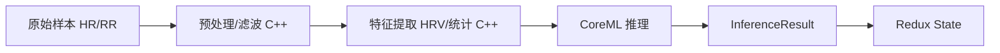
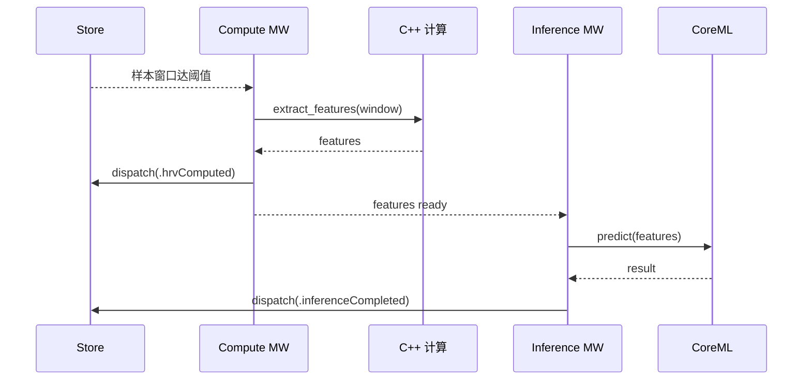

# 06 · CoreML 推理 与 C++ 计算层

> 本文档给出**规划与集成方式**，不含具体算法/模型设计。详细算法与 C++ 集成落在 `docs/specs/`（当前仅占位）。

## 1. 处理管线（Pipeline）

从原始心率数据到推理结论，整体是一条流水线：



- **预处理 + 特征提取** = **重计算**，下沉到 **C++**（性能 + 未来跨平台复用）。
- **推理** = **CoreML**（端上、离线、隐私友好）。
- 两者都是**副作用**，由 Redux Middleware 编排（见 `04`）。

## 2. C++ 计算层

### 2.1 职责
- 信号预处理（滤波、去噪、伪差剔除）。
- HRV 指标（时域 / 频域，如 SDNN、RMSSD、LF/HF 等——具体在 spec 定）。
- 特征向量构造（喂给 CoreML）。

### 2.2 为什么用 C++
- 计算密集、需精确控制性能与内存。
- 便于未来复用到其他平台 / 与硬件侧算法共享。

### 2.3 集成方式（已定：C ABI + 预留 Swift/C++ 直接互操作迁移路径）

**决策**：v1 采用 **C ABI 方案**——C++ 内部实现，**对外仅暴露一层纯 C 接口**（`extern "C"`），Swift 通过桥接头（bridging header / module map）调用；C++ 代码以 **SwiftPM target** 形式打包管理。

| 方案 | 说明 | 结论 |
| --- | --- | --- |
| **A. C ABI（v1 选用）** | C++ 暴露纯 C 接口，Swift 经桥接调用 | ✅ 最稳妥、边界清晰、可控 |
| B. Swift/C++ 互操作 | Swift 5.9+ 直接与 C++ 互操作 | 🔄 v1 不采用，但**架构已预留迁移路径**（见下方） |
| C. SwiftPM 打包 | 打包方式（与桥接机制正交）| ➕ 作为 A 的打包手段并用 |

#### 迁移路径：C ABI → Swift/C++ 直接互操作（最小成本）

**关键设计**：`ComputeBridge.swift` 是整个系统中**唯一**直接依赖 C ABI 的文件（~50 行）。C++ 内部实现（`hrv.cpp`/`dsp.cpp`）的接口语义（POD 值类型进出、caller 分配输出缓冲、int 状态码）与 Swift/C++ 互操作完全兼容。迁移只改 2 个文件，C++ 实现逻辑不碰一行：

| 改动的文件 | 变更 |
|---|---|
| `ComputeBridge.swift` | 从 `import HRSenseComputeCxx`（module map）改为 `import hrs_compute.h`（C++ header 直接 import，`-cxx-interoperability-mode=default`） |
| `hrs_compute.h` | 去掉 `extern "C"` 包裹，函数签名不变 |
| `module.modulemap` | 删除（不再需要） |
| `Package.swift` | target settings 加 `-cxx-interoperability-mode=default` |

**不受影响的文件**（全部通过 `ComputeRepository` 协议隔离）：
- `HRSenseCore/` — 所有 Entity、Repository 协议
- `HRSenseData/Repositories/ComputeRepositoryImpl.swift` — 调 `ComputeBridge`，公开 API 不变
- `HRSenseFeature/Middleware/ComputeMiddleware.swift` — 通过协议消费
- 所有单元测试 — `ComputeBridge` 公开 API 签名不变，黄金值测试自动复用
- `hrv.cpp`、`dsp.cpp` — C++ 实现不感知互操作方式

> **边界原则**：无论是 C ABI 还是 Swift/C++ 直接互操作，Swift 侧始终只看到"输入样本 → 输出指标/特征"的**窄接口**（POD/值类型进出，避免 C++ 类型跨界），不泄露 C++ 细节。这就是为什么迁移成本极低——两种方案共享同一个接口契约。具体接口签名、内存所有权、线程约定在 [`specs/0001`](specs/0001-cpp-compute-integration.spec.md) 定稿。

### 2.4 建议接口形态（示意）
```
// 概念接口（最终形态在 spec 决定）
compute_hrv(samples[], count) -> HRVMetrics
extract_features(window[]) -> FeatureVector
```

## 3. CoreML 推理

### 3.1 定位
- 端上推理：状态识别 / 异常检测 / 其他（模型任务在 spec 定）。
- 输入：C++ 产出的特征向量（或时间序列窗口）。
- 输出：`InferenceResult`（类别/分数/置信度）。

### 3.2 集成要点
- 模型以 `.mlmodel/.mlpackage` 形式打包，注意**版本管理**（模型版本随 App 演进）。
- 推理在后台执行，结果通过 `inferenceCompleted` Action 进入 State。
- 关注**性能与功耗**：推理频率、批量窗口、必要时降频。
- 特征口径必须与训练一致（训练/推理特征提取共用同一 C++ 实现，避免 train/serve skew）。

### 3.3 模型生命周期（规划）
- 训练/导出流程独立于 App（另立文档/仓库）。
- App 侧只消费导出的模型 + 约定的特征契约。
- 预留模型热更新/多版本共存的可能（后续评估）。

### 3.4 现成开源预训练模型可用性（调研结论）

**结论：没有"官方即插即用"的心率/HRV 推理 CoreML 模型；但社区有可直接用或可转换的资源。** 对本项目而言，最务实的路线是"**先用占位/自训小模型打通管线，再逐步替换**"。

> 该推荐路线已细化为独立 spec：[`specs/0002-coreml-inference-pipeline.spec.md`](specs/0002-coreml-inference-pipeline.spec.md)（含分阶段路线、14 维特征契约、CoreML I/O schema、转换与合规、验收标准）。

#### (a) Apple 官方 Core ML 模型库
- 官方 [Core ML Models](https://developer.apple.com/machine-learning/models/) 与 Hugging Face 的 Apple Core ML Gallery 主要是**视觉/语言**模型（FastViT、MobileNetV2、Resnet50、YOLOv3、Depth Anything、Segment Anything、OpenELM 等），**没有**心率/HRV 生理信号模型。
- **Create ML 的 Activity Classifier**：不是预训练模型，但提供"喂 CSV/传感器数据 → 一键训练导出 `.mlmodel`"的低成本自训通道（基于 Core Motion 加速度等）。适合我们**自训**。

#### (b) 社区可用资源（需自行核对许可与质量）

| 资源 | 任务 | 格式 | 说明 |
| --- | --- | --- | --- |
| [Synheart HRV emotion models](https://huggingface.co/Synheart/synheart-emotion-binary-classification-onnx-models) | HRV → 情绪/压力(Baseline vs Stress) 二分类 | ONNX | 输入 **14 个 HRV 特征**（RMSSD/SDNN/pNN50/LF/HF/…），WESAD 数据集训练；可用 `coremltools` 转 CoreML。**许可需核对** |
| [PhysioTwin / Capstone-Behavorial](https://github.com/Ctt011/Capstone-Behavorial) | 活动分类(体力 vs 认知) | **已含 `.mlmodel`** + ONNX | 随机森林，特征 HR_mean/HR_std/ACC_mean/ACC_std；含 StandardScaler 参数；可参考其"活动过滤"思路。**许可需核对** |
| 研究模型 (PhysioNet/WESAD 等) | 压力/情绪/睡眠等 | PyTorch/ONNX | 一般需 `coremltools` 转换；数据集/权重许可需逐一核对 |

#### (c) 推荐做法
1. **管线优先**：用一个**占位模型**（Create ML 快速训练的小随机森林/简单分类器，或对 Synheart ONNX 转 CoreML）先把 `特征 → CoreML → 结果 → Redux` 全链路打通。
2. **特征对齐**：Synheart 的 **14 特征 HRV 集**是很好的参考，可直接作为我们 **C++ 特征提取的输出契约** 与 **CoreML 输入 schema**（保证 train/serve 一致）。
3. **合规**：任何外部权重/数据集务必登记到 `THIRD_PARTY_LICENSES.md`，核对是否允许商用与是否需署名（BSD/MIT/Apache 宽松；CC-BY-NC 等有限制）。
4. **转换工具**：统一用 `coremltools`（BSD-3-Clause）做 ONNX/PyTorch → CoreML 转换。
5. **算法原型移植**：算法工程师的 Python/MATLAB 原型 → 对齐 I/O 口径 → 计算类移植 C++（spec 0001）、模型类转 CoreML → **黄金值对拍**回归。详见 [spec 0001 §9](specs/0001-cpp-compute-integration.spec.md)。

## 4. 与 Redux 的衔接



- Reducer 只负责把 `hrvComputed` / `inferenceCompleted` 结果写入 State，保持纯函数。
- 计算/推理的触发时机、窗口大小、频率由 Middleware 控制。

### 3.5 推理任务集（v1 + 扩展）

| 任务 | 优先级 | 输入 | 说明 |
| --- | --- | --- | --- |
| 压力/状态二分类 | v1 | 14 维 HRV(5min 窗) | 主任务（spec 0002）|
| **睡眠结构分析** | P2(加分) | 长时窗 HRV+趋势+体动 | 复用同管线，产出 hypnogram（spec 0002 §3.8）|
| 异常/告警(可选) | 后续 | 心率/波形特征 | 视需要扩展 |

## 5. 开源协议 / 许可证（License 核查）

针对"CoreML 部分是否涉及开源协议"的核查结论：

| 组件 | 性质 | 许可证 | 说明 / 影响 |
| --- | --- | --- | --- |
| **Core ML 运行时框架** | Apple 私有框架 | 无独立开源许可，随 Apple SDK 提供 | 受 Apple 开发者协议约束，App 直接链接系统框架即可，**无第三方开源义务** |
| **coremltools**（模型转换工具） | 开源（Apple 维护） | **BSD-3-Clause** | 仅用于**离线训练/转换**（Python 侧），不随 App 分发；BSD 宽松，无 copyleft 传染 |
| **Create ML** | Apple 工具 | 随 Xcode 提供 | 训练/生成 `.mlmodel`，无额外开源义务 |
| **模型来源（如 PyTorch/TF 转换）** | 视原模型而定 | **取决于原始模型/数据集许可** | ⚠️ 若模型基于第三方开源权重或数据集，需核对其许可（如 Apache-2.0/MIT/CC 等）并遵守署名/使用限制 |

**要点**：
- 用 Core ML 框架本身**不引入开源协议义务**；`coremltools` 是 BSD-3-Clause，宽松且仅在构建期使用。
- **真正的许可风险在"模型的来源"**：若使用外部预训练权重或公开数据集训练，务必核对并记录其许可与商用限制。自研数据 + 自训模型则无此顾虑。
- 建议在仓库维护一份 `THIRD_PARTY_LICENSES` / 模型来源清单，登记每个模型的出处与许可。

## 6. 决策落点（均已进入 spec 并固化）
- [x] C++ 集成方案：**C ABI**（见 2.3）；接口/内存/线程细节 → spec 0001 §7（已固化）。
- [x] CoreML 落地路线 / 14 维特征契约 / I-O schema → spec 0002（已固化）。
- [x] 首选推理任务：**压力二分类**；窗口 **5min/步长 30s**；标准化打进模型 → spec 0002 §7。
- [x] 模型分发：**Git LFS**；外部模型许可须登记 → spec 0002 §7。
- [ ] （实现层）HRV 各指标的具体数值实现 → 归入 spec 0001（属实现任务，非待决策；采用标准定义 RMSSD/SDNN/pNN50/LF/HF 等）。
