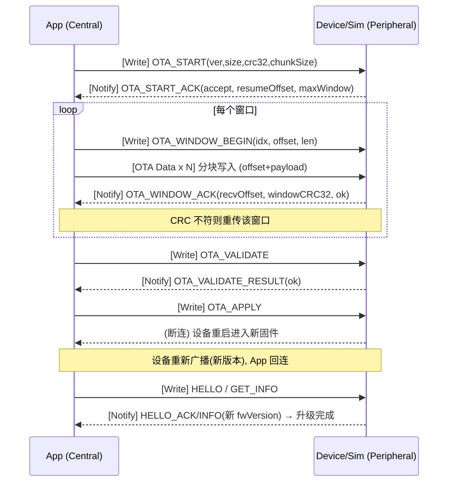
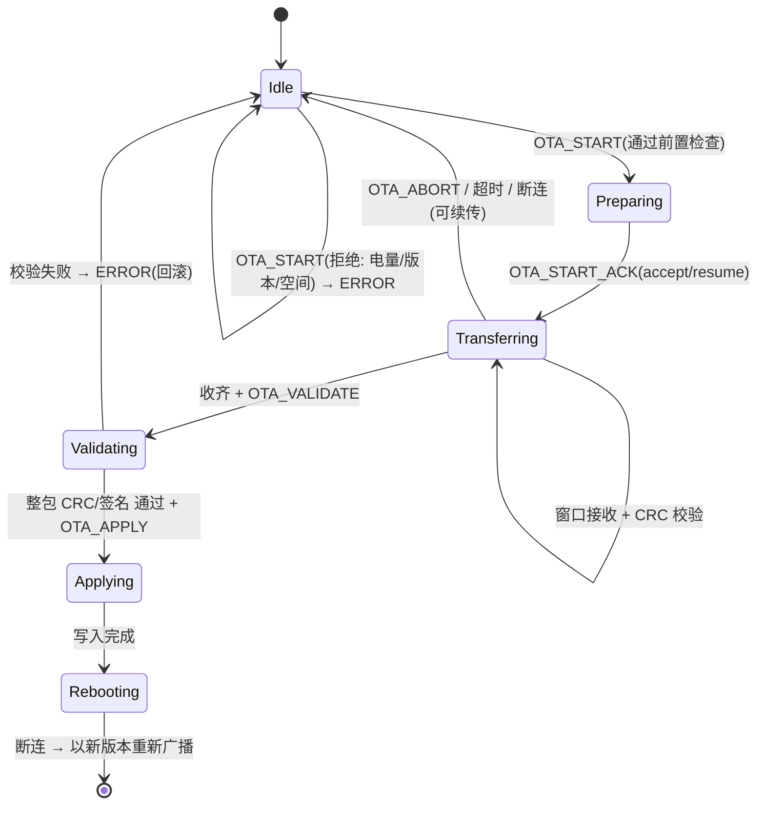

#  07 · OTA / DFU 固件升级设计

> 目标：为设备固件的**空中升级（OTA, Over-The-Air）/ 设备固件更新（DFU, Device Firmware Update）** 定义一套贴近业界常见做法（参考 Nordic Secure DFU 的对象化传输思路）的协议与流程。当前**仅用于模拟**（macOS 模拟器实现设备侧行为），确保端到端流程可被验证。
>
> 复用 `03` 的自定义协议栈：控制走命令层（L3），镜像数据走专用高吞吐通道。

## 1. 设计要点（业界常见做法）

- **分离控制与数据**：控制/进度用命令+notify，镜像块用**专用 Write-Without-Response 特征**以获得吞吐。
- **对象/分块传输 + 分段校验**：镜像切成固定大小 chunk，按**窗口(window)**批量发送，每窗口回 CRC/进度，边传边校验。
- **元数据先行（Init Packet）**：先发固件版本、大小、整包 CRC32、（可选）哈希/签名，设备据此决定是否接收。
- **断点续传**：中断后可从 `resumeOffset` 继续，避免整包重传。
- **整包校验 + 激活 + 重启 + 回连**：全部收齐后校验整包 → 应用 → 重启 → 重新广播（携带新版本）→ App 回连并通过 `INFO/HELLO_ACK` 确认新版本。
- **安全前置条件**：电量阈值、禁止降级（除非显式允许）、前台进行。
- **失败回滚**：设备侧保留旧固件，升级未成功则回滚（模拟器模拟该语义）。

## 2. GATT 与协议扩展（对 `03` 的增量）


| 项    | 定义                                                                                                                 |
| ---- | ------------------------------------------------------------------------------------------------------------------ |
| 能力位  | `capabilities` bit9 `OTA_DFU`（见 `03` §5.3.1）                                                                       |
| 新增特征 | **OTA Data**，Short ID `0005`，UUID `48525330-0005-4B8E-9F2A-1D3C5E7B9A10`，属性 **Write Without Response**（App→设备，镜像块） |
| 控制通道 | 复用 **Control/Write(0003)** 下发 OTA 命令；**Data/Notify(0002)** 回进度/结果                                                  |
| 命令码段 | OTA 占用 `0x20–0x2F`（请求）/ `0xA0–0xAF`（响应），见下表                                                                        |


### 2.1 OTA 命令表（L3，`Type=0x01`）


| OpCode | 名称                  | 方向      | Payload(TLV)                                                                      |
| ------ | ------------------- | ------- | --------------------------------------------------------------------------------- |
| `0x20` | OTA_START           | App→Dev | fwVersion, imageSize(u32), imageCRC32(u32), chunkSize(u16), hash/sig              |
| `0xA0` | OTA_START_ACK       | Dev→App | status(accept/reject/resume), resumeOffset(u32), maxChunkSize(u16), maxWindow(u8) |
| `0x21` | OTA_WINDOW_BEGIN    | App→Dev | windowIndex(u32), offset(u32), length(u32)                                        |
| `0xA1` | OTA_WINDOW_ACK      | Dev→App | recvOffset(u32), windowCRC32(u32), status                                         |
| `0x23` | OTA_VALIDATE        | App→Dev | — （全部块传完后请求整包校验）                                                                  |
| `0xA3` | OTA_VALIDATE_RESULT | Dev→App | status(ok/crcFail/sigFail)                                                        |
| `0x24` | OTA_APPLY           | App→Dev | — （校验通过后请求激活并重启）                                                                  |
| `0x25` | OTA_ABORT           | App↔Dev | reason                                                                            |
| `0x0F` | ERROR               | Dev→App | otaErrorCode（电量不足/版本非法/空间不足/超时…）                                                  |


> 镜像块本体通过 **OTA Data(0005)** 特征传输，块格式：`offset(u32, LE) + payload(chunkSize)`；控制层只负责窗口开始/确认与整体流程。

## 3. 传输时序




## 4. 设备侧 OTA 状态机（模拟器实现）




## 5. 安全与前置条件（固化）

- **电量阈值**：`battery >= 30%` 方可 `OTA_START`，否则回 `ERROR(电量不足)`。
- **禁止降级**：`fwVersion <= 当前版本` 默认拒绝（除非 `allowDowngrade` 标志）。
- **完整性**：整包 **CRC32** 必校验；预留 **SHA-256 + 签名** 字段（模拟器 v1 可用空实现/固定值占位）。
- **原子性/回滚**：设备保留旧镜像，未 `APPLY` 成功不切换；模拟器以状态机模拟"失败即回滚旧版本"。
- **续传**：`OTA_START` 携带同一 `imageCRC32` 时，设备返回 `resumeOffset` 支持断点续传。
- **前台约束**：OTA 期间需保持前台连接（后台策略后续评估）。

## 6. 模拟器（macOS）行为

- 接收镜像块 → 写入内存缓冲（不落真实固件）→ 按 `chunkSize`/窗口回 `OTA_WINDOW_ACK` + CRC。
- 整包校验通过后模拟"重启"：**主动断连 → 延时 → 以更新后的 `fwVersion` 重新广播**。
- **进度可视化**：控制台显示接收字节/进度百分比/当前状态。
- **故障注入**（配合 `05`）：
  - 传输中途断连（验证 App 续传）。
  - 某窗口 CRC 故意出错（验证重传）。
  - `OTA_START` 拒绝（电量不足/版本非法/空间不足）。
  - 校验失败（验证回滚 + App 报错）。
  - 重启后不回来（验证 App 超时与恢复）。

## 7. App 侧集成（Clean + Redux）

- **Domain**：`OTAUpdateUseCase`（编排 START→窗口传输→VALIDATE→APPLY→回连确认）。
- **Data**：`DeviceRepository` 增加 OTA 相关能力（写 OTA Data 特征、收 OTA notify）。
- **Redux**：新增 `OTAState`（阶段、进度、错误）；OTA 全流程副作用在 **OTA Middleware** 中，Reducer 只写进度/状态。
- **UI**：升级入口、固件版本对比、进度条、失败重试/续传、完成提示。
- **状态建模**：

```swift
enum OTAPhase: Equatable {
    case idle
    case preparing
    case transferring(progress: Double)   // 0.0 ... 1.0
    case validating
    case applying
    case rebootingAndReconnecting
    case completed(newVersion: String)
    case failed(OTAError)
}
```

## 8. 里程碑落点

- 归入 `01-roadmap.md` 的 **M6（健壮性/故障注入）之后**，作为独立 OTA 小里程碑；依赖协议(M1)与连接/命令闭环(M3)。
- 真机迁移(M7)时，仅需让真机 bootloader/DFU 语义对齐本协议的 START/WINDOW/VALIDATE/APPLY 流程（差异走能力位声明）。

## 9. 状态：本设计已固化（仅模拟用途）

- [x] OTA GATT 特征 / 能力位 / 命令码段。
- [x] 对象化窗口传输 + 分段/整包 CRC。
- [x] 断点续传、禁止降级、电量阈值、回滚语义。
- [x] 设备状态机 + App 侧状态建模。
- [ ] （真机阶段）签名/安全启动的正式方案（v1 模拟以占位）。