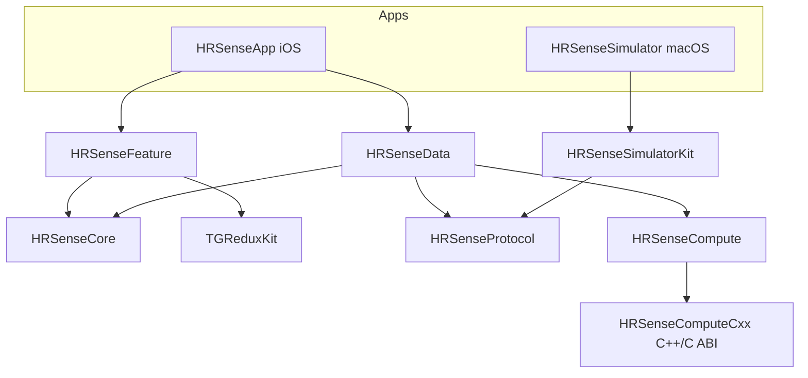

# 08 · 项目结构与文件组织（骨架规划）

> 目的：给出 **SwiftPM 优先** 的仓库文件组织形式——`Package.swift` + 各 SPM 包 + 两个 App 外壳。**本文仅为结构规划**，代码尚未落地；示例 `Package.swift` / 头文件为**建议片段**，实现时以此为蓝本。

## 1. 原则

- **逻辑全部进 SPM 包**（可独立编译、可脱离蓝牙单测）；两个可执行 App 只做"外壳/组装(composition root)"。
- **依赖单向、由内向外**：`Protocol` / `Core(Domain)` 无外部依赖；`Data` 依赖它们；App 外壳依赖 `Feature`/`Data`；`Core` 不反向依赖任何具体实现（依赖倒置）。
- **两端共享协议**：`HRSenseProtocol` 一份实现，App 与模拟器都依赖（见 `03` §9）。
- **C++ 走 C ABI**：C++ 目标只对外暴露纯 C 头（见 `spec 0001`）。

## 2. 顶层目录总览

```text
HRSense/
├── Package.swift                 # 核心库：一个包多产品(多 target)
├── Sources/                      # 各 SPM 库 target 源码
│   ├── HRSenseProtocol/          #   协议编解码(L2–L4)，两端共享，无依赖
│   ├── HRSenseCore/              #   Domain：Entities / UseCase 协议 / Repository 协议
│   ├── HRSenseComputeCxx/        #   C++ 实现 + 纯 C 接口头(extern "C")
│   ├── HRSenseCompute/           #   Swift 封装(import C 模块)，对上层给值类型接口
│   ├── HRSenseData/              #   Data：BLE 数据源 + Repository 实现 + CoreMLService
│   ├── HRSenseFeature/           #   Presentation：Redux(State/Action/Reducer/MW) + SwiftUI(iOS)
│   └── HRSenseSimulatorKit/      #   模拟设备逻辑：Peripheral / 场景引擎 / 数据生成 / 故障注入
├── Tests/                        # 与各 target 对应的单元测试
│   ├── HRSenseProtocolTests/
│   ├── HRSenseComputeTests/
│   ├── HRSenseDataTests/
│   ├── HRSenseFeatureTests/
│   └── HRSenseSimulatorKitTests/
├── Apps/                         # 两个可执行程序的 Xcode 外壳(薄)
│   ├── HRSenseApp/               #   iOS App(Central)：入口 + 权限 + 组装
│   │   ├── HRSenseApp.xcodeproj
│   │   └── HRSenseApp/
│   │       ├── HRSenseAppApp.swift      # @main，构建 Store + 注入依赖
│   │       ├── AppComposition.swift     # composition root：把 Data 装进 Feature
│   │       ├── Info.plist               # NSBluetoothAlwaysUsageDescription 等
│   │       ├── HRSenseApp.entitlements
│   │       └── Assets.xcassets/
│   └── HRSenseSimulator/         #   macOS 模拟设备(Peripheral)：入口 + 权限 + 组装
│       ├── HRSenseSimulator.xcodeproj
│       └── HRSenseSimulator/
│           ├── SimulatorApp.swift
│           ├── Info.plist               # NSBluetoothAlwaysUsageDescription
│           ├── HRSenseSimulator.entitlements  # App Sandbox + Bluetooth
│           └── Assets.xcassets/
├── Models/                       # CoreML 模型资源(.mlpackage)，Git LFS 跟踪
│   └── StressClassifier_v1.mlpackage
├── proto/                        # (可选)Protobuf .proto schema，与 FW 共享(见 03 §6.4)
├── Scenarios/                    # 模拟器场景脚本(JSON) + 录制数据集(CSV)
├── HRSense.xcworkspace           # 工作区：聚合两个 app 工程 + 本地 Package
├── docs/                         # 本仓库文档
├── tools/                        # coremltools 转换脚本等(构建期)
├── THIRD_PARTY_LICENSES.md       # 第三方依赖 / 模型来源与许可登记
├── .gitattributes                # LFS 规则(*.mlpackage 等)
└── .gitignore
```

## 3. 两种组织形态（选型）

### 形态 A（推荐）：单一核心包 + 多产品 + 两个 App 外壳
- 一个根 `Package.swift`，内含多个 library 产品/target（Protocol、Core、Compute、Data、Feature、SimulatorKit）。
- 两个 App 是 Xcode 工程，通过**本地路径依赖**引用该根包。
- **优点**：本地依赖图简单、只有一个 `Package.swift`、跨模块重构方便；模块化靠 target 边界即可。
- **适用**：当前中小规模，最省心。

### 形态 B（备选）：多独立包
- `Packages/HRSenseProtocol/`, `Packages/HRSenseCore/` … 各自独立 `Package.swift`。
- **优点**：强隔离、可独立版本化/复用到其它仓库。
- **缺点**：多份 `Package.swift`、跨包改动成本高、版本对齐麻烦。
- **适用**：未来某模块要对外发布/多仓库复用时，再从形态 A 拆分。

> 本文其余内容以**形态 A**为准。

## 4. 根 `Package.swift`（建议片段）

```swift
// swift-tools-version: 6.0
import PackageDescription

let package = Package(
    name: "HRSense",
    platforms: [.iOS(.v17), .macOS(.v14)],
    products: [
        .library(name: "HRSenseProtocol",     targets: ["HRSenseProtocol"]),
        .library(name: "HRSenseCore",         targets: ["HRSenseCore"]),
        .library(name: "HRSenseCompute",      targets: ["HRSenseCompute"]),
        .library(name: "HRSenseData",         targets: ["HRSenseData"]),
        .library(name: "HRSenseFeature",      targets: ["HRSenseFeature"]),
        .library(name: "HRSenseSimulatorKit", targets: ["HRSenseSimulatorKit"]),
    ],
    dependencies: [
        .package(url: "https://github.com/tangzzz-fan/TGReduxKit.git", from: "1.0.0"),
    ],
    targets: [
        // 协议编解码：两端共享，无依赖
        .target(name: "HRSenseProtocol"),

        // Domain：实体 + UseCase/Repository 协议，无依赖
        .target(name: "HRSenseCore"),

        // C++ 实现（只暴露纯 C 头）
        .target(
            name: "HRSenseComputeCxx",
            // 头文件放 include/，作为公共 C 接口
            cxxSettings: [.headerSearchPath("include")]
        ),
        // Swift 封装：import C 模块，向上给值类型接口
        .target(
            name: "HRSenseCompute",
            dependencies: ["HRSenseComputeCxx"]
        ),

        // Data：BLE 数据源 + Repository 实现 + CoreMLService
        .target(
            name: "HRSenseData",
            dependencies: ["HRSenseProtocol", "HRSenseCore", "HRSenseCompute"]
        ),

        // Presentation：Redux + SwiftUI(iOS)
        .target(
            name: "HRSenseFeature",
            dependencies: ["HRSenseCore", .product(name: "TGReduxKit", package: "TGReduxKit")]
        ),

        // 模拟设备逻辑
        .target(
            name: "HRSenseSimulatorKit",
            dependencies: ["HRSenseProtocol"]
        ),

        // 测试
        .testTarget(name: "HRSenseProtocolTests",     dependencies: ["HRSenseProtocol"]),
        .testTarget(name: "HRSenseComputeTests",      dependencies: ["HRSenseCompute"]),
        .testTarget(name: "HRSenseDataTests",         dependencies: ["HRSenseData"]),
        .testTarget(name: "HRSenseFeatureTests",      dependencies: ["HRSenseFeature"]),
        .testTarget(name: "HRSenseSimulatorKitTests", dependencies: ["HRSenseSimulatorKit"]),
    ]
)
```

> `TGReduxKit` 的版本号为占位，落地时以其实际 tag 为准。

## 5. 各库 target 结构与职责

### 5.1 `HRSenseProtocol`（两端共享 · 见 `03`）
```text
Sources/HRSenseProtocol/
├── Model/            # Command / DeviceSample / DeviceEvent / DecodedFrame ...
├── Framing/          # 分片、重组(FrameAssembler)、seq/CRC(CRC-16/CCITT-FALSE)
├── Codec/            # encodeCommand / encodeData / 解码
├── OTA/              # OTA 命令编解码(见 07)
└── Capabilities.swift
```
- 无外部依赖；纯字节 in/out，黄金样例(golden bytes)单测。

### 5.2 `HRSenseCore`（Domain）
```text
Sources/HRSenseCore/
├── Entities/         # HeartRateSample / RRInterval / DeviceInfo / ConnectionState / HRVMetrics / InferenceResult / OTAPhase
├── Repositories/     # DeviceRepository / ComputeRepository / InferenceRepository (协议)
└── UseCases/         # StartMonitoring / ComputeHRV / RunInference / ConnectDevice / OTAUpdate
```
- 无框架依赖；用假实现即可单测。

### 5.3 `HRSenseComputeCxx` + `HRSenseCompute`（C ABI · 见 `spec 0001`）
```text
Sources/HRSenseComputeCxx/
├── include/
│   ├── hrs_compute.h        # 纯 C 接口(extern "C")：唯一对外头
│   └── module.modulemap     # 暴露给 Swift 的模块
├── hrv.cpp / dsp.cpp ...    # C++ 实现(内部)
Sources/HRSenseCompute/
└── ComputeBridge.swift      # import HRSenseComputeCxx，包成 Swift 值类型接口
```
- `module.modulemap` 示例：
```text
module HRSenseComputeCxx {
    header "hrs_compute.h"
    export *
}
```
- `hrs_compute.h`（纯 C，见 spec 0001 §3）：`hrs_compute_hrv(...)`、`hrs_extract_features(...)`，调用方分配缓冲、返回码错误。

### 5.4 `HRSenseData`
```text
Sources/HRSenseData/
├── BLE/              # BLECentralDataSource(CBCentralManager 封装, 含 restoreIdentifier/willRestoreState)
├── Repositories/     # DeviceRepositoryImpl / ComputeRepositoryImpl / InferenceRepositoryImpl
├── Persistence/      # SwiftDataStore + WaveformFileStore(见 spec 0004)
├── Observability/    # MetricsCollector + 日志插桩(见 docs/10)
└── ML/               # CoreMLService(加载/predict/版本)
```
- 依赖 `HRSenseProtocol`(解码) + `HRSenseCore`(实现其协议) + `HRSenseCompute`(特征)。

### 5.5 `HRSenseFeature`（Redux + SwiftUI）
```text
Sources/HRSenseFeature/
├── State/            # AppState / LiveState / OTAState / ...
├── Actions/          # Action
├── Reducer/          # 纯函数
├── Middleware/       # Connection / BLEStream / Compute / Inference / OTA
└── Views/            # SwiftUI 界面
```
- 依赖 `HRSenseCore` + `TGReduxKit`；**不**直接依赖 `HRSenseData`（通过 `Core` 的协议解耦，具体实现由 App 外壳注入）。

### 5.6 `HRSenseSimulatorKit`
```text
Sources/HRSenseSimulatorKit/
├── Peripheral/       # CBPeripheralManager 封装
├── Scenario/         # ScenarioEngine + 场景脚本(JSON)解析
├── Generators/       # DataGenerator(静息/运动/合成RR/异常/回放/手动)
├── Faults/           # FaultInjector
└── OTA/              # 设备侧 OTA 状态机(见 07)
```
- 依赖 `HRSenseProtocol`(编码)。

## 6. 两个 App 外壳（薄）

### 6.1 `Apps/HRSenseApp`（iOS · Central）
- **职责**：`@main` 入口、蓝牙权限、**composition root**（把 `HRSenseData` 的实现注入 `HRSenseFeature` 的 Store）。
- 依赖：`HRSenseFeature` + `HRSenseData`（本地包）。
- 关键文件：
  - `AppComposition.swift`：构造 `DeviceRepositoryImpl` 等，装配 Store 与 Middleware。
  - `Info.plist`：`NSBluetoothAlwaysUsageDescription`（必填）；`UIBackgroundModes: [bluetooth-central]`（后台 BLE，见 `04` §5A）。
  - `CBCentralManager` 设 `CBCentralManagerOptionRestoreIdentifierKey` 并实现 `willRestoreState`（状态恢复）。
  - `.entitlements`：按需（如 HealthKit 后续接入再加）。

组装示意（建议片段）：
```swift
@main
struct HRSenseAppApp: App {
    @State private var store = AppComposition.makeStore()   // 注入 Data 实现
    var body: some Scene { WindowGroup { RootView().environment(store) } }
}
```

### 6.2 `Apps/HRSenseSimulator`（macOS · Peripheral）
- **职责**：`@main` 入口、蓝牙权限、控制台 UI、（可选）headless 启动参数、加载 `Scenarios/`。
- 依赖：`HRSenseSimulatorKit`（本地包）。
- 关键文件：
  - `Info.plist`：`NSBluetoothAlwaysUsageDescription`。
  - `.entitlements`：App Sandbox + Bluetooth（`com.apple.security.device.bluetooth`）。
  - 支持 `--headless --scenario <path>` 以接 CI（见 `05` §9.3）。

## 7. 依赖关系图



- 注意 `HRSenseFeature` 不指向 `HRSenseData`：二者通过 `HRSenseCore` 的 Repository 协议解耦，App 外壳在 composition root 注入实现——这样 Feature 可用假实现单测。

## 8. Xcode 工作区与本地依赖

- `HRSense.xcworkspace` 聚合：根 SwiftPM 包 + `Apps/HRSenseApp.xcodeproj` + `Apps/HRSenseSimulator.xcodeproj`。
- 两个 app 工程通过 **Add Local Package**（路径指向仓库根）引用所需 products。
- 好处：改包即时生效、断点可跨包调试、CI 可单独 `swift test` 跑库测试，App 用 `xcodebuild` 跑。

## 9. 资源与合规

- **CoreML 模型**：放 `Models/*.mlpackage`，用 **Git LFS** 跟踪（见 `spec 0002`）。`.gitattributes` 加 `*.mlpackage filter=lfs diff=lfs merge=lfs -text`。
- **场景/数据集**：`Scenarios/*.json`、录制 `*.csv`（见 `05` §9.1）。
- **许可登记**：`THIRD_PARTY_LICENSES.md` 记 `TGReduxKit`(MIT)、`coremltools`(BSD-3-Clause，构建期)、任何外部模型/数据集来源。

## 10. 命名与边界约定

- 模块前缀统一 `HRSense*`；C 接口前缀 `hrs_`。
- 依赖只允许"由外向内"，`Core`/`Protocol` 不得依赖上层。
- 跨层只经**协议(接口)**通信；具体实现在 App 外壳装配。

## 11. 建议落地顺序（对应 `01-roadmap`）

1. 建根 `Package.swift` + `HRSenseProtocol` 骨架 + 其测试（M0/M1）。
2. `HRSenseSimulatorKit` + `Apps/HRSenseSimulator` 外壳（M2）。
3. `HRSenseCore` + `HRSenseData` + `Apps/HRSenseApp` 外壳，打通连接（M3）。
4. `HRSenseFeature`（Redux+UI）（M4）。
5. `HRSenseComputeCxx/Compute` + `Models/` + CoreMLService（M5，见 spec 0001/0002）。

> 本文为结构蓝图；实际创建各文件/工程在进入对应里程碑时进行。
