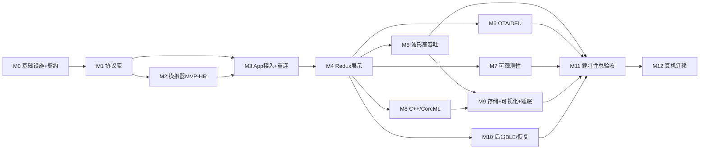

# 11 · 项目落地计划（Milestone + 验收标准）· 标杆文档

> 这是后续**执行与验收的标杆文档**：把项目拆成有序 milestone，每个都给出**目标 / 交付物 / 可验收标准（尽量可量化）/ 依赖**。与 [`01-roadmap.md`](01-roadmap.md) 节点一一对应（01 讲并行与依赖，本文讲"做到什么算过"）。
>
> **验收前提（无硬件）**：BLE 端到端需 **Mac(模拟器) + iPhone/iPad 真机**（iOS 模拟器无真实蓝牙）；纯逻辑用**单元测试**；链路故障用**模拟器故障注入**；标 🔴 的项需**真机**才能最终确认。数值目标标注为"目标(可调)"，落地时先测量记录再据实收敛。

## 0. 通用完成定义（Definition of Done）

每个 milestone 通过需同时满足：
- 交付物代码 `swift build` / `xcodebuild` 通过，相关**单元测试全绿**。
- 该里程碑的**验收标准逐条满足**（下文各节）。
- 关键路径有**日志/指标**可观测（见 [docs/10](10-observability.md)）。
- 涉及协议的改动**已同步** [`03`](03-ble-gatt-protocol.md) 与 `HRSenseProtocol` 包（契约单一真相）。
- 文档更新（对应 spec/章节）。

## 1. 里程碑依赖图

---

## M0 · 基础设施与协议契约冻结
- **目标**：仓库/SPM 骨架就绪；冻结 v1 协议契约。
- **交付物**：根 `Package.swift` + 各空 target 可编译；`03` 契约冻结（UUID/CRC/能力位/帧/命令/时间戳/小端）；`.gitattributes`(LFS)；最小 CI（`swift build`）。
- **验收标准**：
  - [ ] `swift build` 通过；仓库结构符合 [`08`](08-project-structure.md)。
  - [ ] `03` 无"v1 待定"项（仅保留"真机校订"一条）。
  - [ ] CI 在 push 时自动跑通。
- **依赖**：—

## M1 · 协议库 `HRSenseProtocol`（编解码 + 单测）
- **目标**：L2–L4 编解码可脱离蓝牙独立工作；日志基线起步。
- **交付物**：分片/重组(`FrameAssembler`)、seq/CRC、命令/数据/ACK/事件、OTA 与波形块编解码；`HRSenseLogging` 门面雏形。
- **验收标准**：
  - [ ] 单测覆盖：正常帧 / 单分片 / 多分片 / 乱序 / CRC 错 / 截断 / 未知 Tag —— 全通过。
  - [ ] 黄金值：`CRC16("123456789")==0x29B1`；一组固定输入的编码字节稳定（golden bytes）。
  - [ ] **往返属性测试**：`decode(encode(x)) == x` 对随机用例成立。
  - [ ] 核心编解码测试覆盖率 ≥ 80%（目标，可调）。
- **依赖**：M0

## M2 · macOS 模拟器 MVP（HR）
- **目标**：可广播、被连、握手、按协议推 HR。
- **交付物**：`CBPeripheralManager` 封装 + 接入协议包 + HR 生成 + 简易 UI；headless 基础。
- **验收标准**：
  - [ ] 用通用 BLE 工具（LightBlue/nRF Connect）能：按 Service UUID 发现、读 Info、订阅 Notify 并收到**符合 `03` 格式**的 HR 帧。
  - [ ] `HELLO→HELLO_ACK` 正确；`START_STREAM/STOP_STREAM` 生效。
  - [ ] `--headless --scenario <file>` 可无 UI 启动并按脚本产数。
- **依赖**：M1

## M3 · App BLE 接入 + 重连（HR）🔴 联调节点1
- **目标**：iOS 真机连模拟器，端到端 HR，断线自动重连。
- **交付物**：`CBCentralManager` 封装 + 解码 + 连接状态机 + 指数退避重连 + 重握手/重订阅。
- **验收标准**（真机 + 模拟器）：
  - [ ] 端到端实时 HR 显示；连续运行 ≥ 10 分钟无崩溃、无内存持续增长。
  - [ ] 模拟器主动断连后，App 自动重连并恢复数据（退避重连，重连后重新握手+重订阅）。
  - [ ] 注入 5% 丢包时 HR 仍连续更新，丢样被统计（`sampleSeq` 缺口计数）。
  - [ ] 版本/能力协商在日志中正确可见。
- **依赖**：M1、M2

## M4 · App 展示层（Clean + Redux）
- **目标**：数据入 Redux，完成展示与错误/连接态。
- **交付物**：State/Action/Reducer/Middleware；HR 趋势图；连接/错误 UI；`AppError` 落地。
- **验收标准**：
  - [ ] Reducer 纯函数单测：关键 Action→State 断言通过。
  - [ ] Middleware 单测（假 Repository）：派发的 Action 序列符合预期。
  - [ ] UI：实时 HR + 趋势 + 连接/错误态；UI 更新节流 ≤ 2Hz，滚动/刷新不卡。
- **依赖**：M3

## M5 · 实时波形高吞吐（ECG/PPG）— BLE 深度优化核心
- **目标**：波形通道端到端 + 吞吐量化 + 高性能渲染。（见 [spec 0003](specs/0003-waveform-high-throughput.spec.md)）
- **交付物**：`03` 波形通道；模拟器波形发生器 + 吞吐/丢样面板；App 波形环形缓冲 + 自绘视图 + 指标埋点。
- **验收标准**（真机 + 模拟器）：
  - [ ] 在 ≥128Hz（目标，可调到 250Hz）采样率下，波形端到端连续显示 ≥ 5 分钟。
  - [ ] **量化并记录**：有效吞吐(bytes/s、samples/s)、端到端时延、丢块率（注入 0 时应≈0）。
  - [ ] 波形视图渲染 🔴 ≥ 55fps（真机）；内存在环形缓冲上限内稳定（无泄漏式增长）。
  - [ ] 注入丢块/乱序/块内截断：UI 不崩、重组正确、丢块率统计准确。
  - [ ] MTU 动态填充生效（日志显示协商 MTU 与块大小）。
- **依赖**：M4（在 M3 BLE 链路之上，接入 `HRSenseFeature` 的 Redux/UI 管线）

## M6 · OTA / DFU 全流程（JD 核心）🔴
- **目标**：端到端固件升级（模拟），稳定/可靠/安全/优秀 UX。（见 [07](07-ota-dfu.md)）
- **交付物**：OTA 命令+数据通道；模拟器设备侧 OTA 状态机；App `OTAUseCase`/`OTAMiddleware`/进度 UI。
- **验收标准**：
  - [ ] 正常升级 **连续 10 次成功率 100%**；进度单调递增；完成后经 `INFO/HELLO_ACK` 确认**新版本号**。
  - [ ] **断点续传**：传输中断连后从 `resumeOffset` 续传成功。
  - [ ] **完整性**：篡改镜像/CRC → 设备拒绝并回滚旧版本，App 明确报错。
  - [ ] **窗口重传**：某窗口 CRC 错 → 自动重传该窗口后成功。
  - [ ] **前置检查**：电量 <30% 拒绝启动、禁止降级。
  - [ ] 全程无崩溃；所有失败路径都有清晰错误态与可重试/续传入口。
- **依赖**：M4（在 M3 连接/命令闭环之上，落地 OTA 状态、Action 与 Middleware）

## M7 · 可观测性（日志 / 崩溃 / 监控）
- **目标**：建立诊断基础设施。（见 [docs/10](10-observability.md)）
- **交付物**：`HRSenseLogging` 分类；Redux Logging Middleware；MetricKit 接入；`MetricsCollector` + DEBUG 面板。
- **验收标准**：
  - [ ] 日志可按 category 开关；可**导出诊断包**；App 与模拟器 hex 格式一致，可并排 diff。
  - [ ] MetricKit 能捕获**注入的一次崩溃/卡顿**诊断；崩溃报告附最近状态迁移。
  - [ ] 面板实时显示：连接成功率 / 重连次数 / 命令超时率 / 丢样率 / 吞吐 / OTA 成功率。
- **依赖**：M4（日志基线自 M1 起持续建设）

## M8 · 计算（C++）+ CoreML 推理
- **目标**：HR/HRV 特征(C++) + 压力二分类推理接入。（见 [spec 0001](specs/0001-cpp-compute-integration.spec.md)、[spec 0002](specs/0002-coreml-inference-pipeline.spec.md)）
- **交付物**：`HRSenseComputeCxx/Compute`(C ABI)；14 维特征；`CoreMLService` + 占位模型；Inference Middleware。
- **验收标准**：
  - [ ] C++ 计算**黄金值对拍**：给定 RR 序列，RMSSD/SDNN 等与参考值误差 < 阈值。
  - [ ] 特征输出 14 维、口径与训练侧一致（契约测试）。
  - [ ] 占位模型端到端：特征→predict→`InferenceResult`→State→UI 显示。
  - [ ] 5min 窗 / 30s 步长触发正确；单次推理耗时记录（目标 <X ms）。
- **依赖**：M4

## M9 · 本地存储 + 可视化 + 睡眠结构
- **目标**：持久化 + 高性能图表 + 睡眠 hypnogram。（见 [spec 0004](specs/0004-local-storage.spec.md)、[spec 0002 §3.8](specs/0002-coreml-inference-pipeline.spec.md)）
- **交付物**：`SwiftDataStore`+`WaveformFileStore`；保留/归档任务；趋势/HRV/睡眠带状图；睡眠分期占位模型。
- **验收标准**：
  - [ ] 会话数据落库；**重启 App 后**可查询/聚合（日视图）。
  - [ ] 波形大块存文件 + 校验往返一致；保留策略生效（构造过期数据：波形清理、原始点降采样归档）。
  - [ ] 整夜 `replay` → 睡眠阶段带状图显示，分期结果落库。
  - [ ] 存储写入**不阻塞** UI/BLE（后台批量写）。
- **依赖**：M5、M8

## M10 · 后台 BLE + 状态恢复 🔴
- **目标**：后台运行与系统恢复。（见 [`04` §5A](04-app-clean-redux.md)）
- **交付物**：`bluetooth-central` 后台模式；`restoreIdentifier` + `willRestoreState`；后台降级策略。
- **验收标准**（真机）：
  - [ ] App 进后台后仍能接收 notify（短时场景）。
  - [ ] 进程被系统回收后，蓝牙事件**唤醒 App 并恢复**连接/订阅（`willRestoreState` 路径命中，日志可见）。
  - [ ] 记录后台唤醒/耗电表现（真机实测报告）。
- **依赖**：M4

## M11 · 健壮性总验收（故障注入 + 端到端自动化）
- **目标**：系统性验证异常路径与长稳。
- **交付物**：场景脚本库(JSON) 覆盖各类故障；headless 模拟器 + CI 端到端；回归集。
- **验收标准**：
  - [ ] 脚本化 E2E（CI/半自动）跑通：连接 / 丢包 / 断连重连 / OTA(含失败) / 波形丢块 / 低电量 —— 全部按预期。
  - [ ] **长稳**：连续运行 ≥ 1 小时（或整夜 replay）无崩溃、内存稳定。
  - [ ] 关键指标达标汇总（引用 M3/M5/M6/M8 的门槛）。
- **依赖**：M5–M10

## M12 · 真机迁移（后置）
- **目标**：从模拟器切换到真实硬件。
- **验收标准**：
  - [ ] 真机协议对齐，差异经**能力协商**吸收，App 上层尽量无感。
  - [ ] 现有 E2E 关键路径在真机复现（连接/波形/OTA）。
  - [ ] 模拟器保留为 CI/回归工具。
- **依赖**：硬件到位

---

## 2. JD ↔ 里程碑映射（自证覆盖）

| JD 要点 | 主要里程碑 |
| --- | --- |
| OTA/DFU（核心） | **M6** |
| BLE 深度优化 / 实时波形吞吐 | **M5**（+ M3 重连、M10 后台）|
| 多方联调 / 数据协议 / 全链路定位 | M2/M3（模拟器联调）+ M7（可观测）+ M11 |
| 数据计算与可视化（HR/HRV/睡眠 + 存储 + 图表） | **M8 + M9** |
| 崩溃/日志/监控 | **M7** |
| C/C++ 高性能算法桥接 | **M8**（spec 0001）|
| Core ML | **M8**（spec 0002）|
| 后台任务（BLE 相关） | **M10** |
| 读 Python/MATLAB 原型 | M8（spec 0001 §9 对拍流程）|

## 3. 建议节奏与并行

- **关键路径**：M0→M1→M2/M3→M4→(M5 与 M6 并行，均为 JD 核心、风险前移)→M8→M9→M11。
- **可并行**：M5(波形) 与 M6(OTA) 在 M4 后并行；M7(可观测) 与 M8(计算) 可并行；M10(后台) 相对独立。
- **风险前移**：波形吞吐(M5)、OTA(M6)、后台恢复(M10) 是三大难点，尽早各打一个最小闭环，别堆到最后。

> 本文为执行标杆；每进入一个 milestone，用其"验收标准"作为该阶段的 Definition of Done 勾选清单。
