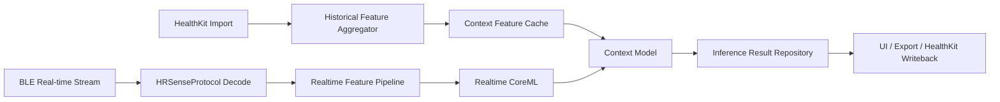

# HealthKit 接入与 CoreML 数据闭环方案

## 1. 背景

当前仓库的健康数据主路径来自自定义 BLE 外设：

- 设备侧采集 HR、RR、波形
- App 侧做协议解码、窗口聚合、HRV 计算和 CoreML 推理

仓库中当前没有真正接入 HealthKit：

- 没有 `HKHealthStore`
- 没有 HealthKit entitlements
- 没有授权流
- 没有从 Apple Health 导入数据
- 也没有把本项目产生的结果写回 HealthKit

因此，当前项目的 ML 数据闭环仍然是“私有采集链路闭环”，不是“系统健康生态闭环”。

---

## 2. 旧方案的问题

- 当前 CoreML 只使用自有 BLE 数据，训练和推理可控，但跨来源特征不足
- 无法与 Apple Watch / iPhone 系统级健康数据形成补充
- 无法做历史趋势、睡眠上下文、活动上下文与恢复状态的联合建模
- 若后续要做用户长期个体化建模，HealthKit 缺失会造成数据稀疏

但也不能误判为“接了 HealthKit 就一定更好”。HealthKit 数据具备三个现实约束：

1. 采样频率和时间粒度未必满足实时模型
2. 来源设备与测量方法异构，数据口径不统一
3. 权限、隐私、合规、解释责任明显更重

因此 HealthKit 更适合作为 **补充数据源、训练特征增强源、结果回写边界**，而不是替代现有 BLE 主链路。

---

## 3. 设计目标

1. 在不破坏现有 BLE 主链的前提下引入 HealthKit
2. 把 HealthKit 放在 Data 层，通过仓库抽象接入
3. 明确“哪些数据用于实时推理，哪些数据用于离线/补充特征”
4. 建立读授权、写授权、同步、回写、质量标记的完整边界
5. 为睡眠监测、心率监测、神经监测三条产品线提供共用的数据底座

非目标：

- 不把 HealthKit 当作实时 BLE 流的替代品
- 不在本阶段做联邦学习或端云协同训练
- 不直接把未经质量控制的多源数据混入同一特征窗口

---

## 4. 是否值得接入

结论：**可以接入，而且应该接入，但接入位置必须受控。**

### 4.1 适合用 HealthKit 的部分

- 历史心率趋势
- 静息心率
- HRV（如 SDNN）
- 睡眠分析结果
- 步数、活动能量、运动时段
- 呼吸频率
- 血氧饱和度
- 体温或手腕温度趋势
- 心房颤动历史、心电图导出结果的元数据关联

### 4.2 不适合直接依赖 HealthKit 的部分

- 高频实时原始波形主链
- OTA 和设备状态控制
- 需要强时间对齐的秒级连续样本推理
- 依赖自定义协议语义的设备上下文

因此建议定位为：

- **BLE = 主实时数据源**
- **HealthKit = 历史补充数据源 + 结果回写目标 + 个体化建模上下文**

---

## 5. 可接入的数据边界

### 5.1 读取边界

建议优先读取：

| 数据类型 | 用途 | 推理价值 |
| --- | --- | --- |
| 心率 `heartRate` | 长期趋势、基线估计 | 高 |
| HRV `heartRateVariabilitySDNN` | 自主神经恢复状态 | 高 |
| 睡眠分析 `sleepAnalysis` | 睡眠标签、训练标签、评估参考 | 高 |
| 呼吸频率 `respiratoryRate` | 睡眠/压力/恢复上下文 | 中 |
| 血氧 `oxygenSaturation` | 睡眠异常与恢复状态 | 中 |
| 步数/活动能量 | 活动干扰因子剔除 | 高 |
| 静息心率 | 个体基线 | 高 |

### 5.2 写入边界

建议写回：

- 设备侧采集的心率摘要
- 计算出的 HRV 摘要
- 睡眠阶段结果摘要
- 神经/压力评分摘要

不建议写回：

- 高频原始波形
- 协议级调试日志
- 未经过滤的异常值

---

## 6. 对 CoreML 的价值

### 6.1 训练阶段

HealthKit 更适合用于：

- 历史特征补齐
- 伪标签构建
- 用户个体基线建模
- 场景切分

示例：

- 过去 7 天静息心率均值
- 过去 3 夜的睡眠时长、深睡占比
- 最近 24 小时活动负荷
- 最近 7 天 HRV 波动范围

这些特征不适合从单次 BLE session 中获得，但非常适合作为上层模型输入。

### 6.2 在线推理阶段

建议把模型分成两层：

1. **实时模型**
   - 输入：BLE 实时 HR/RR/波形衍生特征
   - 输出：当前状态、告警、瞬时分类
2. **上下文模型**
   - 输入：HealthKit 历史趋势 + 实时模型输出
   - 输出：个体化风险评分、恢复状态、睡眠质量评分

不要把 HealthKit 历史查询直接塞进每一次实时推理中。原因是：

- 查询成本更高
- 权限和可用性不稳定
- 数据延迟不可控

正确做法是先做 **异步聚合**，再做 **上下文特征缓存**。

---

## 7. 推荐架构

---

## 8. 模块化实施计划

### 模块 1：权限与工程接线

- 预计时间：0.5d
- 文件：
  - `Apps/HRSenseApp/.../Info.plist`
  - `Apps/HRSenseApp/.../*.entitlements`
  - `HRSenseApp` 工程配置
- 工作：
  - 打开 HealthKit capability
  - 补隐私说明
  - 准备读写权限集合

### 模块 2：Core 层抽象

- 预计时间：0.5d
- 文件：
  - `Sources/HRSenseCore/Repositories/...`
  - `Sources/HRSenseCore/Entities/...`
- 工作：
  - 定义 `HealthDataRepository`
  - 定义 `HealthSample`, `SleepRecord`, `HistoricalBaseline`
  - 定义质量和来源标签

### 模块 3：Data 层 HealthKit 实现

- 预计时间：1.5d
- 文件：
  - `Sources/HRSenseData/HealthKit/...`
  - `Sources/HRSenseData/Repositories/...`
- 工作：
  - 封装 `HKHealthStore`
  - 授权请求
  - Anchored query / observer query
  - 历史拉取与增量同步

### 模块 4：历史特征聚合

- 预计时间：1d
- 文件：
  - `Sources/HRSenseData/ML/...`
  - `Sources/HRSenseData/Persistence/...`
- 工作：
  - 按小时/日/夜聚合基线特征
  - 缓存上下文特征
  - 供 CoreML 上下文模型消费

### 模块 5：推理链路升级

- 预计时间：1d
- 文件：
  - `Sources/HRSenseCompute/...`
  - `Sources/HRSenseFeature/Middleware/...`
- 工作：
  - 把实时模型与上下文模型分层
  - 让 Middleware 先读 context cache，再拼接特征

### 模块 6：写回与审计

- 预计时间：0.5d
- 文件：
  - `Sources/HRSenseData/HealthKit/...`
  - `Sources/HRSenseFeature/...`
- 工作：
  - 把摘要结果回写 HealthKit
  - 记录来源、版本、写回时间

### 模块 7：测试与合规

- 预计时间：1d
- 文件：
  - `Tests/...`
  - `THIRD_PARTY_LICENSES.md`
- 工作：
  - fake repository 测试
  - HealthKit 映射测试
  - 隐私与授权流程验收

总计：`6.0d`

---

## 9. 旧代码问题与改造收益

### 9.1 旧代码问题

- 实时链强，但长期画像弱
- 可做实时分类，但难做个体化长期学习
- 无法对接 iPhone / Apple Watch 生态已有健康资产

### 9.2 改造收益

- 睡眠、恢复、压力、神经状态判断可引入长期上下文
- 模型更容易做个体基线校正
- 用户看到的结果可回流到系统健康生态
- 对后续睡眠和神经路线的产品化更关键

---

## 10. 风险与控制

### 10.1 数据异构风险

不同来源设备的采样口径不同。

控制策略：

- 为每条样本记录 source
- 不混用原始值，先统一做质量标记和聚合

### 10.2 权限拒绝风险

HealthKit 可随时被用户拒绝或撤销。

控制策略：

- 模型设计必须允许“无 HealthKit”降级运行
- 保持 BLE 主链独立可用

### 10.3 合规风险

HealthKit 涉及敏感健康数据。

控制策略：

- 最小权限申请
- 明确用途
- 只缓存必要摘要
- 不导出无边界的原始敏感数据

---

## 11. 分阶段建议

### Phase A：只读导入

- 读取心率、HRV、睡眠、活动
- 不写回
- 不接入正式模型，只做缓存和分析

### Phase B：上下文增强推理

- 增加 context cache
- 支持个体化基线特征
- 接入上下文模型

### Phase C：结果写回

- 回写摘要结果
- 增加来源说明和版本审计

推荐顺序：`A -> B -> C`

---

## 12. 验收标准

- [ ] App 完成 HealthKit 授权与拒绝路径闭环
- [ ] 可成功读取心率、HRV、睡眠、活动四类基础数据
- [ ] 实时模型与上下文模型分层清晰
- [ ] 无 HealthKit 权限时，BLE 主链和现有推理不受影响
- [ ] 可把指定摘要结果回写 HealthKit
- [ ] 日志与诊断面板能看到同步时间、来源和失败原因

---

## 13. 最终判断

HealthKit **适合接入**，但它在本项目中的正确角色是：

- 补充数据源
- 历史上下文特征源
- 训练与评估辅助源
- 结果回写边界

它**不应该替代**现有 BLE 实时链，也**不应该直接并入每一帧实时推理**。
