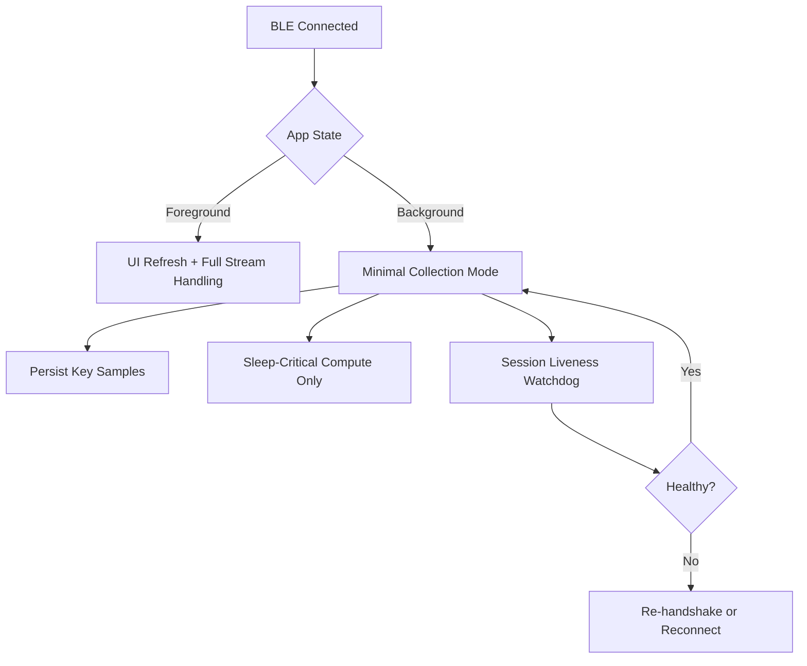

# iOS 后台采集现状与后续设计方案

## 1. 背景

当前项目的 iOS App 已经具备后台 BLE 的基础接线：

- `Info.plist` 已声明 `bluetooth-central`
- `CBCentralManager` 已配置 restoration identifier
- `willRestoreState` 路径已接线
- `ConnectionMiddleware` 已实现恢复资格门控
- `BackgroundMiddleware` 已实现最小降级策略

因此，当前状态不是“完全没做后台采集”，而是：

- **架构骨架已实现**
- **主流程已接线**
- **真机验收尚未闭环**
- **会话保活与后台数据完整性机制仍偏弱**

---

## 2. 旧方案的问题

### 2.1 问题不是“有没有后台模式”

仅仅把 `bluetooth-central` 写进 `Info.plist`，不等于后台采集能力已经成立。

后台 BLE 能力要成立，至少需要四层同时闭环：

1. 系统权限与状态恢复
2. 连接恢复与重新订阅
3. 数据流静默检测与恢复
4. 真机背景运行验收

当前项目已经完成前两层的大部分，但后两层仍未关闭。

### 2.2 当前缺口

- 没有完整的 session liveness/heartbeat 机制
- 对“连接存在但流已停”的后台异常处理不足
- 后台模式的指标和日志不够强
- 真机后台唤醒、后台 notify 连续性、耗电记录尚未形成验收证据

---

## 3. 当前实现结论

### 3.1 已实现部分

- 启动期恢复资格门控
- `willRestoreState` 到恢复链路的接线
- 重新发现服务与重握手主链
- 后台下停扫描、停 UI、停部分 compute 的降级策略
- 睡眠监测路径下保留必要 compute 能力

### 3.2 未完全实现部分

- 后台持续采样的真机可靠性证明
- 静默链路主动探测
- 重握手判定的更精细规则
- 诊断面板中的后台恢复指标闭环

### 3.3 最终判断

当前 iOS App **已经实现后台采集架构骨架**，但**不能宣称后台采集已完整交付**。

更准确的口径是：

- `partial / pending-validation`

---

## 4. 设计目标

1. 把后台 BLE 从“能恢复”升级为“能稳定采集”
2. 明确前后台的采样、渲染、推理、存储策略
3. 使睡眠场景优先级高于非关键实时展示
4. 保证主链路与能耗之间可平衡
5. 为后续睡眠监测和神经监测打下稳定后台底座

---

## 5. 设计原则

### 5.1 前后台职责分离

前台优先：

- UI 实时刷新
- 波形渲染
- 即时交互

后台优先：

- BLE 订阅连续性
- 最小必要存储
- 最小必要计算
- 会话恢复与异常记录

### 5.2 让后台采集成为业务模式，而不是系统侥幸

不能依赖“系统这次刚好没有挂掉我”作为设计前提。

后台链路必须具备：

- 状态恢复
- 静默探测
- 可恢复
- 可观测

### 5.3 采集与显示分离

后台不追求“显示”，只追求“数据不断”和“窗口完整”。

---

## 6. 推荐后续架构

---

## 7. 模块化实施计划

### 模块 1：后台采集状态模型收敛

- 预计时间：0.5d
- 文件：
  - `Sources/HRSenseCore/Entities/...`
  - `Sources/HRSenseFeature/State/...`
- 工作：
  - 区分 `foregroundStreaming`、`backgroundCollecting`、`backgroundRecovering`
  - 收敛用户语义与内部状态语义

### 模块 2：后台会话保活

- 预计时间：1d
- 关联文档：
  - `会话保活与心跳机制设计方案.md`
- 工作：
  - 加静默 watchdog
  - 后台低频场景下加轻量 ping/pong
  - 接入恢复动作

### 模块 3：后台采样与持久化策略

- 预计时间：1d
- 文件：
  - `Sources/HRSenseData/...`
  - `Sources/HRSenseFeature/Middleware/...`
- 工作：
  - 区分“原始高频数据”和“后台必要摘要数据”
  - 睡眠/神经场景保留关键窗口
  - 非必要波形绘制与非必要推理暂停

### 模块 4：后台恢复判定精细化

- 预计时间：0.5d
- 文件：
  - `Sources/HRSenseData/Repositories/DeviceRepositoryImpl.swift`
  - `Sources/HRSenseFeature/Middleware/ConnectionMiddleware.swift`
- 工作：
  - 基于 `sampleSeq` 连续性和静默时长决定是否重握手
  - 收敛恢复失败回退逻辑

### 模块 5：诊断与指标

- 预计时间：0.5d
- 文件：
  - `Sources/HRSenseData/MetricsCollector.swift`
  - `Sources/HRSenseFeature/...`
- 工作：
  - 新增后台唤醒次数
  - 新增后台静默超时次数
  - 新增恢复成功率与平均恢复时长

### 模块 6：真机验收计划

- 预计时间：1d
- 设备：
  - `iPhone 17 Pro Max, iOS 26.5`
- 工作：
  - 后台短时采集
  - 锁屏场景
  - 系统回收后恢复
  - 电量和日志留档

总计：`4.5d`

---

## 8. 后台模式按业务的差异化策略

### 8.1 心率监测

- 后台允许低频心率与 RR 摘要持续入库
- 关闭波形 UI 渲染
- 非必要模型推理降频

### 8.2 睡眠监测

- 后台采集优先级最高
- 保证整夜窗口连续性
- 可持续计算睡眠阶段所需摘要特征

### 8.3 神经监测

- 保留自主神经相关窗口
- 引入更严格的静默探测和恢复策略
- 保证事件前后上下文不丢失

---

## 9. 旧代码问题与改造收益

### 9.1 旧代码问题

- 后台设计偏连接恢复视角，偏少“长时采样运营视角”
- 后台状态机与质量指标不足
- 验收停留在工程层，不足以支撑产品口径

### 9.2 改造收益

- 可从“能恢复”升级为“能连续采”
- 能支持睡眠与神经监测这类真正依赖后台的功能
- 后续出现后台数据断档时更易定位根因

---

## 10. 验收标准

- [ ] App 进入后台后，短时场景仍可持续接收关键 notify
- [ ] 系统回收进程后，可通过 `willRestoreState` 恢复到可采状态
- [ ] 后台静默时可触发恢复逻辑
- [ ] 睡眠场景整夜回放中，关键窗口无系统性缺口
- [ ] 诊断面板可见后台恢复与失败指标
- [ ] 真机测试记录完整留档

---

## 11. 最终判断

当前 iOS App **不是没有后台采集**，而是 **后台采集已完成第一阶段架构落地，但第二阶段的稳定性、探活机制和验收证据尚未完成**。

后续设计重点不是重复造一套后台 BLE，而是补齐：

1. session liveness
2. 后台持久化策略
3. 后台诊断指标
4. 真机验收
