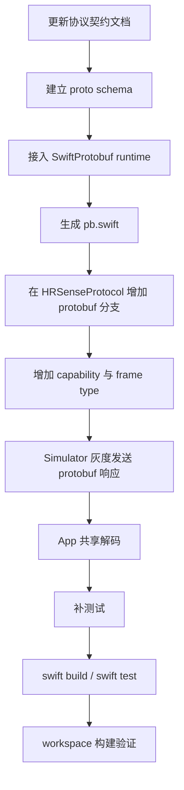

# M1 · TLV 到 Protobuf 分层接入实践指导

## 1. 文档目的

本项目当前已经有一条稳定运行的协议主链：

- `GATT`
- `L2 分帧 / CRC / ACK`
- `L3 命令语义`
- `L4 TLV 负载`

这意味着 Protobuf 的接入不能按“新项目从零设计”的思路推进，而必须按“**已有 TLV 主链如何安全演进**”来处理。

本文件不是治理原则复述，而是面向实施者的实践指导，重点回答：

1. 在 TLV 已上线的前提下，Protobuf 应该怎样分层接入
2. 应该按什么顺序分步骤推进
3. 如何确保主链稳定，不破坏现有联调与验收资产
4. 如何保证可回退、可追踪、可回溯
5. 哪些路径应该先做，哪些路径明确不该先做

---

## 2. 当前前提

当前仓库的真实情况是：

- TLV 已完整落地在 `HRSenseProtocol`
- App 与 Simulator 共享同一份协议实现
- 波形、OTA、握手、设备信息等都已经有现成的 TLV / 紧凑二进制路径
- 当前项目允许接入 Protobuf，但不能破坏以下冻结边界：
  - 不改 GATT
  - 不改 L2 分片 / CRC / ACK
  - 不让 Protobuf 侵入 UI / Persistence

因此，Protobuf 的正确定位是：

- **作为结构化协议负载的可选编码分支**

而不是：

- 全量替换 TLV
- 替代高吞吐二进制块
- 改写现有连接与传输机制

---

## 3. 分层原则

### 3.1 不可动层

以下层在 Protobuf 接入中视为稳定底座，不作为改造目标：

1. `L0 BLE`
2. `L1 GATT Service / Characteristic`
3. `L2 分片 / 重组 / CRC / ACK`
4. `L3 opcode / flags / req-resp 语义`

这些层承担的是链路可靠性与会话控制责任，Protobuf 不应侵入。

### 3.2 可演进层

真正允许引入 Protobuf 的层只有：

1. **结构化协议负载**
2. **Schema 契约治理**
3. **代码生成与运行时编解码**
4. **协商与灰度启用机制**

### 3.3 保持域模型稳定

最佳实践不是让 App / Simulator 上层直接依赖 Protobuf message，而是：

- 底层字节使用 `TLV` 或 `Protobuf`
- 解码后仍收敛到现有域模型：
  - `Command`
  - `DeviceInfo`
  - `DeviceSample`
  - `DeviceEvent`

原因：

- 避免 `SwiftProtobuf` 侵入整个上层架构
- 降低未来替换或回退成本
- 保持测试边界稳定

---

## 4. 分步骤接入顺序

### 第一步：先写契约，不先改业务

必须先完成：

1. 更新协议文档
2. 明确 capability 位
3. 明确 frame type
4. 明确首批接入消息范围
5. 明确 fallback 规则

没有这些前置契约，代码接入只会变成试错。

### 第二步：先建 Schema 与生成链

先建立：

1. `proto/` 目录
2. `.proto` 文件
3. `protoc` 生成脚本
4. `SwiftProtobuf` 运行时依赖

此阶段的目标是让仓库具备“生成和编译 protobuf 代码”的能力，而不是立即切换协议运行时。

### 第三步：只做低风险结构化消息

第一阶段只允许接入：

- `HELLO_ACK`
- `INFO`
- `DeviceInfo`

理由：

- 字段结构稳定
- 吞吐量低
- 调试成本低
- 易于做 TLV / Protobuf 双实现对照

### 第四步：双栈共存，不单边切换

运行时必须保持：

- TLV 主路径可继续工作
- Protobuf 分支通过协商灰度启用
- 不支持时自动回退 TLV

任何“单边切换”都是高风险错误做法。

### 第五步：做一致性与回退验证

至少要验证：

1. TLV 路径仍然通过
2. Protobuf 路径可工作
3. 双方 capability 不一致时自动回退
4. 解码后的域模型一致

---

## 5. 首批落地范围建议

### 推荐优先级 P0

优先接入：

- `HELLO_ACK`
- `INFO`
- `DeviceInfo`

原因：

- 元数据型消息天然适合 schema
- 不承担大吞吐
- 易于灰度与回归

### 推荐优先级 P1

在 P0 稳定后再考虑：

- 结构化设备状态
- 结构化设备事件
- 错误消息

### 不建议首批接入

以下路径明确不建议在第一轮就接入：

- 波形块
- OTA 数据块
- 高频实时样本主路径

原因：

- 对体积和吞吐更敏感
- 现有紧凑编码更可控
- 改动扩散面过大

---

## 6. 稳定性控制

### 6.1 双阀门原则

要让 Protobuf 生效，至少通过两个阀门：

1. **构建阀门**
   - `.proto` 可生成
   - `SwiftProtobuf` 可编译
2. **运行时阀门**
   - 双端 capability 都声明支持
   - 双方都识别对应 frame type

只有两个阀门都通过，才允许进入 Protobuf 路径。

### 6.2 默认主链不变

稳定性控制的核心不是“让 Protobuf 尽快生效”，而是：

- **在任何异常下都能回到 TLV 主链**

因此：

- TLV 仍是默认路径
- Protobuf 是协商开启的增强路径

### 6.3 保持单一入口

不要在 App 与 Simulator 各自手写一套 protobuf 解析逻辑。

必须坚持：

- `HRSenseProtocol` 作为统一编解码入口

这样才能避免协议漂移。

### 6.4 保持上层业务不感知编码差异

业务层不应写出下面这种分支：

```swift
if useProtobuf {
    // ...
} else {
    // ...
}
```

正确做法是：

- 协议层内部区分 TLV / Protobuf
- 上层永远只消费领域模型

---

## 7. 如何保证回退

### 7.1 运行时回退

回退条件包括：

1. 对端未声明 `PROTOBUF_PAYLOAD`
2. 本端未声明 `PROTOBUF_PAYLOAD`
3. `protobufCommand` 解码失败
4. schema 版本不兼容
5. payload 超出限制

回退动作：

- 继续发送 / 接收 TLV `command`
- 日志标记本次 protobuf 协商失败
- 不影响连接主流程

### 7.2 构建回退

如果未来出现 `SwiftProtobuf` 版本不兼容或生成器问题，必须可以做到：

1. 不删 `.proto`
2. 不删生成脚本
3. 暂停运行时启用 capability
4. 让仓库继续以 TLV 主链运行

这就是“保留工程能力，但关闭运行时入口”的回退模式。

### 7.3 发布回退

如果把 Protobuf 分支接到真机 / 固件联调中，发布时应使用：

1. capability 灰度
2. simulator 先验证
3. app build 验证
4. 小范围真机 / 固件联调

不要直接把 Protobuf 作为默认生产路径。

---

## 8. 如何保证可回溯

### 8.1 文档回溯

每次接入必须留下三类文档：

1. 协议契约文档
2. 实施方案文档
3. 缺口补齐 / 实践指导文档

缺任何一类，后续维护者都无法准确判断“为什么这样设计”。

### 8.2 Schema 回溯

必须保留：

- `.proto`
- 生成脚本
- 生成产物
- 字段号历史
- `reserved` 记录

这样才能在未来定位：

- 哪个字段是何时加的
- 哪个字段为何弃用
- 哪个 schema 版本和哪个 app/simulator 版本对应

### 8.3 字节级回溯

必须补：

1. golden tests
2. TLV / Protobuf 一致性测试
3. frame type 解码测试

这样出现问题时，可以从字节层定位到底是：

- 协商失败
- 编码错误
- 生成代码不兼容
- 上层映射错误

### 8.4 运行时回溯

日志至少记录：

1. 是否声明 `PROTOBUF_PAYLOAD`
2. 是否协商成功
3. 走的是 TLV 还是 Protobuf
4. protobuf 解码失败原因
5. 是否发生自动回退

没有这些日志，就无法在 BLE 联调中追根溯源。

---

## 9. 测试与验证口径

### 9.1 单元测试

必须补：

1. `.proto` 生成后的编码 / 解码测试
2. `protobufCommand` frame 解码测试
3. `CommandProcessor` 的协商与回退测试
4. TLV / Protobuf 解码后域模型一致性测试

### 9.2 包级验证

必须通过：

```bash
swift build
swift test
```

### 9.3 Workspace 验证

必须通过：

```bash
nocorrect xcodebuild -workspace HRSense.xcworkspace -scheme HRSenseApp \
  -destination 'platform=iOS Simulator,name=iPhone 17 Pro,OS=26.5' build

nocorrect xcodebuild -workspace HRSense.xcworkspace -scheme HRSenseSimulator \
  -destination 'platform=macOS' build
```

### 9.4 为什么一定要同时验证 App 与 Simulator

因为这次改动的本质是共享协议层接入，不是单端功能改动。

如果只验证 App，不验证 Simulator，就等于没有验证真实互通路径。

---

## 10. 实施建议顺序

推荐按照下面顺序推进：



---

## 11. 实施红线

以下做法直接判定为错误实践：

1. 还没协商 capability 就单边切到 protobuf
2. 把 Protobuf 直接塞进 UI / Persistence
3. 第一轮就替换波形或 OTA 数据块
4. App 与 Simulator 各自写一套独立 protobuf 解析逻辑
5. 只验证单测，不验证 workspace build
6. 没有回退逻辑就发布

---

## 12. 当前最优实践结论

在本项目里，TLV 已经是稳定事实，Protobuf 的正确接入方式只有一种：

- **把它作为结构化协议负载的灰度增强分支**
- **不破坏现有 TLV 主链**
- **先接低风险消息**
- **保持统一协议入口**
- **全程可回退、可回溯、可验证**

如果偏离这五点，接入成本和事故概率都会显著上升。
