# M5 模拟器波形到 App 展示的完整链路说明

## 文档目的

这份文档专门说明当前项目里“模拟器波形 -> BLE Notify -> ring buffer -> middleware -> UI”的完整链路。

它和 `m9-app-display-and-inference-chain.md` 的区别是：

- `m9-app-display-and-inference-chain.md` 更偏总览，说明波形链和推理链的边界
- 本文档只聚焦 **波形展示链本身**

也就是说，这里回答的是：

- 波形数据从哪里产生
- 如何通过 BLE 进入 App
- 如何进入 `WaveformRingBuffer`
- 如何进入 Redux
- UI 最终怎么显示

## 一张总图

```mermaid
graph LR
    GEN[WaveformGenerator ECG/PPG] --> STREAM[WaveformStreamer]
    STREAM --> ENC[WaveformEncoder]
    ENC --> PERI[SimulatedPeripheral.pushNotifyFragments]
    PERI --> BLE[CBPeripheralManager Notify 0002]
    BLE --> CENTRAL[BLECentralDataSource]
    CENTRAL --> PARSER[BLEDataParser.parseWaveformBlock]
    PARSER --> RING[WaveformRingBuffer]
    RING --> WFMW[WaveformMiddleware]
    WFMW --> REDUX[WaveformState]
    REDUX --> ROOT[RootView]
    ROOT --> DISPLAY[WaveformDisplayView]
    DISPLAY --> CANVAS[WaveformCanvasView]
```

## 第 1 段：模拟器如何生成波形

### 1. 波形发生器

模拟器中的波形不是直接写死的数组，而是通过波形合成器实时生成。

关键对象：

- `WaveformGenerator.ecg(...)`
- `WaveformGenerator.ppg(...)`

职责是：

- 维护 block 连续性
- 维护 `blockSeq`
- 维护 `startTimestampMs`
- 输出一个协议层 `WaveformBlock`

### 2. 波形流控器

`WaveformStreamer` 会以固定频率输出波形 block。

它负责：

- 根据 MTU 计算 `samplesPerBlock`
- 按固定 block interval 周期性生成 block
- 调用 `WaveformEncoder.encode(...)`
- 把 waveform block 编码成一组可通过 Notify 发送的 fragments

### 3. Simulator UI 路径里的关键点

当前项目有两条 simulator 运行路径：

1. `SimulatorHeadlessRunner`
2. `SimulatorViewModel`

这两条路径最终都应该在收到 `START_STREAM(sampleKinds)` 后：

- 判断是否需要 `heartRate`
- 判断是否需要 `waveform`
- 在需要时启动对应的 stream

这次修复后，`SimulatorViewModel` 也具备了与 headless 对齐的 waveform 能力。

## 第 2 段：波形如何通过 BLE Notify 发出去

波形不通过 `DeviceSample` 那条低频路径发送，而是走高吞吐 waveform block 路径。

发送方式是：

1. `WaveformStreamer` 生成 `WaveformBlock`
2. `WaveformEncoder` 把 block 编码成多片 `Data`
3. `SimulatedPeripheral.pushNotifyFragments(...)` 把 fragments 发到 `0002 Data/Notify`
4. 底层由 `CBPeripheralManager.updateValue(...)` 推给已订阅 central

这一层的核心特点：

- 它是高频 notify 片段流
- 它和 `heartRate / RR` 那条低频 `DeviceSample` 路径不是同一实现

这也是本次问题容易出现的原因之一：如果只实现了低频 sample 路径，心率能工作，但波形仍然会完全缺失。

## 第 3 段：iOS 端如何接收 waveform

### 1. BLE 接收入口

iOS 侧的入口在：

- `BLECentralDataSource`

中央收到 notify 后，会区分：

- 命令响应
- 低频 sample
- 高频 waveform block

### 2. 解析层

`BLEDataParser.parseWaveformBlock(...)` 负责把协议层的 `WaveformBlock` 转成领域层 `[WaveformSample]`。

这里做了几件重要工作：

- 根据 `waveformType` 转成 `WaveformType`
- 通过 `localT0 + startTimestampMs` 计算绝对时间
- 根据 `sampleBits` 做归一化
- 为每个 sample 填充 `timestamp`

因此，进入 App 之后的 `WaveformSample.value` 已经不是原始 ADC 整数，而是适合 UI 侧绘制和后续算法处理的归一化浮点值。

## 第 4 段：ring buffer 在链路中的作用

`WaveformRingBuffer` 是波形展示链的中间缓冲层。

它负责：

- 缓存最近一段时间的波形样本
- 控制容量上限
- 记录 block loss、吞吐、samplesPerSec 等指标

关键点是：

- ring buffer 只关心“最近窗口”
- 它不是长期存储
- 它更像是一个实时展示和诊断使用的高吞吐缓存

## 第 5 段：middleware 如何把波形送进 Redux

`WaveformMiddleware` 会周期性轮询 ring buffer。

当前行为是：

1. 从 `WaveformRingBuffer.readRecent(durationMs: 5000)` 读取最近 5 秒样本
2. 从 `metricsSnapshot` 读取当前指标
3. 如果样本非空，派发 `waveformSamplesReceived(samples)`
4. 无论样本是否为空，都会派发 `waveformMetricsUpdated(metrics)`

这也是一个很重要的运行时判断依据：

- 有 `waveformMetricsUpdated`，不代表一定有实际波形样本
- 只有同时看到 `waveformSamplesReceived(...)`，才能说明 UI 侧真的拿到了波形数据

## 第 6 段：Redux 状态如何管理 ECG / PPG

当前 Redux 中波形相关状态主要在 `WaveformState`：

- `ecgSamples`
- `ppgSamples`
- `selectedType`
- `metrics`
- `isStreaming`

这次修复后，`AppReducer` 会按 `WaveformSample.type` 分流：

- ECG 进入 `ecgSamples`
- PPG 进入 `ppgSamples`

因此 `selectedType` 才真正有了意义。

## 第 7 段：UI 最终如何显示

最终 UI 展示链是：

1. `RootView` 根据 `selectedType` 取出当前显示样本
2. `WaveformDisplayView` 承担上层展示和类型切换
3. `WaveformCanvasView` 负责真正绘制折线/包络

`WaveformCanvasView` 依赖一个关键前提：

- 传入的 `WaveformSample.value` 已经是归一化值

因此绘制时应该直接按画布高度缩放，而不应该再次人为缩小振幅。

## 第 8 段：这条链路和 CoreML 的关系

这条链路当前的主要目标是：

- 实时可视化
- 诊断与吞吐观测
- 为后续持久化或波形文件存储提供输入

它**当前不是 CoreML 主推理链**。

也就是说：

- 看到波形，不代表已经进入 CoreML
- 看不到波形，也不一定代表推理链完全坏了

当前项目的 CoreML 主要消费的是：

- 心率 / RR
- C++ 计算得到的 HRV 或睡眠特征

而不是这条实时 waveform display 通道本身。

## 第 9 段：这次故障说明了什么

这次波形问题说明，在这条链路里最容易出现断裂的不是 BLE 连接本身，而是：

- 生成端和展示端的运行路径不一致
- 高吞吐 waveform 和低频 heart rate 只实现了一半
- metrics 与 samples 的可见性没有被区分使用

后续排查类似问题时，建议按下面顺序看：

1. 是否看到 `waveformSamplesReceived`
2. ring buffer 是否有 recent samples
3. central 是否收到 `WaveformBlock`
4. simulator 是否真的启动了 `WaveformStreamer`
5. UI 是否按 `selectedType` 显示对应的 sample 数组

## 相关代码落点

- `Sources/HRSenseSimulatorKit/Generators/WaveformGenerator.swift`
- `Sources/HRSenseSimulatorKit/Generators/WaveformStreamer.swift`
- `Sources/HRSenseSimulatorUI/SimulatorViewModel.swift`
- `Sources/HRSenseSimulatorKit/Peripheral/SimulatedPeripheral.swift`
- `Sources/HRSenseData/BLE/BLECentralDataSource.swift`
- `Sources/HRSenseData/BLE/BLEDataParser.swift`
- `Sources/HRSenseData/WaveformRingBuffer.swift`
- `Sources/HRSenseFeature/Middleware/WaveformMiddleware.swift`
- `Sources/HRSenseFeature/Reducer/AppReducer.swift`
- `Sources/HRSenseFeature/Views/RootView.swift`
- `Sources/HRSenseFeature/Views/WaveformDisplayView.swift`
- `Sources/HRSenseFeature/Views/WaveformCanvasView.swift`
