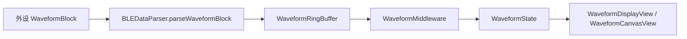

# M9 App 展示与推理全链路说明

## 先辨析一个关键前提

如果把当前链路概括成：

`波形数据 -> CoreML -> App 展示`

这个说法 **不完全正确**。

更准确地说，当前工程里存在两条并行但相关的链路：

1. **波形展示链**
   - 设备波形块
   - 协议解码
   - `WaveformRingBuffer`
   - Redux `WaveformState`
   - `WaveformDisplayView`

2. **推理链**
   - 设备 HR / RR 数据
   - `ComputeMiddleware`
   - C++ 计算 `HRVMetrics`
   - `FeatureVector`
   - `InferenceMiddleware`
   - `CoreMLService`
   - `InferenceResult`
   - App 展示

也就是说：

- **波形当前主要用于实时展示与存储**
- **CoreML 当前主要消费 RR/HRV 特征，而不是直接消费高频波形**

这和很多真实健康类 App 的第一版工程路径是一致的，因为：

- 实时波形的吞吐与渲染问题，和
- 端上状态/压力/睡眠推理问题

虽然都来自同一个外设流，但在工程上通常会拆成两条不同的处理通道。

## 当前代码里的真实全链路

### 1. 设备流进入 App

设备通过 BLE 把两类数据送进 App：

- **低频样本**：心率、RR、事件
- **高频样本**：ECG / PPG 波形块

入口在：

- `Sources/HRSenseData/BLE/BLECentralDataSource.swift`
- `Sources/HRSenseData/BLE/BLEDataParser.swift`

其中 `BLEDataParser` 负责把协议层对象转换成领域层对象：

- `DeviceSample -> HeartRateSample`
- `WaveformBlock -> [WaveformSample]`

## 2. 波形展示链

波形链路当前是：

对应代码落点：

- `Sources/HRSenseData/BLE/BLEDataParser.swift`
- `Sources/HRSenseData/WaveformRingBuffer.swift`
- `Sources/HRSenseFeature/Middleware/WaveformMiddleware.swift`
- `Sources/HRSenseFeature/State/WaveformState.swift`
- `Sources/HRSenseFeature/Views/WaveformDisplayView.swift`

这条链路的目标是：

- 保证高吞吐波形可以在 App 内实时显示
- 统计吞吐、丢块、采样速率
- 为后续 M9 的波形文件存储保留输入

这里 **没有经过 CoreML**。

## 3. 推理展示链

推理链路当前是：

```mermaid
graph LR
    DEV[外设 HR/RR] --> PARSER[BLEDataParser.parseSample]
    PARSER --> ACTION[heartRateReceived]
    ACTION --> CMW[ComputeMiddleware]
    CMW --> CPP[C++ ComputeRepository]
    CPP --> HRV[HRVMetrics]
    HRV --> FV[FeatureVector]
    FV --> IMW[InferenceMiddleware]
    IMW --> ML[CoreMLService]
    ML --> RES[InferenceResult]
    RES --> STATE[InferenceState]
    STATE --> UI[RootView]
```

对应代码落点：

- `Sources/HRSenseFeature/Middleware/ComputeMiddleware.swift`
- `Sources/HRSenseData/Repositories/ComputeRepositoryImpl.swift`
- `Sources/HRSenseCore/Entities/HRVMetrics.swift`
- `Sources/HRSenseCore/Entities/FeatureVector.swift`
- `Sources/HRSenseFeature/Middleware/InferenceMiddleware.swift`
- `Sources/HRSenseData/Repositories/InferenceRepositoryImpl.swift`
- `Sources/HRSenseCompute/CoreMLService.swift`
- `Sources/HRSenseFeature/State/InferenceState.swift`
- `Sources/HRSenseFeature/Views/RootView.swift`

这里当前的核心事实是：

- CoreML 的输入是 **14 维 HRV 特征**
- 不是原始 ECG/PPG 波形

## 4. M9 在这条链路里负责什么

`M9` 不是“把 BLE 接进来”的里程碑，也不是“把 CoreML 基础推理打通”的里程碑。

`M9` 在这条链路里的职责是把前面已经跑起来的数据变成：

- **可持久化**
- **可回看**
- **可聚合**
- **可做睡眠结构分析**

当前已经落地的 M9 对应点：

### 已完成

- `PersistenceStore` 抽象边界
- `SwiftDataStore` 结构化数据落库
- `WaveformFileStore` 波形文件存储
- `RetentionCleanupTask` 的过期清理与分钟归档

### 正在推进

- 阶段 5：睡眠分期输入契约与仓储/服务骨架

### 还没完成

- `PersistenceMiddleware` 把实时流自动落库
- `SleepMiddleware` 把夜间窗口持续拼成 `SleepSession`
- `SleepHypnogramView` 的真实数据源

## 5. 当前阶段 5 的正确理解

阶段 5 现在不应理解为：

- “波形已经直接进睡眠模型”

而应理解为：

- 先把 **睡眠窗口输入契约** 固化
- 再把 **睡眠模型接入点** 固化
- 最后再接 **SleepMiddleware / SleepSession / Hypnogram**

这轮之后，阶段 5 新增了：

- `SleepWindowInput`
- `SleepTimeContext`
- `SleepCXXFeatures`
- `SleepInferenceRepository`

也就是说，睡眠分期的输入现在已经明确为三块：

1. `HRVMetrics`
2. 时间上下文
3. 未来 C++ 计算的睡眠附加特征

## 6. “外设能传流式数据，App 现在能展示吗”这个问题

### 可以展示的部分

如果外设已经按当前协议正确传输：

- `HeartRateSample`
- `RR intervals`
- `WaveformBlock`

那么 **当前 App 已经可以展示**：

- 实时心率
- 实时波形
- 压力/状态推理结果

这是一个**实时展示最小闭环**。

### 还不能算完成的部分

但它 **还不是 M9 的完整最小闭环**，因为还缺：

- 自动持久化接线
- 睡眠窗口持续推理
- `SleepSession` 落库
- Hypnogram 历史展示

换句话说：

- **M5 + M8 的实时闭环已经基本成立**
- **M9 的“存储 + 睡眠 + 历史展示”闭环还没有完全成立**

## 7. 当前最小闭环状态判断

当前项目可以分三层来判断“是否闭环”：

### A. 实时展示闭环

**是，基本已闭环**

- BLE 数据能进 App
- 心率能展示
- 波形能展示
- 推理结果能展示

### B. M9 存储闭环

**部分闭环**

- 存储基础设施已经有了
- 保留/归档基础也有了
- 但实时流还没统一接到持久化中间件

### C. M9 睡眠闭环

**尚未闭环**

- 输入契约刚开始固化
- 服务与仓储边界已开始
- 还没有夜间持续推理与 hypnogram 展示

## 8. 下一步最合理的推进顺序

为了让阶段 5 尽快形成真正可演示的睡眠最小闭环，建议按下面顺序继续：

1. **补 SleepWindowInput 的生产路径**
   - 从 RR/HRV 窗口生成 `SleepWindowInput`

2. **补 C++ 睡眠附加特征实现**
   - `hrTrend`
   - `circadianVariation`

3. **补 SleepMiddleware**
   - 窗口累积
   - 推理
   - segment 合并
   - `SleepSession` 落库

4. **补历史展示**
   - `SleepHypnogramView`
   - 睡眠历史查询

这样推进后，才能从“实时展示闭环”真正进入“M9 睡眠闭环”。
