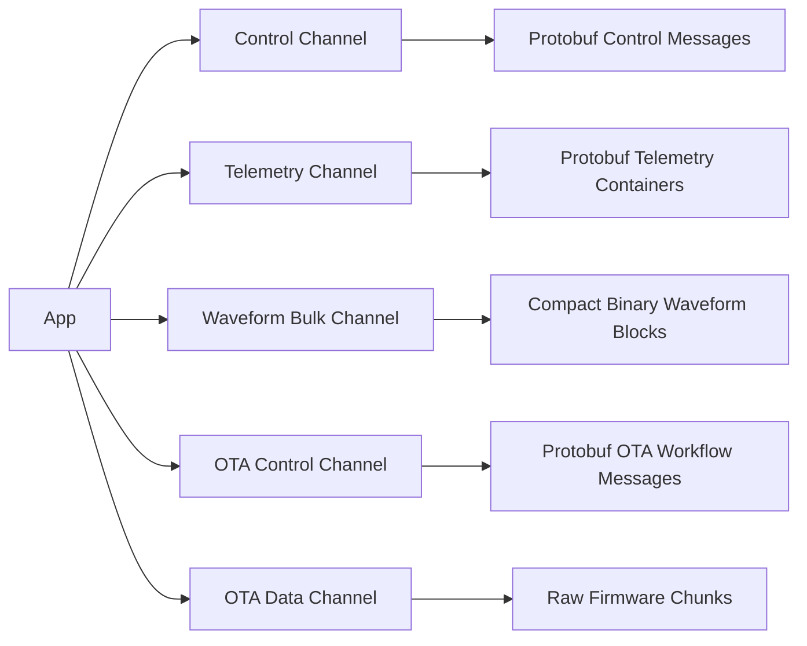

# 从零开始的 Schema-First + Protobuf-First 架构设计

## 1. 文档目标

本文不讨论当前仓库的现实约束，也不讨论已有 TLV 实现如何迁移。

本文只回答一个问题：

- 在一个**从 Day 0 就决定采用 schema-first + protobuf-first** 的心率 / 睡眠数据采集 App 项目里，协议、代码生成、版本治理、波形高吞吐链路、OTA 链路，应该如何一起被设计成一套长期可维护的系统。

目标场景：

- iOS App 作为 Central
- Android App 作为并行消费端
- 固件 / 模拟器作为 Peripheral
- 业务包含心率、RR、睡眠、设备状态、诊断、波形、OTA

一句话结论：

- **让 Protobuf 成为跨端结构化语义的唯一主契约，让自定义二进制通道只承担吞吐敏感的原始块传输。**

这意味着：

- 握手、协商、状态、配置、普通数据容器、睡眠结果、诊断导出，默认都用 Protobuf
- 波形原始块、OTA 固件 chunk，不强行用 Protobuf 承载原始字节
- 传输层和契约层从 Day 0 就分开，避免后续“为了统一而牺牲性能”

---

## 2. 核心设计判断

### 2.1 先分清三个问题

从零开始设计时，最容易犯的错误，是把下面三个问题混成一个问题：

1. **跨端语义怎么定义**
2. **字节怎么在 BLE 上运**
3. **大吞吐原始数据怎么压到最小成本**

正确做法是把它们拆开：

- **Schema 层**解决“语义如何定义”
- **Transport 层**解决“字节如何可靠过 BLE”
- **Bulk Data 层**解决“高吞吐路径如何最省”

因此，架构上不能直接说“项目使用 Protobuf”，而应该明确为：

- **项目使用 Protobuf 作为结构化契约语言**
- **项目使用自定义 BLE 传输层承载帧**
- **项目使用二进制块格式承载极端吞吐路径**

### 2.2 从 Day 0 就不追求“全量 Protobuf”

从零开始，也不应该把所有内容都塞进 `.proto` 的序列化结果里。

原因不是技术做不到，而是系统目标不同：

- Protobuf 擅长：字段治理、代码生成、兼容演进、跨端统一
- Protobuf 不擅长：BLE MTU 受限场景下的极限压缩、极高频采样块、固件镜像裸字节搬运

因此 Day 0 的正确目标不是：

- “所有 payload 都是 protobuf bytes”

而是：

- **所有长期需要协商的结构化语义都先落在 schema**

---

## 3. 总体分层架构

建议从一开始就使用下面这套分层。

```text
L5 Product Semantics
- Heart rate / RR / sleep stage / metrics / diagnostics / OTA workflow

L4 Contract Layer
- Protobuf schemas (.proto)
- Generated Swift / Kotlin / C bindings
- Compatibility and version rules

L3 Message Mapping Layer
- Domain <-> Generated message mapping
- Validation / normalization / defaulting

L2 Transport Layer
- BLE characteristic routing
- Frame header / fragmentation / reassembly / seq / CRC / ACK / timeout

L1 BLE GATT Layer
- Custom services / characteristics

L0 Runtime / Hardware
- iOS / Android / firmware / simulator
```

其中最关键的边界有两个：

1. **Generated message 不直接等于业务 Domain**
2. **Transport envelope 不直接等于 Protobuf message**

这两个边界如果从一开始就建立，后续维护成本会显著下降。

### 3.1 推荐的逻辑通道拆分



这张图表达的是一个原则：

- **控制面、状态面、结果面走 Protobuf**
- **原始高吞吐数据走专用 bulk lane**

---

## 4. 从零开始的协议职责划分

### 4.1 哪些必须是 Protobuf

以下内容从 Day 0 就应该由 `.proto` 定义：

1. 握手消息
2. 能力协商
3. 设备信息
4. 流控制命令
5. 配置下发
6. 错误模型
7. 设备状态
8. 心率 / RR / 电量等常规数据容器
9. 睡眠阶段与结构化算法结果
10. 诊断、日志导出、度量快照
11. OTA 会话控制消息

这些消息的共同特征是：

- 字段会演进
- 多端都要理解
- 语义比字节更重要
- 协商成本比编码极限更重要

### 4.2 哪些不应该强行是 Protobuf

以下内容不建议把原始字节直接全量放进 Protobuf：

1. 高频 ECG / PPG 波形原始块
2. OTA 固件镜像 chunk
3. 极高频、极小粒度、对每字节都敏感的原始采样链路

这里不是完全排斥 Protobuf，而是明确边界：

- **控制信息和元信息仍然由 Protobuf 表达**
- **真正的大块原始数据使用自定义紧凑格式**

### 4.3 数据分类矩阵

| 数据类别 | 默认承载 | 原因 |
| --- | --- | --- |
| 握手 / 能力 / 版本 | Protobuf | 跨端长期协商主路径 |
| 设备信息 / 状态 / 事件 | Protobuf | 字段多且经常扩展 |
| 心率 / RR / 电量批量容器 | Protobuf | 结构化强，吞吐中低 |
| 睡眠结果 / HRV / 指标摘要 | Protobuf | 跨端业务语义强 |
| 波形 metadata | Protobuf | 需要跨端统一解释 |
| 波形 samples raw block | Compact Binary | 高频、数组大、对密度敏感 |
| OTA manifest / begin / commit / abort / progress | Protobuf | 状态机复杂，字段演进快 |
| OTA firmware chunk | Raw bytes | 本质是字节搬运，不需要字段语义 |

---

## 5. Schema 目录与模块设计

### 5.1 推荐采用“契约仓库”思维

从零开始时，最稳的方式不是让 App 工程直接手写 `.proto`，而是建立一个**契约中心**。

可以是：

- 单独仓库 `hrsense-contracts`

也可以是：

- Monorepo 中独立的 `proto/` 根目录 + 独立 CI + 独立版本发布

关键不是仓库形式，而是组织原则：

- `.proto` 是主事实来源
- 各端只消费 schema release
- 业务实现不能绕过 schema 自发定义跨端字段

### 5.2 推荐目录结构

```text
proto/
├── buf.yaml
├── buf.gen.yaml
├── README.md
└── hrsense/
    ├── common/
    │   └── v1/
    │       ├── units.proto
    │       ├── device.proto
    │       ├── capability.proto
    │       ├── error.proto
    │       └── timestamp.proto
    ├── session/
    │   └── v1/
    │       ├── handshake.proto
    │       ├── info.proto
    │       └── event.proto
    ├── telemetry/
    │   └── v1/
    │       ├── heart_rate.proto
    │       ├── rr_interval.proto
    │       ├── batch.proto
    │       └── device_status.proto
    ├── sleep/
    │   └── v1/
    │       ├── sleep_stage.proto
    │       ├── sleep_summary.proto
    │       └── features.proto
    ├── waveform/
    │   └── v1/
    │       ├── waveform_control.proto
    │       └── waveform_metadata.proto
    ├── ota/
    │   └── v1/
    │       ├── ota_session.proto
    │       ├── ota_manifest.proto
    │       └── ota_result.proto
    └── diagnostics/
        └── v1/
            ├── metrics.proto
            ├── log_bundle.proto
            └── trace.proto
```

### 5.3 schema 分层规则

从 Day 0 开始就应该有以下规则：

1. `common/` 只放稳定基础类型
2. `session/` 只放连接期与协商期消息
3. `telemetry/` 只放常规业务数据容器
4. `sleep/` 放离线或窗口化结果，不放 transport 细节
5. `waveform/` 只放控制与 metadata，不放整块 raw samples
6. `ota/` 只放 OTA 状态机消息，不放镜像字节
7. `diagnostics/` 放观测与导出，不与业务消息混写

这套分层的价值是：

- 后续新增字段时，团队知道应该改哪个包
- 代码生成后的模块边界稳定
- 不会把“业务状态”和“传输优化字段”写进同一个 message

---

## 6. Message 设计规范

### 6.1 先定消息职责，再定字段

每个 message 在定义前都要先写清楚：

1. 谁发送
2. 谁消费
3. 生命周期是什么
4. 是否要求兼容旧端
5. 是否会高频发送

如果这 5 件事没写清楚，不允许先开字段。

### 6.2 推荐的 message 设计原则

1. 高频核心字段放 `1-15`
2. 使用 `oneof` 表达互斥命令体
3. 使用 `enum` 表达状态，不用魔法数字
4. 使用嵌套 message 表达稳定聚合
5. 删除字段必须 `reserved`
6. 不把 UI 字段、数据库字段直接塞进 schema
7. 不把 transport header 字段混进业务消息

### 6.3 推荐的控制面模型

控制面建议定义一个顶层 envelope，但 envelope 只解决“命令类型归类”，不重复实现 transport。

示意：

```protobuf
syntax = "proto3";

package hrsense.session.v1;

message ControlEnvelope {
  uint32 request_id = 1;
  uint64 sent_at_ms = 2;

  oneof payload {
    HelloRequest hello = 10;
    StartStreamRequest start_stream = 11;
    StopStreamRequest stop_stream = 12;
    SetConfigRequest set_config = 13;
    GetInfoRequest get_info = 14;
    ErrorReport error = 15;
  }
}
```

设计要点：

- `request_id` 只解决业务请求关联
- `ACK`、`seq`、`retry` 仍属于 transport，不写进 message

### 6.4 推荐的普通数据容器模型

不要为每一个心率点单独发一个 protobuf message。正确做法是发**批量容器**。

示意：

```protobuf
syntax = "proto3";

package hrsense.telemetry.v1;

message HeartRateBatch {
  uint32 batch_seq = 1;
  uint64 start_timestamp_ms = 2;
  repeated HeartRateSample samples = 3;
}

message HeartRateSample {
  uint32 offset_ms = 1;
  uint32 heart_rate_bpm = 2;
  repeated uint32 rr_intervals_ms = 3;
  uint32 battery_percent = 4;
  SensorStatus sensor_status = 5;
}
```

这样设计的原因：

- 减少每样本重复字段开销
- 更适合 BLE MTU 下的批量封包
- 更容易做跨端 golden tests

### 6.5 睡眠数据的推荐模型

睡眠结果不应混入实时心率流，而应独立为“窗口化结果流”。

建议：

- `SleepFeatureWindow`
- `SleepStageSegment`
- `SleepSessionSummary`

结构上要满足三件事：

1. 实时计算中间结果可传
2. 最终分期结果可回放
3. 离线重算结果可与旧版本共存

这类结构化业务结果非常适合 Protobuf。

---

## 7. 波形链路的 Day 0 设计

### 7.1 不要把波形原始块本体塞进大而复杂的 protobuf

波形是典型高吞吐场景：

- 样本量大
- 发送频率高
- 极度依赖 MTU 与打包密度

如果把一整个 ECG/PPG block 的 raw samples 直接放进深层 protobuf message，问题会立刻出现：

1. 字节密度不够稳
2. 固件端编码成本升高
3. 调试时难分辨是 transport 问题还是 message 问题
4. 分片后问题定位更复杂

### 7.2 正确边界：metadata 走 Protobuf，sample block 走紧凑二进制

推荐拆成两个层次：

1. **WaveformControl / WaveformMetadata**
   - 用 Protobuf
   - 描述波形类型、采样率、通道数、量化位宽、压缩模式、block 序号范围

2. **WaveformRawBlock**
   - 用自定义 binary block
   - 只包含最必要头部 + sample bytes

示意：

```text
Waveform Block
+------------+------------+-------------+------------------+
| block_seq  | sample_cnt | start_ts_ms | sample bytes ... |
+------------+------------+-------------+------------------+
```

### 7.3 波形建议的职责分拆

- Protobuf 定义：
  - `StartWaveformStreamRequest`
  - `StopWaveformStreamRequest`
  - `WaveformStreamConfig`
  - `WaveformFormat`
  - `WaveformGapEvent`
  - `WaveformSummary`

- Binary block 定义：
  - `block_seq`
  - `sample_count`
  - `start_timestamp_ms`
  - `encoding`
  - `payload`

### 7.4 为什么这才是长期可维护架构

因为波形真正需要跨端长期协商的，是：

- 采样率
- 编码方式
- 通道配置
- 连续性规则
- 丢块恢复语义

这些都应该由 schema 表达。

波形真正不需要由 schema 描述每个字节的是：

- 那几百上千个连续采样值本身

因此最优架构不是“波形不用 Protobuf”，而是：

- **波形用 Protobuf 管理控制语义，用 binary block 承载 bulk payload**

---

## 8. OTA 链路的 Day 0 设计

### 8.1 OTA 必须天然拆成控制面和数据面

OTA 如果从零开始就设计正确，必须拆成：

1. **OTA Control Plane**
   - session begin
   - manifest
   - chunk window
   - resume token
   - verify result
   - commit / abort

2. **OTA Data Plane**
   - firmware raw chunks

### 8.2 OTA 控制面全部用 Protobuf

OTA 控制面消息最适合 Protobuf，因为其状态机会不断演化。

建议 schema 包含：

- `OtaBeginRequest`
- `OtaBeginResponse`
- `OtaManifest`
- `OtaChunkWindowAck`
- `OtaResumeState`
- `OtaVerifyResult`
- `OtaCommitRequest`
- `OtaAbortReason`

这些消息的共同特征：

- 字段明显会扩展
- 多端都要理解
- 追求状态透明和失败可恢复

### 8.3 OTA 数据面保持 raw chunk

firmware image 本质是一个字节数组。

对这种数据，最好的方式不是“为每个 chunk 建一个复杂 protobuf”，而是：

- transport header 指明 `chunk_offset`
- `chunk_length`
- `chunk_crc`
- payload 直接传原始 bytes

如果需要更强治理，可以让 manifest 用 Protobuf 描述整个镜像：

- 固件版本
- 目标硬件
- 全局 SHA256
- chunk 大小
- 签名信息
- 最低 bootloader 版本

但 chunk 本体仍然保持 raw。

### 8.4 OTA 恢复能力的关键点

OTA 从 Day 0 就要按“可中断、可恢复、可校验”设计。

因此 Protobuf schema 里必须预留：

1. `session_id`
2. `resume_token`
3. `next_expected_offset`
4. `window_size`
5. `verification_status`
6. `failure_reason`

这类字段如果靠手写 TLV 和文档维护，后期极易失控。

---

## 9. 代码生成与集成方式

### 9.1 工具链建议

建议直接把 `buf` 作为 schema 管理入口，而不是只靠裸 `protoc` 命令。

推荐链路：

- Schema lint: `buf lint`
- Breaking check: `buf breaking`
- Swift: `swift-protobuf`
- Kotlin: `protoc-gen-kotlin` 或 Java/Kotlin 生成链
- Firmware: `nanopb`
- Python / tooling: `protoc` Python bindings

### 9.2 生成产物组织

推荐从 Day 0 就把“生成产物”和“业务映射”分开。

示意：

```text
Sources/
├── HRSenseContractGenerated/
│   ├── Swift/
│   └── C/
├── HRSenseProtocolTransport/
├── HRSenseContractMapping/
└── HRSenseDomain/
```

职责：

- `HRSenseContractGenerated`
  - 只存自动生成代码
  - 不写业务逻辑

- `HRSenseContractMapping`
  - 负责 generated message <-> domain model 映射
  - 做业务校验、默认值补齐、单位转换

- `HRSenseProtocolTransport`
  - 只负责 frame、fragment、ack、crc、routing

这套分层会避免一个长期常见问题：

- generated code 到处渗透，最后全项目都绑死在 schema 细节上

### 9.3 是否提交生成代码

从零开始时，建议采用下面的规则：

1. `.proto` 一定提交
2. `buf` 配置一定提交
3. 固件使用的 C 生成产物建议提交
4. Swift / Kotlin 生成产物可以按团队形态选择

推荐实践：

- Monorepo：提交生成代码，并由 CI 校验 regenerate 后无 diff
- 多仓库：把生成产物作为版本化 artifact 发布，消费端按 tag 引入

关键目标不是形式，而是：

- **任何一次 schema release 都必须可重复生成、可回溯、可定位**

### 9.4 App 端集成原则

App 端不应该直接在 ViewModel 或 Reducer 中操作 generated message。

正确路径：

```text
BLE bytes
-> Transport decode
-> Generated protobuf message
-> Contract mapper
-> Domain entity
-> Reducer / UseCase / ViewState
```

这能避免以下问题：

- schema 调整直接冲击 UI
- generated 命名泄漏到业务层
- 测试需要绑定底层协议类型

---

## 10. 版本规则与兼容策略

### 10.1 版本要分三层

从零开始设计时，不能只用一个“version”混过去。

必须拆成三层：

1. **Transport Version**
   - frame header / fragmentation / ACK / CRC 的版本
   - 极少变化

2. **Schema Major Version**
   - `.proto` package 版本，如 `hrsense.telemetry.v1`
   - 用来表达破坏性契约代际

3. **Feature Capability Version**
   - 某个功能是否支持、支持哪种模式
   - 用于握手协商

这样设计的好处是：

- transport 稳定时，schema 可以独立演进
- schema 不 breaking 时，不需要 bump transport
- 新能力上线时，不需要强制升级所有旧设备

### 10.2 推荐的兼容黄金法则

以下规则应该从第一天写进治理文档：

1. 新增字段，只能新增字段号，不能插槽复用
2. 删除字段，必须 `reserved`
3. 不允许修改已发布字段号
4. 不允许任意修改字段语义
5. 包名中的 `v1/v2` 只用于 major breaking
6. minor 演进通过“新增 optional / repeated 字段”完成
7. 旧端忽略 unknown fields，新端保留兼容映射

### 10.3 握手协商建议

握手至少包含下面这些信息：

- supported transport versions
- supported schema majors
- capability bitmap or feature list
- waveform support profile
- ota support profile
- max payload size / mtu hint

示意：

```protobuf
message HelloRequest {
  repeated uint32 supported_transport_versions = 1;
  repeated uint32 supported_schema_majors = 2;
  repeated string enabled_features = 3;
  uint32 max_application_payload_bytes = 4;
}
```

`HelloAck` 返回：

- selected transport version
- selected schema major
- accepted features
- device limits

注意：

- **握手解决的是“我们现在按哪套契约讲话”**
- **schema 版本规则解决的是“这套契约能怎么改”**

两者不能相互代替。

---

## 11. 治理与维护机制

### 11.1 Schema 评审流程

推荐从 Day 0 就固定以下流程：

1. 先改 `.proto`
2. 跑 `buf lint`
3. 跑 `buf breaking`
4. 更新 schema changelog
5. 生成各端代码
6. 更新 golden corpus
7. 通过后再允许业务实现改动

如果顺序反过来，后续一定回到“代码先跑，契约后补”的失控状态。

### 11.2 评审责任人

每个 schema 变更至少需要：

1. App 代表
2. Firmware 代表
3. Android 或算法消费者代表

原因很简单：

- schema 是跨端契约，不属于单端私产

### 11.3 推荐的治理工件

从零开始时就应该同时维护：

1. `proto/README.md`
2. `SCHEMA_CHANGELOG.md`
3. `COMPATIBILITY_MATRIX.md`
4. `docs/protocol-version-policy.md`
5. golden corpus 测试数据目录

其中：

- `SCHEMA_CHANGELOG.md` 记录每次字段演进
- `COMPATIBILITY_MATRIX.md` 记录 App / Android / Firmware / Simulator 对各 schema major 的支持关系

### 11.4 Golden Corpus 机制

不要只做“本平台 encode 然后本平台 decode”的 round-trip 测试。

必须从 Day 0 建立跨语言 golden corpus：

- 一组标准 `.bin`
- 对应 JSON 文义样例
- Swift / Kotlin / C / Python 都消费同一份样例

这样可以验证：

- 字段兼容
- unknown field 行为
- enum 默认值
- repeated 字段边界
- 跨语言一致性

---

## 12. 测试与验证体系

### 12.1 必备测试层次

从零开始的 protobuf-first 项目，至少要有下面 6 层测试：

1. **Schema lint tests**
   - `buf lint`

2. **Breaking compatibility tests**
   - `buf breaking`

3. **Generated code compile tests**
   - Swift / Kotlin / nanopb 全部编译

4. **Golden corpus tests**
   - 跨语言样例一致性

5. **Transport + contract integration tests**
   - 分片 / 乱序 / CRC 错误下的解码正确性

6. **E2E simulator tests**
   - 握手
   - 常规数据流
   - 波形流
   - OTA 会话恢复

### 12.2 波形专项测试

波形必须额外测：

1. MTU 下 block packing 效率
2. 长时间 blockSeq 连续性
3. 丢块统计是否可见
4. metadata 与 raw block 是否严格对应

### 12.3 OTA 专项测试

OTA 必须额外测：

1. 断点恢复
2. chunk window ACK
3. chunk CRC 错误
4. 最终镜像校验
5. rollback / abort

---

## 13. 从零开始的模块实施路线

下面给出一个**按模块 / 功能 + 时间**的实施方案。

### Phase 0 · 契约基础设施（1 周）

目标：

- 建立 schema 仓库结构
- 配置 `buf lint` / `buf breaking`
- 打通 Swift / Kotlin / nanopb 生成
- 建立 changelog 与 compatibility matrix

交付物：

- `proto/` 根目录
- `buf.yaml`
- `buf.gen.yaml`
- 生成脚本
- CI 校验

### Phase 1 · 传输层与握手（1 周）

目标：

- 固化 BLE GATT 通道
- 固化 frame / fragment / seq / crc
- 用 Protobuf 定义 `HelloRequest` / `HelloAck`

交付物：

- transport library
- handshake schema
- 首批 golden bytes

### Phase 2 · 控制面与设备信息（1-2 周）

目标：

- 定义控制面 envelope
- 定义 `GetInfo` / `StartStream` / `StopStream` / `SetConfig` / `Error`
- 定义设备能力与限制信息

交付物：

- `session/v1`
- `common/v1`
- 控制面 E2E 联调

### Phase 3 · 常规遥测与睡眠结果（2 周）

目标：

- 建立 `telemetry/v1`
- 建立 `sleep/v1`
- 使用批量容器承载心率 / RR / 状态
- 使用窗口化结果承载睡眠 / 指标

交付物：

- `HeartRateBatch`
- `DeviceStatus`
- `SleepFeatureWindow`
- `SleepStageSegment`

### Phase 4 · 波形专用链路（2 周）

目标：

- 定义 `waveform/v1` 控制与 metadata schema
- 落地 waveform binary block
- 建立 blockSeq / gap 观测

交付物：

- `WaveformFormat`
- `WaveformGapEvent`
- `WaveformSummary`
- binary block codec

### Phase 5 · OTA 专用链路（2 周）

目标：

- 定义 `ota/v1` 会话状态机
- 落地 firmware chunk 传输
- 支持 resume / verify / commit / abort

交付物：

- `OtaManifest`
- `OtaResumeState`
- `OtaVerifyResult`
- chunk data transport

### Phase 6 · 可观测性与发布治理（1 周）

目标：

- 加入 diagnostics schema
- 固化 golden corpus
- 固化 schema 发布流程

交付物：

- `diagnostics/v1`
- contract release pipeline
- 兼容矩阵维护规则

---

## 14. 长期维护的关键约束

如果希望 1 年后系统仍然清晰，下面这些约束必须从第一天执行。

### 14.1 约束一：Schema 是唯一主契约

不允许出现：

- 文档一套
- Swift 一套
- Kotlin 一套
- Firmware 一套

必须做到：

- 跨端字段定义只认 `.proto`

### 14.2 约束二：Generated code 不得直通业务层

不允许：

- ViewModel 持有 protobuf message
- 数据库存储直接绑 generated struct

必须：

- 通过 mapper 转成 domain model

### 14.3 约束三：高吞吐原始块不为了“统一”而牺牲边界

不允许：

- 为了宣称“全量 protobuf”而把 waveform raw / ota raw 硬塞到复杂 schema

必须：

- 保持 control plane 与 bulk plane 分离

### 14.4 约束四：所有 breaking 变更必须可证明

每一次 major 变更都要明确：

1. 为什么不能兼容新增字段解决
2. 哪些端要同步升级
3. 兼容窗口持续多久
4. golden corpus 如何分代维护

---

## 15. 最终架构结论

对于一个从零开始、面向心率 / 睡眠采集、同时包含波形与 OTA 的 App 项目，最优架构不是：

- “全协议全量 protobuf”

而是：

- **自定义 BLE transport + Protobuf-first 结构化契约 + Binary bulk lanes**

更具体地说：

1. **Protobuf 是跨端语义主语言**
   - 握手、控制、状态、普通数据容器、睡眠结果、诊断、OTA 控制全部 schema-first

2. **Transport 是稳定底座**
   - fragment / reassembly / seq / CRC / timeout / ACK 独立存在

3. **Waveform 与 OTA 走专用 bulk path**
   - 控制和 metadata 用 Protobuf
   - 原始 samples / firmware chunks 用紧凑 binary

4. **Generated code 与 Domain 必须隔离**
   - 避免 schema 细节渗透到产品层

5. **版本治理必须前置**
   - schema release、breaking check、golden corpus、compatibility matrix 从 Day 0 固化

如果从项目一开始就采用这套设计，最终获得的不是“项目用了 Protobuf”这么简单，而是：

- **跨端协议演进拥有单一事实来源**
- **协商成本被前移到 schema 评审，而不是联调现场**
- **高吞吐链路仍然保留性能上限**
- **App、Android、Firmware、Simulator 可以长期共享同一套契约而不失控**
