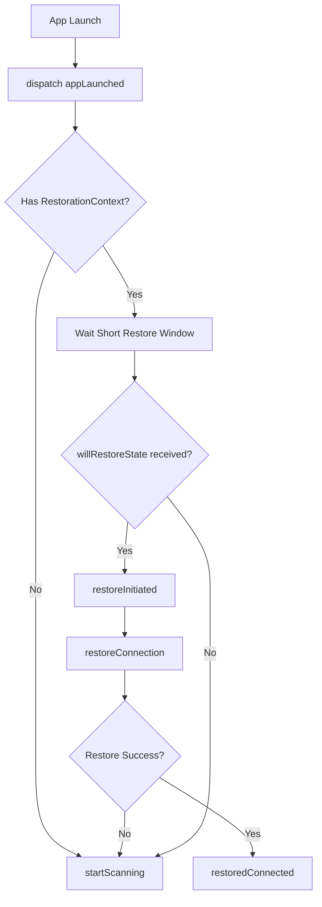
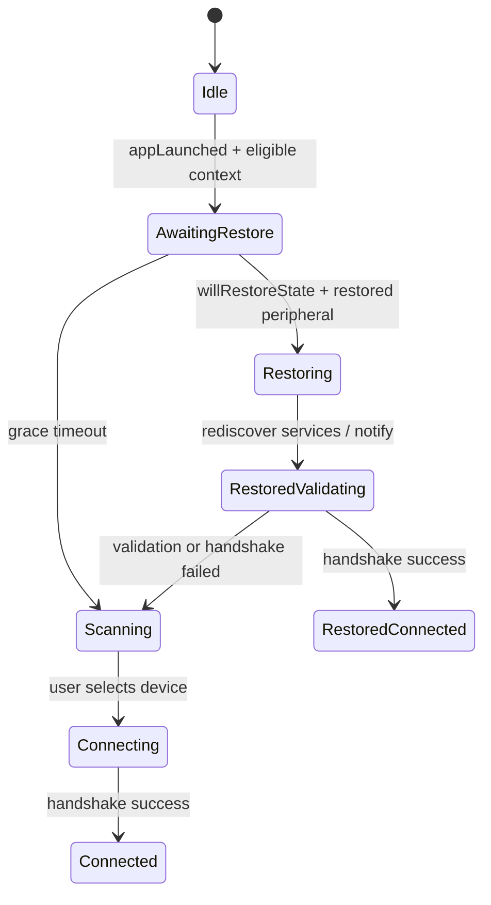

# Restoration Eligibility Gate 设计与实施说明

## 1. 背景

当前 App 在启动阶段已经接入 CoreBluetooth state restoration，但用户首屏仍可能短暂看到 `restoring` / `restored` 一类状态。这种实现从 BLE 能力上是合理的，但从用户体验与启动状态机设计看，存在明显缺口：

- 首次启动不具备任何成功连接历史，却仍可能进入恢复相关分支的判断路径
- `RootView` 启动即无条件触发扫描，恢复与扫描会在启动期竞争
- `restoring` 直接作为用户可见状态暴露，内部协商态与用户语义态没有分层
- 恢复校验依赖内存态 `AppState.device`，冷启动时该上下文天然不稳定
- `willEnterForeground` 与 `restoreInitiated` 可能交错，导致 lifecycle 语义抖动

因此，本次改造不采用“首次启动加一个 if 判断”的补丁方案，而采用 **Restoration Eligibility Gate** 最佳实践：只有在系统提供了可恢复 peripheral，且 App 自身确实持久化过可恢复上下文时，才进入恢复流程。

---

## 2. 当前设计中的问题

### 2.1 恢复资格没有显式建模

当前恢复链路只有系统侧条件：

- `CBCentralManagerOptionRestoreIdentifierKey`
- `centralManager(_:willRestoreState:)`

但没有 App 侧的恢复资格条件。结果就是：

- 第一次启动和第 N 次启动都走同一套判断路径
- 冷启动恢复时缺少稳定的设备身份上下文

### 2.2 启动扫描与恢复并发竞争

当前 `RootView.onAppear` 无条件 dispatch `.startScanning`。这会带来两个问题：

1. 若系统刚好回调恢复外设，扫描会覆盖首屏连接状态
2. 若恢复失败，用户很难区分是“恢复失败回退扫描”还是“启动就开始扫描”

### 2.3 内部恢复态直接暴露给用户

`ConnectionState.restored` 与 `restoredValidating` 是内部协议恢复过程中的中间态。它们对开发者有价值，但不一定应直接成为用户首屏的显著状态文案。

### 2.4 恢复校验上下文来源错误

当前恢复校验主要依赖 `store.state.device`。这个值只适合前台活跃会话，不适合作为冷启动恢复的权威身份来源。冷启动时，持久化上下文才是正确边界。

### 2.5 lifecycle 状态机存在覆盖风险

如果 `willEnterForeground` 在恢复初始化期触发，`lifecycle` 可能被过早推回 `.active`，使 `restoring` 只剩极短可见窗口，导致状态语义不稳定。

---

## 3. 设计目标

本次改造目标分成五条：

1. 首次启动天然不进入恢复流程
2. 恢复流程必须同时满足“系统恢复对象 + 本地恢复资格”
3. 启动期恢复与扫描互斥，避免竞争
4. 用户可见状态从内部状态解耦，降低启动期抖动
5. 恢复链路具备可测试、可替换、可文档化的边界

非目标：

- 不改变 CoreBluetooth restoration 的基础接线方式
- 不引入新的数据库依赖，恢复资格仅使用轻量持久化
- 不修改协议文档 `docs/03-ble-gatt-protocol.md`，因为本次不涉及协议契约变化

---

## 4. 最佳实践方案

### 4.1 恢复资格门控

新增 `RestorationContext` 与 `RestorationContextStore`：

- `RestorationContext`
  - `peripheralIdentifier`
  - `model`
  - `protocolVersion`
  - `capabilities`
  - `lastSuccessfulHandshakeAt`
- `RestorationContextStore`
  - `load()`
  - `save(_:)`
  - `clear()`

恢复资格定义：

- 系统必须通过 `willRestoreState` 提供 peripheral
- App 本地必须能读取到上一次成功握手后写入的 `RestorationContext`

任一条件不满足：

- 不进入 `.restoreInitiated`
- 不进入用户可见的恢复文案
- 直接回落到普通扫描路径

### 4.2 启动协调

新增启动动作 `.appLaunched`，由 `ConnectionMiddleware` 统一编排启动期逻辑：

- 无恢复资格：
  - 立即启动扫描
- 有恢复资格：
  - 进入一个很短的恢复等待窗口
  - 如果窗口内收到系统恢复对象，则开始恢复
  - 如果窗口内没有恢复对象，则自动回落扫描

这样可以避免 `RootView` 直接把“启动扫描”写死在 UI 层。

### 4.3 恢复与扫描互斥

规则：

- 恢复等待期间，自动扫描不立即触发
- 恢复进行期间，`startScanning` 不应覆盖恢复态
- 用户手动触发扫描时，可以取消等待中的自动恢复回退任务

### 4.4 恢复上下文持久化边界

恢复资格只在“成功握手”之后写入。换句话说：

- 首次安装后第一次启动：没有上下文，不恢复
- 曾成功连接过设备后：具备恢复资格
- 后续冷启动：只有系统真的给出恢复 peripheral 时才恢复

### 4.5 用户体验策略

内部状态仍保留：

- `restored`
- `restoredValidating`
- `restoredConnected`

但用户文案改为更接近业务语义：

- `restored` -> `Restoring Previous Device...`
- `restoredValidating` -> `Validating Previous Device...`
- `restoredConnected` -> `Connected`

用户关心的是“我是否已恢复到可用连接”，不是“当前正处于 CoreBluetooth 中间态”。

---

## 5. 流程描述

### 5.1 启动时序

### 5.2 恢复主链路

---

## 6. 模块化实施计划

### 模块 1：恢复资格存储

- 预计时间：0.5h - 1h
- 位置：
  - `Sources/HRSenseCore/Entities/RestorationContext.swift`
  - `Sources/HRSenseCore/Repositories/RestorationContextStore.swift`
  - `Sources/HRSenseData/Repositories/UserDefaultsRestorationContextStore.swift`
- 目标：
  - 建立恢复资格的数据边界
  - 让首次启动天然没有恢复资格

### 模块 2：恢复流程重构

- 预计时间：1h - 1.5h
- 位置：
  - `Sources/HRSenseData/Repositories/DeviceRepositoryImpl.swift`
  - `Sources/HRSenseFeature/Middleware/ConnectionMiddleware.swift`
- 目标：
  - 用 `RestorationContext` 替代内存态设备作为恢复校验依据
  - 建立恢复等待窗口与回退扫描机制
  - 保证恢复与扫描互斥

### 模块 3：UI 启动与状态呈现

- 预计时间：0.5h - 1h
- 位置：
  - `Sources/HRSenseFeature/Views/RootView.swift`
  - `Sources/HRSenseFeature/Reducer/AppReducer.swift`
- 目标：
  - 移除 `RootView` 启动即扫描
  - 改为 `.appLaunched` 统一驱动
  - 收敛恢复态文案，避免“首屏莫名 restoring”

### 模块 4：测试补齐

- 预计时间：1h - 1.5h
- 位置：
  - `Tests/HRSenseFeatureTests/ConnectionMiddlewareTests.swift`
  - `Tests/HRSenseFeatureTests/ReducerTests.swift`
  - 需要时补 `HRSenseDataTests`
- 目标：
  - 验证首次启动立即扫描
  - 验证有恢复资格但无恢复事件时自动回退扫描
  - 验证有恢复资格且收到恢复事件时执行恢复
  - 验证恢复失败后回退扫描

### 模块 5：文档同步与维护口径

- 预计时间：0.5h
- 位置：
  - 本文档
  - 必要时同步 `docs/gap-closure/m10-background-ble-restore-design.md`
- 目标：
  - 明确旧设计问题
  - 保证后续维护者理解“为什么不是 first-launch if 补丁”

---

## 7. 风险与权衡

### 7.1 为什么不只做 first-launch 开关

`firstLaunch == false` 只能解决第一次启动，不解决：

- 第 N 次启动的状态抖动
- 恢复与扫描竞争
- 冷启动恢复上下文不稳定

因此它不是架构性修复。

### 7.2 为什么用 UserDefaults

恢复资格属于轻量启动配置，不是业务实体：

- 读写频率低
- 数据结构小
- 启动阶段必须低成本读取

因此 `UserDefaults` 比 `SwiftData` 更合适。

### 7.3 为什么恢复成功后仍然显示 Connected

恢复成功后的用户目标态和普通连接成功是同一件事：设备已可用。保留内部 `restoredConnected` 对日志、测试和故障定位有帮助，但不需要把这种差异继续放大给用户。

---

## 8. 实施结论

本方案应实施。

原因不是“第一次启动体验差”这么简单，而是当前启动恢复设计存在三个结构性问题：

1. 没有恢复资格门控
2. 启动扫描与恢复竞争
3. 内部恢复态直接暴露为用户体验

`Restoration Eligibility Gate` 通过增加持久化恢复资格、统一启动协调与回退扫描策略，使系统恢复能力与用户体验同时成立。
