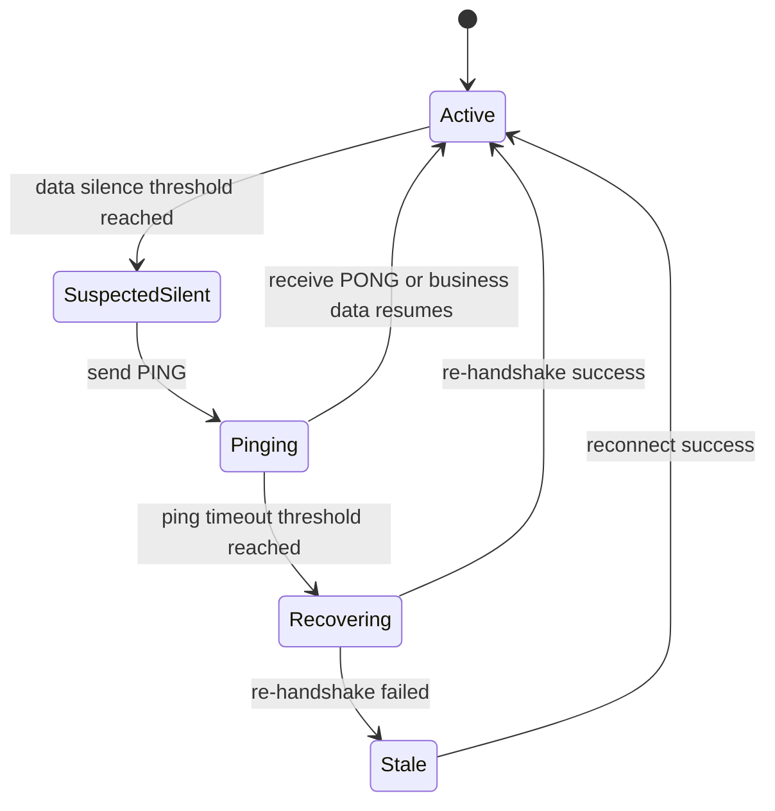

# 会话保活与心跳机制设计方案

## 1. 背景

当前项目已经实现：

- BLE 连接建立与断开重连
- `HELLO -> HELLO_ACK -> START_STREAM` 握手链路
- 命令超时处理
- CoreBluetooth state restoration

但当前没有独立的应用层保活机制：

- 没有 `PING/PONG`
- 没有 `HEARTBEAT/HEARTBEAT_ACK`
- 没有静默流 watchdog
- 没有“连接未断但数据流已死”的主动探测

这意味着现阶段系统主要依赖以下三类信号判断链路是否失效：

1. CoreBluetooth 断连事件
2. 命令写入后的超时
3. 恢复失败后的重连/回退扫描

这套方案在“持续高频有流量”的实时心率展示场景下可以工作，但在健康监测产品进入后台、低频采样、夜间长时监测、设备固件异常静默等场景时，存在明显盲区。

---

## 2. 当前方案的问题

### 2.1 旧方案的问题

- 只要设备持续推流，系统看起来“像是活着”，但一旦设备固件进入静默异常，App 不一定能及时感知
- 连接状态和数据流状态没有分层建模，当前更像“transport connected”，而不是“session alive”
- 后台采集场景中，系统不会因为业务语义上的静默而主动帮助 App 恢复
- 健康场景通常关注连续性和完整性，仅靠断连事件不足以作为医疗级或准医疗级链路质量保障

### 2.2 为什么这在健康场景更重要

不同健康任务对“保活”的需求强度不同：

| 场景 | 是否建议加心跳 | 原因 |
| --- | --- | --- |
| 前台实时心率展示 | 可选 | 数据高频持续，流本身就是天然保活 |
| 后台短时运动监测 | 建议 | 需要尽快发现数据静默和会话失活 |
| 夜间睡眠监测 | 必须 | 会话持续时间长，异常静默难靠用户感知 |
| 神经/自主神经长期监测 | 必须 | 更依赖稳定窗口与连续样本完整性 |
| OTA | 不建议复用该心跳 | OTA 应使用专用窗口 ACK/进度超时机制 |

结论不是“所有场景都必须加心跳”，而是：

- **实时连续流前台场景**可以先不加独立心跳
- **后台、低频、长时监测场景**必须补齐会话存活机制

---

## 3. 设计目标

1. 区分“BLE 已连接”和“业务会话仍然活着”
2. 在不破坏现有协议主链的前提下增量补齐 liveness
3. 对前台高频流量场景不引入不必要开销
4. 对后台/长时监测场景提供明确的探活和恢复策略
5. 让指标层可以度量静默超时、探活失败、自动恢复次数

非目标：

- 不把心跳机制塞进 OTA 数据通道
- 不把 GATT/L2 transport 行为改成“每包 ACK”
- 不让 Feature 层直接感知底层探活细节

---

## 4. 方案结论

## 4.1 是否需要增加心跳

需要，但不是“全时开启的粗暴心跳”，而是 **分层 liveness 机制**：

1. **前台高频数据流阶段**
   - 以数据流静默 watchdog 为主
   - 不强制发送额外 heartbeat
2. **后台或低频数据流阶段**
   - 启用轻量 `PING/PONG`
   - 或在无流量窗口后发送探活命令
3. **恢复/重连判定阶段**
   - 连续探活失败后，进入重新握手或重连

### 4.2 不建议直接复用“心率数据”当保活

原因：

- 心率数据属于业务数据，不是链路控制语义
- 业务数据可能被降频、聚合、暂停
- 睡眠和后台场景中，采样节奏可能主动变慢

因此应单独建模“会话活性”。

---

## 5. 放在哪一层加

### 5.1 协议层

在 `docs/03-ble-gatt-protocol.md` 与 `HRSenseProtocol` 中新增控制面命令：

- `PING`
- `PONG`

建议规则：

- `PING` 只走命令通道
- `PONG` 只做轻量回应，不携带大负载
- 可附带：
  - `sessionUptimeMs`
  - `lastSampleSeq`
  - `streamState`
  - `serverTimestampMs` 或 `deviceRelativeMs`

### 5.2 Data 层

在 `HRSenseData` 新增 `SessionLivenessCoordinator`，职责如下：

- 记录最近一次收到业务数据的时间
- 记录最近一次成功命令往返时间
- 判断是否进入静默窗口
- 触发 `PING`
- 等待 `PONG`
- 超时后上报 session unhealthy
- 触发重新握手或重连

### 5.3 Core 层

在 `HRSenseCore` 增加领域概念：

- `SessionLivenessState`
  - `active`
  - `suspectedSilent`
  - `pinging`
  - `stale`
  - `recovering`

并增加指标实体：

- `lastDataAt`
- `lastPingAt`
- `lastPongAt`
- `consecutiveLivenessFailures`

### 5.4 Feature 层

Feature 层不直接操作 ping/pong，只消费高层状态：

- `sessionHealthy`
- `sessionRecovering`
- `sessionStale`

UI 只体现为：

- “采集中”
- “连接恢复中”
- “数据流中断”

避免把协议细节泄漏到展示层。

---

## 6. 推荐触发策略

### 6.1 数据流静默 watchdog

优先于心跳命令，作为第一层判断：

- 前台实时模式：
  - 若 `3 x 预期采样周期` 未收到业务数据，标记 `suspectedSilent`
- 后台低频模式：
  - 若 `10-15s` 无业务数据，进入一次探活
- 夜间睡眠模式：
  - 以更长窗口判断，例如 `15-30s`

### 6.2 轻量探活 ping

仅在以下条件下触发：

1. 当前已完成握手
2. 当前无正在执行的重要命令
3. 最近一段时间没有业务数据到达
4. 当前不是 OTA 进行中

### 6.3 恢复动作分层

一次 `PING` 失败后不要立即断链：

1. 第一次失败：记录可疑静默
2. 第二次失败：执行重新握手
3. 连续失败：执行断开 + 指数退避重连

---

## 7. 流程描述

---

## 8. 模块化实施计划

### 模块 1：协议契约扩展

- 预计时间：0.5d
- 文件：
  - `docs/03-ble-gatt-protocol.md`
  - `Sources/HRSenseProtocol/...`
  - `Tests/HRSenseProtocolTests/...`
- 工作：
  - 新增 `PING/PONG` 命令定义
  - 明确 payload 与超时规则
  - 补黄金值编码/解码测试

### 模块 2：Data 层 liveness 协调器

- 预计时间：1d
- 文件：
  - `Sources/HRSenseData/BLE/...`
  - `Sources/HRSenseData/Repositories/DeviceRepositoryImpl.swift`
- 工作：
  - 新增静默 watchdog
  - 接入命令发送与超时
  - 统一恢复入口

### 模块 3：Core 状态与指标

- 预计时间：0.5d
- 文件：
  - `Sources/HRSenseCore/Entities/...`
  - `Sources/HRSenseData/MetricsCollector.swift`
- 工作：
  - 增加 session liveness 状态
  - 增加静默超时/探活失败指标

### 模块 4：Feature 呈现与中间件联动

- 预计时间：0.5d
- 文件：
  - `Sources/HRSenseFeature/...`
- 工作：
  - 把恢复态与数据静默态暴露给 UI
  - 保持 Reducer 纯净，只接状态动作

### 模块 5：Simulator 故障注入与回归验证

- 预计时间：0.5d
- 文件：
  - `Sources/HRSenseSimulatorKit/...`
  - `Scenarios/...`
  - `Tests/...`
- 工作：
  - 新增“连接不断但停止推流”场景
  - 新增“PONG 丢失/延迟”场景
  - 验证自动恢复行为

总计：`3.0d`

---

## 9. 改造收益

- 旧代码的问题从“只能看见断连”升级为“能看见会话级静默”
- 后台与睡眠长时场景更稳
- 为后续睡眠监测和神经监测打基础
- 指标和日志能更准确解释“为什么用户看到连接在，但数据没了”

---

## 10. 验收标准

- [ ] 前台连续流场景下，不因冗余 heartbeat 引入额外可见抖动
- [ ] 模拟“连接不断、数据静默”时，系统能在阈值内发现并恢复
- [ ] 后台短时运行场景中，能记录静默超时与恢复次数
- [ ] 睡眠长时场景中，断流后可进入重新握手或重连
- [ ] 诊断面板可展示 liveness 相关指标

---

## 11. 最终判断

当前项目**不需要为了前台实时心率展示而立即加入重型 heartbeat**，但**必须为后台采集、睡眠监测、神经监测补齐 session liveness 机制**。

正确做法不是“无脑加心跳包”，而是：

1. 先加静默 watchdog
2. 再加轻量 `PING/PONG`
3. 最后把失败处理接到重握手与重连状态机
