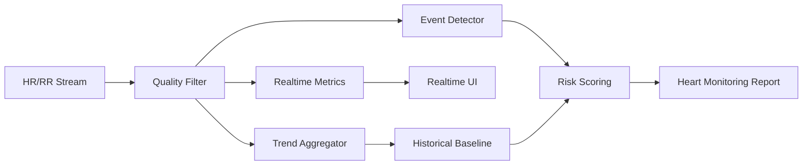

# 心率监测方向演进方案

## 1. 现状判断

心率监测是当前项目最成熟的主链：

- 模拟器可生成 HR/RR 数据
- App 已具备连接、握手、开始采样、接收流数据的主流程
- HRV 计算链已接线
- UI 与 Redux 主展示链已存在

但当前问题在于：主链能跑，不等于心率监测产品已经成型。

---

## 2. 旧方案的问题

- 更偏“协议演示 + 数据展示”，弱于“监测产品化”
- 缺告警、事件、基线、趋势和质量评分体系
- 丢包、静默、恢复等质量信息未充分进入用户语义
- 后台持续心率监测仍未形成完整验收

因此当前更接近“心率采集与实时显示平台”，而不是完整心率监测产品。

---

## 3. 目标定义

心率监测方向建议拆成四层：

1. **实时显示**
2. **趋势分析**
3. **事件检测**
4. **风险分层**

正确演进路径：`显示 -> 趋势 -> 事件 -> 风险`

---

## 4. 需要做的改动

### 4.1 数据质量层

- 为 HR/RR 增加质量评分
- 标记丢包、静默、恢复片段
- 标记异常区段是否可信

### 4.2 趋势层

- 增加静息心率趋势
- 增加恢复心率趋势
- 增加日/周视角统计

### 4.3 事件层

- 增加 tachy/brady 异常检测
- 增加 HRV 急剧波动事件
- 增加运动后恢复事件

### 4.4 结果层

- 形成心率状态卡
- 输出趋势摘要
- 输出质量提示和置信度

### 4.5 生态层

- 对接 HealthKit 历史心率与静息心率
- 支持长期基线对比

---

## 5. 推荐架构

---

## 6. 模块化实施计划

### 模块 1：质量评分与异常标记

- 预计时间：1d
- 工作：
  - 统计丢包和恢复片段
  - 增加 HR/RR 有效性评分
  - 给后续趋势和事件检测做输入过滤

### 模块 2：趋势聚合

- 预计时间：1d
- 工作：
  - 生成分钟、小时、天级趋势
  - 支持静息心率和恢复心率摘要

### 模块 3：事件检测

- 预计时间：1.5d
- 工作：
  - 基于阈值和波动规则增加事件检测器
  - 输出事件类型、持续时间、置信度

### 模块 4：长期基线

- 预计时间：1d
- 工作：
  - 接入 HealthKit 历史心率
  - 构建个人基线和偏离度

### 模块 5：UI 报告层

- 预计时间：1d
- 工作：
  - 增加趋势卡片
  - 增加事件列表
  - 增加质量说明

总计：`5.5d`

---

## 7. 风险与收益

### 风险

- 无多模态上下文时，事件解释力有限
- 缺后台闭环时，长时监测可信度受限

### 收益

- 心率路线最容易最快形成用户可感知价值
- 可作为睡眠和神经路线的底层数据底盘
- 最适合先做产品化打样

---

## 8. 验收标准

- [ ] 可展示质量评分后的实时心率
- [ ] 可输出日级趋势摘要
- [ ] 可标记常见异常事件
- [ ] 可关联长期个体基线
- [ ] 异常事件带来源与可信度说明

---

## 9. 最终判断

心率监测方向当前基础最好，应该优先从“显示链路”升级为“监测链路”，重点不是再堆一个模型，而是补齐：

1. 质量评分
2. 趋势聚合
3. 事件检测
4. 个体基线
