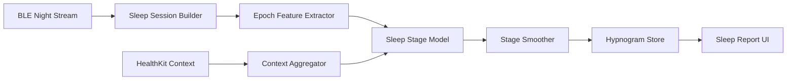

# 睡眠监测方向演进方案

## 1. 现状判断

当前项目已经具备睡眠路线的基础骨架：

- `SleepState`
- `SleepMiddleware`
- `SleepInferenceRepository`
- `SleepStageService`
- 睡眠相关 C++ 特征补充
- 持久化与展示入口的基础接线

但当前成熟度仍停留在“工程占位 + 回退规则 + 局部推理接线”，还不是可产品化的睡眠监测系统。

---

## 2. 旧方案的问题

- 睡眠模型仍偏占位，规则回退权重大
- 缺整夜场景下的窗口连续性保障
- 缺睡眠相关上下文，如活动、呼吸、血氧、体温趋势
- 缺正式的 hypnogram 结果闭环与质量评分
- 缺后台长时稳定采集的验收闭环

因此当前代码更适合称为“睡眠能力雏形”，不应对外表述为成熟睡眠监测。

---

## 3. 目标定义

睡眠方向建议拆成三个层次：

1. **睡眠检测**
   - 用户是否进入睡眠
2. **睡眠分期**
   - Wake / Light / Deep / REM
3. **睡眠质量分析**
   - 连续性、恢复度、波动、异常事件

正确顺序应为：`检测 -> 分期 -> 质量分析`

---

## 4. 需要做的改动

### 4.1 数据层

- 增加整夜 session 管理
- 对 HR、RR、活动、接触状态做夜间窗口聚合
- 加入缺失窗口标记
- 支持后台必要摘要持续入库

### 4.2 计算层

- 强化长窗口特征
- 增加睡眠趋势特征
- 支持 epoch 级输出
- 支持整夜回放复算

### 4.3 推理层

- 从占位模型升级到分期模型
- 支持置信度和低置信度回退
- 支持后处理平滑

### 4.4 UI 层

- 增加 hypnogram
- 增加入睡时间、觉醒次数、深睡占比、睡眠效率
- 增加结果质量提示

### 4.5 数据来源扩展

- 接入 HealthKit 睡眠、活动、HRV、呼吸、血氧作为上下文
- 形成睡眠上下文特征缓存

---

## 5. 推荐产品结构

---

## 6. 模块化实施计划

### 模块 1：夜间会话管理

- 预计时间：1d
- 工作：
  - 定义 `SleepSession`
  - 定义夜间开始/结束规则
  - 标记缺失窗口与恢复片段

### 模块 2：睡眠特征工程

- 预计时间：1.5d
- 工作：
  - 增加 epoch 级特征
  - 增加趋势特征
  - 与 C++ 特征契约对齐

### 模块 3：睡眠模型升级

- 预计时间：2d
- 工作：
  - 落睡眠分期模型
  - 增加置信度阈值
  - 增加平滑和后处理

### 模块 4：后台与恢复保障

- 预计时间：1d
- 工作：
  - 接后台采集策略
  - 接 session liveness
  - 保证夜间长时窗口连续性

### 模块 5：结果展示与报告

- 预计时间：1d
- 工作：
  - hypnogram
  - 睡眠摘要卡片
  - 夜间异常段标记

### 模块 6：HealthKit 上下文增强

- 预计时间：1d
- 工作：
  - 导入睡眠和活动历史
  - 形成个体化上下文特征

总计：`7.5d`

---

## 7. 风险与收益

### 风险

- 没有活动/体动信息时，睡眠分期上限有限
- 单纯 HRV 对 REM/Light/Deep 的区分度可能不足
- 后台长时采集是硬前置

### 收益

- 睡眠是最适合拉开长期用户价值的方向
- 与 HealthKit 和后台能力耦合度高，形成生态壁垒
- 可沉淀个体基线和长期恢复画像

---

## 8. 验收标准

- [ ] 整夜回放可稳定产出 hypnogram
- [ ] 断流与恢复段可被识别和标记
- [ ] 睡眠摘要可落库并展示
- [ ] 无 HealthKit 时仍可运行基础睡眠检测
- [ ] 有 HealthKit 时上下文特征可提升模型输入完整性

---

## 9. 最终判断

睡眠方向应作为项目中长期价值最高的路线之一，但其成立前提不是“再加一个模型”，而是同时补齐：

1. 后台长时采集
2. session liveness
3. 夜间窗口持久化
4. 上下文增强特征
