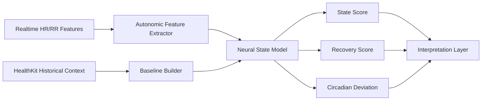

# 神经监测方向演进方案

## 1. 现状判断

当前项目并没有一个显式命名为“神经监测”的成熟子系统，但已经具备可复用基础：

- HRV 特征提取
- CoreML 推理链
- 睡眠分期骨架
- 后台 BLE 与恢复骨架

如果把“神经监测”定义为自主神经、压力、恢复状态、唤醒负荷、节律异常这类神经生理近似指标，那么当前项目已经有入口，但还没有产品化方案。

---

## 2. 旧方案的问题

- 现有推理更偏 stress placeholder，不足以承载神经监测叙事
- 缺明确的神经特征体系和结果解释层
- 缺个体基线与昼夜节律上下文
- 缺事件前后窗口与连续性要求
- 缺风险分层和质量审计

因此“神经监测”如果直接上线，会出现概念过大、证据不足、解释无力的问题。

---

## 3. 目标定义

神经监测方向应聚焦于 **自主神经状态估计**，而不是泛化为不可解释的黑盒。

建议拆成三层：

1. **状态估计**
   - 压力、恢复、负荷
2. **节律分析**
   - 昼夜节律、睡眠后恢复、应激后恢复
3. **事件检测**
   - 异常应激、恢复不足、夜间觉醒负荷

---

## 4. 需要做的改动

### 4.1 特征层

- 强化 HRV、自主神经平衡、节律趋势特征
- 引入更长时窗上下文
- 标记活动干扰与睡眠干扰

### 4.2 模型层

- 从占位 stress classifier 升级到多任务模型
- 输出状态分数、风险等级、解释特征
- 支持个体化 baseline 校准

### 4.3 数据源层

- 接入 HealthKit 的 HRV、睡眠、呼吸、活动、静息心率
- 建立日内和跨天上下文缓存

### 4.4 产品解释层

- 结果文案必须可解释
- 不能只显示“高压力”
- 必须说明是由哪些变化导致

### 4.5 质量控制层

- 没有足够样本窗口时，不输出强结论
- 置信度低时退回“信息不足”

---

## 5. 推荐架构

---

## 6. 模块化实施计划

### 模块 1：神经监测特征契约

- 预计时间：1d
- 工作：
  - 扩 HRV 与节律特征
  - 定义状态输入与窗口要求

### 模块 2：个体基线构建

- 预计时间：1d
- 工作：
  - 引入 7 日或 14 日基线
  - 建立日内时段基线

### 模块 3：多任务模型

- 预计时间：2d
- 工作：
  - 设计 stress / recovery / load 多输出模型
  - 保留低置信度回退

### 模块 4：解释层

- 预计时间：1d
- 工作：
  - 输出触发因子
  - 输出偏离基线的原因摘要

### 模块 5：事件与报告层

- 预计时间：1d
- 工作：
  - 记录异常负荷事件
  - 记录恢复不足事件
  - 形成日报和夜报

总计：`6.0d`

---

## 7. 风险与收益

### 风险

- “神经监测”概念过大，容易超出当前数据能力
- 仅凭 HRV 推断神经状态，解释责任较重
- 若无长期上下文，个体化准确性有限

### 收益

- 最有潜力形成差异化智能能力
- 可与睡眠和心率路线形成高阶整合
- 可沉淀长期恢复和应激画像

---

## 8. 验收标准

- [ ] 模型输出不再只有单一 stress 占位标签
- [ ] 可输出状态、恢复、负荷三个层面的结果
- [ ] 每次输出带置信度和解释摘要
- [ ] 基线缺失时系统可安全降级
- [ ] 有长期上下文时结果可体现个体差异

---

## 9. 最终判断

神经监测方向不能作为一个纯营销词独立推进，必须被收敛为：

1. 自主神经状态估计
2. 长期基线偏离分析
3. 可解释的风险与恢复输出

它依赖心率路线的数据质量，也依赖睡眠路线的后台连续性，是最晚成熟但壁垒最高的方向。
