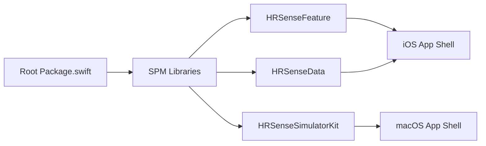

# 13 · 应用壳构建修复方案

> 状态：draft
> 范围：`HRSenseApp`、`HRSenseSimulator`、`Package.swift`、`Apps/`

## 1. 问题定义

当前仓库已经不再是“仅文档阶段”，但应用层组织方式仍停留在过渡态，导致两个直接问题：

1. `iOS` 端当前被放在根包的 `SPM executable target` 中，同时 `HRSenseFeature` 出现了对 `HRSenseData` 的反向依赖，破坏了 Clean Architecture 的单向依赖，最终把 `HRSenseComputeCxx` 依赖链错误拉入 UI 层，触发构建失败。
2. `macOS` 端虽然存在 `SwiftUI` 视图代码，但仍被当作包内 executable 使用，和仓库文档约定的“薄 App 壳 + 本地包”不一致。结果是模拟器逻辑存在，但窗口化应用形态、权限配置、资源管理、发布路径都不稳定。

## 2. 旧实现的问题

### 2.1 架构问题

- `HRSenseFeature` 直接 `import HRSenseData`，违反 `Feature -> Core <- Data` 的依赖倒置规则。
- App 入口、依赖组装、UI 壳、领域逻辑全部混在 `Sources/` 下，导致“库代码”和“应用壳代码”边界模糊。
- `SPM executable` 与真实 `iOS/macOS App` 的职责混用，权限、`Info.plist`、entitlements、资源与运行形态无法明确归位。

### 2.2 工程问题

- `swift build` 对库模块有效，但对 Apple 平台 UI App 只解决“编译模块”，不等于完成“App 产物”构建。
- 当前目录结构与 `docs/08-project-structure.md` 描述不一致，后续协作容易误判真实入口。
- `macOS` 端 UI 看似存在，实际没有被组织成稳定的 App 壳，运行、调试、CI、权限校验都无法形成闭环。

## 3. 修复收益

- 恢复 `Feature` 层纯展示职责，切断 UI 对 `Data/ComputeCxx` 的传染式耦合。
- 明确“SPM 负责模块化复用逻辑，App 壳负责入口和权限”的边界。
- 为 `iOS` 真机/模拟器构建、`macOS` 窗口化运行、后续 BLE 权限与发布流程打下稳定基础。
- 让文档、目录结构、实际构建链重新对齐，降低维护成本。

## 4. 目标结构

```text
HRSense/
├── Package.swift
├── Sources/
│   ├── HRSenseProtocol/
│   ├── HRSenseCore/
│   ├── HRSenseComputeCxx/
│   ├── HRSenseCompute/
│   ├── HRSenseData/
│   ├── HRSenseFeature/
│   └── HRSenseSimulatorKit/
├── Apps/
│   ├── HRSenseApp/
│   │   ├── HRSenseApp.xcodeproj
│   │   └── HRSenseApp/
│   └── HRSenseSimulator/
│       ├── HRSenseSimulator.xcodeproj
│       └── HRSenseSimulator/
└── Tests/
```

## 5. 流程描述



流程说明：

- 根包只承载可复用模块，不再把 `iOS/macOS App` 当成长期运行形态。
- `iOS App Shell` 负责入口、依赖注入、`Info.plist`、后台模式和模拟器/真机构建。
- `macOS App Shell` 负责窗口 UI、蓝牙权限、headless 参数桥接和资源加载。

## 6. 分模块实施计划

| 模块 | 目标 | 预计时间 |
| --- | --- | --- |
| M1 架构止血 | 移除 `Feature -> Data` 直接依赖，恢复 `swift build --product HRSenseApp` | 0.5h |
| M2 App 壳迁移 | 将 `HRSenseApp` / `HRSenseSimulator` 从 `Sources/` 迁移到 `Apps/` | 1.5h |
| M3 权限与配置 | 补齐 `Info.plist`、entitlements、蓝牙描述、模拟器/真机 destination 配置 | 1.0h |
| M4 构建脚本 | 明确 `swift build/test` 与 `xcodebuild` 的边界，补充验证命令 | 0.5h |
| M5 清理收尾 | 删除过渡期 executable 声明，更新 README / 结构文档 / CI | 0.5h |

## 7. 迁移方案

### 第一步：立即修复

- 删除 `HRSenseFeature` 中对 `HRSenseData` 的直接导入。
- 保持当前仓库可继续编译，先恢复核心模块联动。

### 第二步：应用壳拆分

- 在 `Apps/HRSenseApp/` 创建真正的 iOS App 工程。
- 在 `Apps/HRSenseSimulator/` 创建真正的 macOS App 工程。
- 两个工程都通过本地 Package 依赖仓库根包。

### 第三步：安全移除旧代码

- 移除 `Package.swift` 中的 `.executable(name: "HRSenseApp")` 与 `.executable(name: "HRSenseSimulator")`。
- 删除 `Sources/HRSenseApp/`、`Sources/HRSenseSimulator/` 里的过渡壳代码，避免双入口并存。

## 8. 构建与验证策略

### 模块构建

```bash
swift build
swift test
```

### iOS App 壳

```bash
xcodebuild -workspace HRSense.xcworkspace \
  -scheme HRSenseApp \
  -destination "platform=iOS Simulator,name=iPhone 17 Pro,OS=26.5" \
  build
```

### macOS App 壳

```bash
xcodebuild -workspace HRSense.xcworkspace \
  -scheme HRSenseSimulator \
  -destination "platform=macOS" \
  build
```

## 9. 删除策略

- 只保留一种入口形态：`Apps/` 下的真实 App 壳。
- 只保留一种依赖方向：`Feature -> Core <- Data`。
- 只保留一种运行职责划分：SPM 管库，App 壳管入口与权限。

## 10. 当前结论

- `iOS` 构建失败的直接根因是跨层依赖污染，不是 `SwiftUI` 语法问题。
- `macOS` “没有 UI”的根因是应用壳组织方式错误，不是没有视图文件。
- 当前修复先完成“止血”，后续必须完成 `Apps/` 迁移，才能从根上消除两端构建与运行形态问题。
