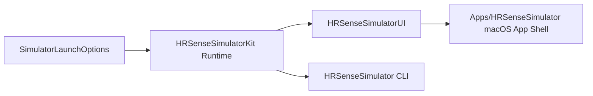

# 14 · Simulator 双入口迁移方案

> 状态：draft
> 范围：`HRSenseSimulatorKit`、`HRSenseSimulator`、`HRSenseSimulatorUI`、`Apps/HRSenseSimulator`

## 1. 问题定义

当前 `Simulator` 的实现把 `SwiftUI` 界面、headless 启动逻辑和临时可执行入口全部堆在 `Sources/HRSenseSimulator/` 下，导致三个问题：

1. 无法按标准 macOS App 形态运行窗口 UI。
2. `swift run HRSenseSimulator` 与图形界面共用一个入口，生命周期职责混乱。
3. 共享模拟逻辑无法被 “App 壳” 与 “CLI/headless” 干净复用。

## 2. 旧实现的问题

### 2.1 架构问题

- `@main`、视图、ViewModel、headless 参数解析全部混在同一个 target。
- UI 层直接承担运行编排职责，导致未来 `Apps/HRSenseSimulator` 无法直接复用。
- 现有 `SPM executable` 同时想扮演 GUI App 和 CLI 工具，职责边界错误。

### 2.2 工程问题

- `swift run` 适合 CLI/headless，不适合作为标准 macOS 窗口 App 的最终运行方式。
- 没有统一的启动参数模型，UI 与 CLI 后续很难保持一致行为。
- 没有 `Apps/HRSenseSimulator` 壳代码和配置文件，后续 `Info.plist` / entitlements / 权限无法归位。

## 3. 重构收益

- 保留两种运行方式：`CLI/headless` 与 `macOS UI`。
- 共享启动参数和运行时编排逻辑，避免双入口漂移。
- 为后续真实 `App Shell` 工程创建与 `xcodebuild` 验证打下基础。
- 明确“Kit 负责核心模拟逻辑，UI 负责展示，CLI 负责脚本化入口”的边界。

## 4. 目标结构

```text
HRSense/
├── Sources/
│   ├── HRSenseSimulatorKit/       # Shared simulator runtime / options
│   ├── HRSenseSimulatorUI/        # SwiftUI dashboard + ViewModel
│   └── HRSenseSimulator/          # CLI / headless executable
├── Apps/
│   └── HRSenseSimulator/
│       └── HRSenseSimulator/      # macOS App shell source + plist + entitlements
└── Tests/
    └── HRSenseSimulatorKitTests/  # Launch option parsing tests
```

## 5. 流程描述



流程说明：

- 所有启动参数先归一到 `SimulatorLaunchOptions`。
- `HRSenseSimulatorKit` 提供 headless 运行时与共享状态编排。
- `HRSenseSimulatorUI` 提供 SwiftUI 仪表盘和 ViewModel。
- `Apps/HRSenseSimulator` 只负责真正的 macOS App 壳。
- `HRSenseSimulator` executable 继续保留为 CLI/headless 入口。

## 6. 分模块实施计划

| 模块 | 目标 | 预计时间 |
| --- | --- | --- |
| M1 启动参数统一 | 增加 `SimulatorLaunchOptions`，统一 UI / CLI 参数语义 | 0.5h |
| M2 Headless runtime | 抽出 `SimulatorHeadlessRunner`，让 CLI 不再依赖 UI 层 | 0.5h |
| M3 UI 模块拆分 | 新建 `HRSenseSimulatorUI`，承载视图与 ViewModel | 1.0h |
| M4 App 壳源码落位 | 在 `Apps/HRSenseSimulator` 放入 `App` 源码、`Info.plist`、entitlements | 0.5h |
| M5 删除旧耦合 | 将 `Sources/HRSenseSimulator` 收敛为纯 CLI 入口 | 0.5h |

## 7. 迁移策略

### 第一步：保留命令行路径

- `swift run HRSenseSimulator` 继续存在，但职责收敛为 CLI/headless。
- 默认支持 `--headless`、`--scenario`、`--mode` 等参数。

### 第二步：拆出 UI 模块

- 将现有 SwiftUI 页面和 ViewModel 移入 `HRSenseSimulatorUI`。
- 让 UI 只依赖 `Kit` 暴露的状态与编排能力。

### 第三步：落盘 App 壳

- 在 `Apps/HRSenseSimulator` 中放入 macOS App 壳源码和配置文件。
- 当前阶段先完成壳代码与配置归位，后续再接入真实 `.xcodeproj`。

## 8. 验证策略

### CLI / SPM

```bash
swift build --product HRSenseSimulator
swift run HRSenseSimulator --headless
swift test
```

### UI 模块

```bash
swift build
```

### 后续 App 壳

```bash
xcodebuild -project Apps/HRSenseSimulator/HRSenseSimulator.xcodeproj \
  -scheme HRSenseSimulator \
  -destination "platform=macOS" \
  build
```

## 9. 删除策略

- 删除旧的 `Sources/HRSenseSimulator/SimulatorApp.swift`、`ContentView.swift`、`SimulatorViewModel.swift`。
- CLI 入口只保留 `main.swift`。
- UI 相关代码只保留在 `HRSenseSimulatorUI` 与 `Apps/HRSenseSimulator`。

## 10. 当前阶段目标

- 先把双入口内核拆干净并保持 `swift run` 可用。
- 再把 `Apps/HRSenseSimulator` 壳代码放到正确目录。
- 最终再补齐真实工程文件与 `xcodebuild` 验证链。
