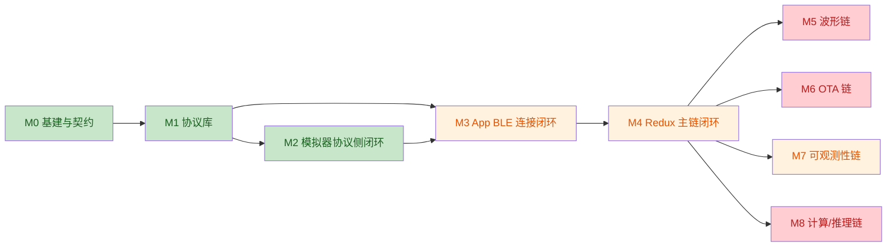
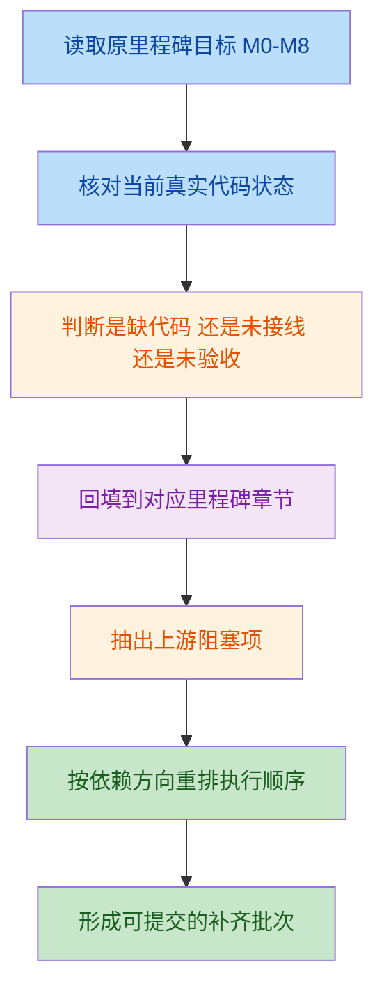

# 15 · M0-M8 当前口径对齐与补齐策略

> 状态：draft
> 范围：`M0` ~ `M8`
> 目的：将“当前真实实现状态”与“`docs/plans` 既定目标”对齐成一份后续执行标杆文档，避免继续在旧口径、当前代码、实际依赖三者之间反复切换。

## 1. 问题定义

当前仓库已经明显超出最初的空骨架阶段，形成了以下现实状态：

1. `Apps/` 下已经存在真实的 `iOS/macOS` App 壳。
2. `Sources/` 下已经存在 `Protocol/Core/Data/Feature/Simulator/Compute` 等多模块实现。
3. `M0-M8` 的大量能力已经不是“没有代码”，而是“有局部实现，但未按计划闭环”。
4. 后续如果继续只按原 `M1/M2/M3...` 文档逐节补，会混淆“文档顺序”和“实际依赖顺序”。

所以，当前需要的不是再写一版 `M0-M8` 计划，而是写一份**对齐口径文档**，解决三个问题：

- 当前到底做到哪里了。
- 哪些是“已有实现但未闭环”。
- 后续应该按什么顺序补，才能避免在下游里程碑上反复返工。

## 2. 旧口径的问题

### 2.1 只按里程碑顺序阅读，不足以指导当前补齐

- `M5/M6/M7/M8` 在文档中分节清楚，但它们都硬依赖 `M4`。
- 当前仓库中的很多偏差，不是某一节内部的小问题，而是**上游链路没有闭环，导致下游功能虽然有代码却无法进入主运行链**。
- 例如 `WaveformMiddleware`、`OTAMiddleware`、`InferenceMiddleware` 已经存在文件，但并未进入主 App 组装链。

### 2.2 只按模块拆，也会丢失里程碑验收边界

- 如果完全按 `BLE/Data/Feature/Compute/Simulator` 模块拆，虽然利于开发，但会弱化 `M3/M4/M5...` 的验收口径。
- 这样会让“本轮到底补到了哪个 milestone 的完成定义”变得模糊，不利于后续阶段性提交和回溯。

### 2.3 当前最缺的是“依赖方向视角下的补齐标杆”

- 当前不是重新设计项目。
- 当前是基于现有代码，按既定依赖链把缺失闭环补齐。
- 因此最优文档结构应当是：
  - **外层按 milestone 管理**
  - **内层按依赖方向执行**

## 3. 我的判断

你的想法是对的，但需要稍微收敛成更稳定的口径：

- **对外管理口径**：继续按 `M1/M2/M3...` 作为章节和验收单位。
- **对内执行口径**：严格按依赖方向推进，而不是按文档编号机械并行。

也就是说，不建议这份文档纯写成“模块清单”，也不建议继续只写成“里程碑复述”。

最稳的方式是：

1. 用 `M0-M8` 作为顶层索引。
2. 每个 milestone 下明确：
   - 当前状态
   - 未对齐项
   - 阻塞它的上游依赖
   - 补齐动作
   - 进入下一阶段的 gate
3. 最后再给一份**按依赖方向重排的执行顺序**。

这个结构兼顾两件事：

- 便于后续补文档时仍按 `M1/M2/...` 管理。
- 便于真正编码时不跑偏，始终先补上游闭环，再补下游能力。

## 4. 当前推荐口径

### 4.1 顶层管理维度：仍按 M0-M8

这是因为：

- 原 `docs/plans` 已经按 milestone 编排。
- `docs/11-delivery-plan.md` 的验收标准也是按 milestone 写的。
- 后续提交、回顾、验收、打勾都应继续使用 milestone 语言。

### 4.2 实际执行维度：按依赖方向推进

当前 `M0-M8` 的真实依赖应当收敛成如下顺序：

这张图表达的核心不是“谁先写文档”，而是“谁先补闭环”。

## 5. 流程描述

流程说明：

- 第一步，不改原计划，把原计划当目标基线。
- 第二步，只看当前磁盘真实实现，不再按旧假设判断。
- 第三步，把问题分成三类：缺代码、未接线、未验收。
- 第四步，把问题归属回 `M0-M8`。
- 第五步，不按章节顺序直接开工，而是把阻塞下游的上游项提前。
- 第六步，每次只交付一个可验证的补齐批次。

## 6. M0-M8 当前状态与补齐判断

### M0

- **当前判断**：基本对齐。
- **状态说明**：根包、测试、CI、App 壳、模块结构都已落地。
- **是否阻塞下游**：否。
- **当前动作**：不再作为主要施工对象。

### M1

- **当前判断**：主体对齐。
- **已具备**：
  - `HRSenseProtocol` 编解码与 CRC 测试。
  - 协议往返属性测试。
- **未完全对齐**：
  - 覆盖率门槛没有仓库内证据。
  - 日志模块与原计划中的独立门面口径存在偏移。
- **是否阻塞下游**：低。
- **当前动作**：只做补证据，不优先重构。

### M2

- **当前判断**：功能大体对齐。
- **已具备**：
  - macOS App 壳
  - CLI / headless
  - 场景引擎
  - 故障注入
- **未完全对齐**：
  - 手工联调验收留痕不足。
- **是否阻塞下游**：低。
- **当前动作**：不作为主阻塞，除非 `M3` 继续暴露设备侧问题。

### M3

- **当前判断**：扫描 → 发现 → 连接入口 → 握手完成状态推进已补齐，但真机联调与重连运行时证据仍不足。
- **核心缺口**：
  - `AppState` 与 `RootView` 现已具备 discovered device 列表和显式连接入口，但仍缺真实 iPhone + simulator 的手工验收记录。
  - `DeviceRepositoryImpl` 现已在 `START_STREAM` 成功后推进 `.connected`，`BLEStreamMiddleware` / `WaveformMiddleware` 可因此启动，但尚未形成自动化 BLE E2E。
  - 重连策略已有指数退避骨架与单元测试，但仍缺运行时断链验证证据。
- **是否阻塞下游**：高。
- **当前动作**：继续以真机联调验证为主，确认 `M3` 主闭环真实可用。

### M4

- **当前判断**：主链骨架已接通，且连接入口现在可被 UI 直接触发；真实性能与设备侧联调证据仍受 `M3` 约束。
- **核心缺口**：
  - Middleware 已接入主 App，且连接状态、发现设备列表、HR / inference / waveform 基础展示都可通过 Store 驱动，但缺真实 BLE 协议闭环下的 E2E 证据。
  - `RootView` 目前仍是最小调试型 UI，而非最终产品态交互。
  - 目前“主链可运行”的证据增加到了 reducer / middleware / data 层测试，但设备侧联调仍需真实运行时验证。
- **是否阻塞下游**：高。
- **当前动作**：紧跟 `M3` 后补齐。

### M5

- **当前判断**：波形生产路径已接通，但真实 BLE E2E 仍缺自动化验证。
- **核心缺口**：
  - `BLECentralDataSource` 现在已将 `.waveform(let block)` 转为 `WaveformSample` 并写入 `WaveformRingBuffer`，但仍未形成真机/模拟器 BLE 的自动化 E2E。
  - `DeviceRepository` 仍只有 `heartRateStream` 边界，没有单独 `waveformStream` 抽象；当前采用的是 data source 直写 ring buffer 的最短闭环方案。
  - `WaveformMiddleware` 已有 fake buffer 测试，`HRSenseDataTests` 也已补 block→buffer 生产路径测试，但“设备 notify -> UI 渲染”仍缺系统级自动化。
- **是否阻塞下游**：中。
- **当前动作**：必须在 `M4` 闭环后再补。

### M6

- **当前判断**：设备侧与 App 侧都未形成可靠闭环。
- **核心缺口**：
  - 模拟器 OTA 数据通道未真正进入 OTA 状态机。
  - App 侧窗口 ACK / 重传仍是占位实现。
  - `OTAMiddleware` 未编排进 Redux 主链。
- **是否阻塞下游**：中。
- **当前动作**：必须在 `M4` 后补，但优先级可与 `M5` 并排。

### M7

- **当前判断**：基础接线已明显改善，但诊断产物仍未闭环。
- **核心缺口**：
  - `LoggingMiddleware` 已进入主 App，`MetricKitManager.shared` 也已有启动点，但这两项仍缺真实运行期留痕证据。
  - `DiagnosticPanelView.refreshMetrics()` 仍为空实现，没有真正读取 live `MetricsCollector`。
  - 诊断导出仍是 share sheet host 占位提示，未形成真实 diagnostic package 导出闭环。
- **是否阻塞下游**：中低。
- **当前动作**：可以穿插推进，但不应早于 `M3/M4` 主闭环。

### M8

- **当前判断**：计算 / 推理主链已接通，但真实输入链与严格回归证据仍不足。
- **核心缺口**：
  - 显式 `FeatureVector` 中间动作、`InferenceMiddleware`、模型资源接线和模型选择策略都已补齐，但缺少“设备真实数据 -> App -> CoreML -> UI”端到端证据。
  - 当前 CoreML 验证主要覆盖转换一致性、服务层加载、middleware 链和构建入包；尚未建立固定特征输入 -> 固定概率输出的严格 golden set。
  - 该链路当前依赖 `heartRateStream` 触发 HRV / feature / inference；如果 `M3` 的真实握手与流启动不稳定，M8 运行时仍会退化为测试层闭环。
- **是否阻塞下游**：中。
- **当前动作**：在 `M4` 后推进，且应晚于 `M3/M4` 主链修正。

## 7. 当前最合理的执行顺序

### 第一阶段：先补主链闭环

| 阶段 | 对应里程碑 | 目标 | 预计时间 |
| --- | --- | --- | --- |
| P1 | M3 | 打通连接、握手、重连、状态同步闭环 | 1.5d |
| P2 | M4 | 补全主 App middleware 接线与 middleware 测试 | 1.0d |

说明：

- 这两步不做完，`M5/M6/M7/M8` 都只能继续堆占位实现。

### 第二阶段：按依赖方向分叉补能力链

| 阶段 | 对应里程碑 | 目标 | 预计时间 |
| --- | --- | --- | --- |
| P3 | M5 | 波形设备入口、ring buffer 写入、Redux/UI 真链路打通 | 1.5d |
| P4 | M6 | OTA 数据通道、ACK/窗口重传、Redux 编排 | 2.0d |
| P5 | M7 | DiagnosticPanel live 刷新与导出闭环 | 1.0d |
| P6 | M8 | 真实设备输入链联调 + golden 输入输出回归 | 1.5d |

说明：

- 这四个阶段都依赖 `M4`，但不要求绝对串行。
- 其中 `M5` 与 `M6` 对 JD 价值更高，应优先。

### 第三阶段：回补证据链

| 阶段 | 对应里程碑 | 目标 | 预计时间 |
| --- | --- | --- | --- |
| P7 | M1/M2/M7/M8 | 补 coverage、联调记录、诊断包导出、黄金值对拍证据 | 0.5d~1.0d |

## 8. 文档使用规则

后续补充时，不建议直接改写 `00` 到 `08` 的原始文档结构，而应按下面规则使用：

1. **原始 milestone 文档**：继续保留，负责“目标与设计方案”。
2. **本文档**：负责“当前口径 + 差距判断 + 实际补齐顺序”。
3. **真正开始某一段施工时**：
   - 先在本文档更新状态。
   - 再回到对应的 `M3/M4/M5...` 文档细化实现动作。
4. **提交前**：
   - 用本文档确认是否跨越了不该提前触碰的下游依赖。

## 9. 直接结论

你的想法应当调整为以下准确表述：

- 不是“单纯按 `M1/M2` 顺序补”。
- 也不是“脱离 milestone，纯按模块补”。
- **正确做法是：以 milestone 作为管理口径，以依赖方向作为执行口径。**

具体到当前仓库，后续补充顺序应当固定为：

1. `M3`
2. `M4`
3. `M5 / M6 / M7 / M8`

其中：

- `M3/M4` 是主链闭环。
- `M5-M8` 是能力分叉闭环。
- 没有必要在 `M3/M4` 未补齐之前继续扩写下游能力。

## 10. 当前阶段目标

- 先用本文档统一“当前口径”。
- 后续所有补齐动作都先回到本文档确认依赖位置。
- 每次只做一个可验证批次，避免再次把 `M5-M8` 的下游占位实现堆到上游闭环之前。
