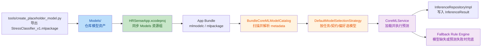
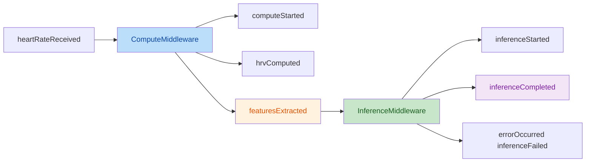

# M8 · CoreML 资源接线与运行时加载流程

## 文档目标

本文件说明 `Models/StressClassifier_v1.mlpackage` 从仓库产物到 iOS App 运行时可用模型的完整落地路径，覆盖：

- 旧实现存在的问题
- 本次接线后的模块职责
- Redux 显式动作链为何必须拆分
- 模型选择策略为何必须抽象
- 资源接入方式
- 运行时加载策略
- 当前如何验证模型输出符合预期
- 模块 / 功能 + 时间分解
- 后续替换真实模型时的维护入口

## 旧实现问题

在本次补齐前，M8 处于“模型已导出，但链路未闭环”的状态：

1. `tools/create_placeholder_model.py` 已能导出 `Models/StressClassifier_v1.mlpackage`，但 iOS App target 未正式纳入模型资源。
2. `CoreMLService` 只支持显式传入 `modelURL`，默认初始化不会自动去 bundle 中搜索模型。
3. `InferenceRepositoryImpl` 虽然默认创建 `CoreMLService()`，但由于服务层不自动加载模型，运行时会长期停留在 fallback。
4. 模型版本信息没有从 CoreML 元数据回传到 `InferenceResult.modelVersion`，导致诊断口径不完整。
5. `ComputeMiddleware` 直接触发推理，`featuresExtracted` 只是名义上的动作，Redux 主链缺少显式中间结果边界。
6. `CoreMLService` 同时承担模型发现、模型选择、模型加载和预测执行四种职责，多模型场景下会快速退化成硬编码。

## 本次实现收益

- 让 `HRSenseApp` 对 `Models/` 建立稳定资源引用，不再依赖手工拖拽文件。
- 让 `CoreMLService` 默认具备“显式 URL 优先、bundle 自动发现兜底”的运行时装配能力。
- 保留 fallback 规则推理，保证没有真实模型时链路仍可运行。
- 让 `InferenceResult` 输出真实的模型版本信息，便于后续观测、排障和替换真实模型。
- 让推理链路回到 `featuresExtracted -> InferenceMiddleware -> inferenceCompleted` 的显式 Redux 结构。
- 让模型选择从 `CoreMLService` 的硬编码查找升级为“模型目录 + 选择策略”两层抽象。

## 模块职责

| 模块 | 文件 | 职责 |
| --- | --- | --- |
| 模型导出层 | `tools/create_placeholder_model.py` | 生成占位 `.mlpackage`，写入模型元数据 |
| 模型资产层 | `Models/StressClassifier_v1.mlpackage` | 仓库内的模型产物，使用 Git LFS 管理 |
| App 资源接线层 | `Apps/HRSenseApp/HRSenseApp.xcodeproj/project.pbxproj` | 将根目录 `Models/` 同步纳入 `HRSenseApp` target 资源图 |
| 模型目录层 | `Sources/HRSenseCompute/CoreMLModelSelection.swift` | 发现 bundle 模型、解析 metadata、按任务/契约/偏好选择模型 |
| 运行时加载层 | `Sources/HRSenseCompute/CoreMLService.swift` | 接收选中的模型描述、加载 CoreML、执行预测、回退规则推理 |
| 业务接线层 | `Sources/HRSenseData/Repositories/InferenceRepositoryImpl.swift` | 调用 `CoreMLService` 并将版本信息写入 `InferenceResult` |
| 计算中间件 | `Sources/HRSenseFeature/Middleware/ComputeMiddleware.swift` | 只负责 RR 窗口、HRV 计算与 `featuresExtracted` 派发 |
| 推理中间件 | `Sources/HRSenseFeature/Middleware/InferenceMiddleware.swift` | 监听 `featuresExtracted`，触发推理并派发 `inferenceCompleted` |

## 设计原理

### 1. 为什么要补全 Redux 显式动作链

核心原则是：**所有可观测的业务中间结果，都必须以 Action + State 的形式显式存在，而不是藏在 Middleware 的局部闭包里。**

如果 `ComputeMiddleware` 直接调用推理仓库，会带来三个问题：

1. `FeatureVector` 无法进入 Store，诊断面板和测试无法观察到“到底推的是什么特征”。
2. `InferenceMiddleware` 失去存在意义，项目约定的“一类中间件只负责一类副作用”被破坏。
3. 后续要在特征和推理之间插入校验、标准化、模型路由时，只能继续把逻辑堆进 `ComputeMiddleware`。

因此，本次改动把主链固定为：

1. `heartRateReceived`
2. `computeStarted`
3. `hrvComputed`
4. `featuresExtracted`
5. `inferenceStarted`
6. `inferenceCompleted` / `errorOccurred(.inferenceFailed)`

这条链的价值不在“动作更多”，而在于边界更清晰：

- 计算层边界：到 `featuresExtracted` 为止
- 推理层边界：从 `featuresExtracted` 开始
- 诊断边界：`latestHRV`、`latestFeatures`、`latestResult` 都能直接进入状态树

### 2. 为什么要抽象模型选择策略

核心原则是：**模型选择属于策略问题，不属于预测执行问题。**

如果继续把模型名、任务名、版本偏好直接写死在 `CoreMLService`：

1. 一旦出现多个任务模型，如 `stress` / `sleep-stage`，服务层就会膨胀成多分支硬编码。
2. 一旦 `featureContractVersion` 升级，新旧模型并存时无法稳定选择兼容模型。
3. 业务层无法解释“为什么这次选中了这个模型”，诊断口径会断裂。

因此，本次拆成两层：

- `BundleCoreMLModelCatalog`
  - 扫描 bundle
  - 发现 `mlmodelc/mlpackage/mlmodel`
  - 解析 `task / modelVersion / featureContractVersion`
- `DefaultModelSelectionStrategy`
  - 按任务匹配
  - 按特征契约匹配
  - 按偏好模型名 / 版本优先级选择

这样 `CoreMLService` 回到单一职责：**加载已选模型并执行预测。**

## 流程描述

### 1. 构建期资源接线

`HRSenseApp.xcodeproj` 通过 `PBXFileSystemSynchronizedRootGroup` 引用根目录 `Models/`，并排除 `.gitkeep`：

- App target 不复制一份模型到源码目录。
- 仓库根目录下的 `Models/` 保持为单一真相来源。
- 后续替换模型时，只需要替换 `Models/StressClassifier_v1.mlpackage` 内容。

### 2. 运行时模型发现与选择

`CoreMLService` 的初始化遵循以下顺序：

1. 如果外部传入 `modelURL`，优先加载该 URL。
2. 如果未传入 URL，则由 `BundleCoreMLModelCatalog` 扫描 `Bundle.main`、`Bundle.allBundles`、`Bundle.allFrameworks`。
3. 扫描结果会解析模型 metadata：
   - `task`
   - `modelVersion`
   - `featureContractVersion`
4. `DefaultModelSelectionStrategy` 再按“任务 + 契约 + 偏好模型名 / 版本”选择一个模型。
5. 搜索同时兼容：
   - `mlmodelc`
   - `mlpackage`
   - `mlmodel`

### 3. Redux 显式动作链

运行时推理链现在固定为：

1. `heartRateReceived`
2. `ComputeMiddleware` 聚合 RR 窗口，满足步长后派发 `computeStarted`
3. `ComputeMiddleware` 完成 HRV 计算后派发 `hrvComputed`
4. `ComputeMiddleware` 生成 `FeatureVector` 后派发 `featuresExtracted`
5. `InferenceMiddleware` 监听 `featuresExtracted` 并派发 `inferenceStarted`
6. `InferenceMiddleware` 完成推理后派发 `inferenceCompleted`
7. 任一阶段失败时统一派发 `errorOccurred(AppError)`

### 4. 运行时预测与回退

模型成功加载后：

1. 校验输入向量必须为 14 维。
2. 构造 `MLMultiArray(Float32[14])`。
3. 调用 `model.prediction(from:)`。
4. 解析 `classLabel` 与 `classProbability`。
5. 从 CoreML 元数据中提取 `modelVersion`，回传到 `InferenceResult`。

模型加载失败或预测失败时：

1. 保留 14 维输入校验。
2. 使用规则推理作为 fallback：
   - `RMSSD` 偏低，或
   - `HR` 偏高
3. 输出 `Baseline/Stress` 概率，用于维持链路运行。
4. `modelVersion` 标记为 `fallback-rule-engine`。

## 运行链路图

## Redux 动作链图

## 当前验证口径

当前对“模型输出符合预期”的验证，分为四层：

1. **转换一致性验证**
   - `tools/create_placeholder_model.py` 在导出后，用 20 组样本对拍 Python 参考分类器与 CoreML 输出的 `classLabel`
2. **运行时单元测试**
   - `CoreMLServiceTests` 验证：
   - 缺失模型时 fallback 生效
   - 显式加载占位模型时可输出 `Baseline/Stress`
   - 特征维度错误会被拒绝
   - 默认选择策略会按任务 / 契约 / 偏好选择模型
3. **Redux 主链测试**
   - `ComputeMiddlewareTests` 验证 `computeStarted -> hrvComputed -> featuresExtracted`
   - `InferenceMiddlewareTests` 验证 `featuresExtracted -> inferenceStarted -> inferenceCompleted`
4. **构建产物验证**
   - 使用 `xcodebuild` 构建 `HRSenseApp`
   - 确认模型最终进入 `HRSenseApp.app/StressClassifier_v1.mlmodelc`

## 模块 / 功能 + 时间分解

| 模块 | 功能 | 预计时间 | 说明 |
| --- | --- | --- | --- |
| 资源接线层 | 将 `Models/` 纳入 iOS App target | 15 分钟 | 修改 `project.pbxproj`，排除 `.gitkeep` |
| 模型目录与选择层 | 增加模型发现与选择策略 | 30 分钟 | 解析 `task/modelVersion/featureContractVersion` |
| 运行时加载层 | 增加 bundle 自动搜索与多扩展名兼容 | 20 分钟 | 同时支持 `mlmodelc/mlpackage/mlmodel` |
| Redux 显式动作链 | 拆分计算与推理中间件职责 | 30 分钟 | 固定 `featuresExtracted -> InferenceMiddleware` 主链 |
| 推理回退层 | 统一失败回退为规则推理 | 10 分钟 | 保证 M8 端到端链路可运行 |
| 版本回传层 | 从模型 metadata 读取 `modelVersion` | 10 分钟 | 便于观测与诊断 |
| 验证层 | 单元测试 + iOS 构建验证 | 30 分钟 | 覆盖动作链、选择策略、显式加载、fallback |
| 文档层 | 补实施流程说明 | 15 分钟 | 供后续真实模型替换时复用 |

## 替换真实模型的维护流程

后续替换真实模型时，按以下顺序执行：

1. 保持输入契约不变：14 维 `Float32` 特征。
2. 导出新的 `.mlpackage`，并保留与当前一致的输入输出名称：
   - input: `features`
   - output: `classLabel`
   - output: `classProbability`
3. 更新模型 metadata：
   - `modelVersion`
   - `featureContractVersion`
   - `task`
4. 用新模型覆盖 `Models/StressClassifier_v1.mlpackage`。
5. 执行：
   - `swift test --filter HRSenseComputeTests`
   - `xcodebuild -workspace HRSense.xcworkspace -scheme HRSenseApp -destination 'platform=iOS Simulator,name=iPhone 17 Pro,OS=26.5' build`

## 风险与边界

- 当前已完成资源接线、运行时加载、Redux 显式动作链和基础模型选择策略，但尚未实现多任务模型并存下的 UI 侧切换入口。
- 当前选择策略仍是“本地 bundle 模型目录 + 默认优先级”，尚未接入远程下发或实验分流。
- 如果未来模型体积显著增大，仍需保留 Git LFS 或构建期下载策略，不能回退为普通 Git 文本管理。
