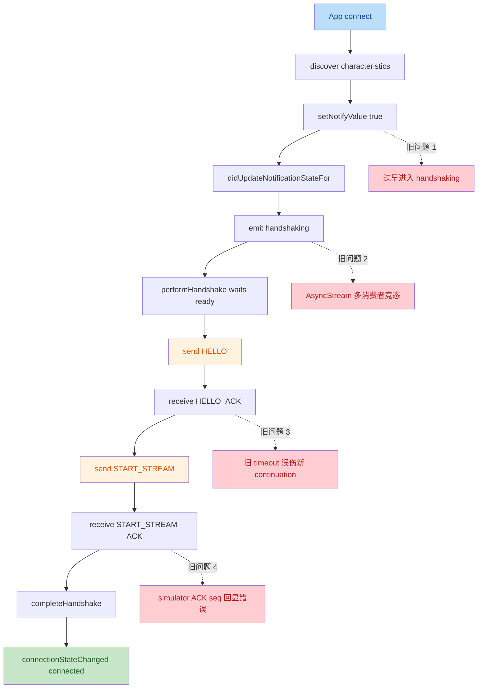

# 19 · M3 BLE 握手超时分层排查记录

> 状态：implemented
> 范围：iOS App 与 `HRSenseSimulator` 的 `HELLO -> HELLO_ACK -> START_STREAM -> ACK` 联调排障
> 目的：把本轮真实 BLE 联调中出现的握手超时问题固化为一份可复用的排查手册，避免后续重复踩坑。

## 1. 背景

在 `18-m3-ble-连接闭环补全方案.md` 完成后，iOS App 已经具备：

- 扫描 simulator 外设
- 显式点击连接
- 进入 `.handshaking`
- 发起 `HELLO`

但真实联调时，连接仍无法稳定进入 `.connected`，并持续出现握手阶段超时。该问题并非单点错误，而是由四层不同的时序/状态问题依次暴露出来。

本记录的核心价值不是“给一个修复结论”，而是把整条排查链收敛成一份可执行诊断路径。

## 2. 现象汇总

本轮联调中，先后出现过以下典型日志特征：

- `HANDSHAKE: sending HELLO`
- `errorOccurred(commandTimeout(opcode: 1))`
- `BLE notify subscription updated: isNotifying=true`
- `connectionStateChanged(handshaking)`
- `HANDSHAKE: received HELLO_ACK`
- `HANDSHAKE: sending START_STREAM`
- `TIMEOUT ignored for stale opcode=0x1 token=0`
- `errorOccurred(commandTimeout(opcode: 3))`

这些日志说明问题不是“根本没有连接上”，而是连接主链在多个阶段分别存在隐藏断点。

## 3. 排查流程描述



## 4. 分层根因

### 4.1 第一层：notify 订阅尚未真正建立，就提前开始握手

#### 现象

- App 端已经调用 `setNotifyValue(true, for:)`
- UI 进入 `.handshaking`
- simulator 收到了 `HELLO` 写入
- 但 App 收不到 `HELLO_ACK`

#### 根因

旧实现把“已经调用 `setNotifyValue(true)`”错误地当成“notify 通道已经可用”。  
实际上只有在 `didUpdateNotificationStateFor` 返回 `isNotifying == true` 后，central 才真正具备接收 notify 的条件。

#### 修复

- 在 `BLECentralDataSource` 内新增 `HandshakeReadinessGate`
- 只有满足以下三个条件才进入 `.handshaking`
- `notify characteristic` 已发现
- `write characteristic` 已发现
- `didUpdateNotificationStateFor` 返回 `isNotifying == true`

#### 相关文件

- `Sources/HRSenseData/BLE/BLECentralDataSource.swift`

### 4.2 第二层：`connectionStateStream` 被多处消费，握手协程错过 `.handshaking`

#### 现象

- UI 已经收到 `connectionStateChanged(handshaking)`
- 日志也显示 `BLE notify subscription updated: isNotifying=true`
- 但 `performHandshake()` 内部却仍然报 `connectionTimeout`

#### 根因

`ConnectionMiddleware` 和 `DeviceRepositoryImpl.performHandshake()` 同时消费 `connectionStateStream`。  
当前 `AsyncStream` 不是广播总线，结果是 UI 能收到 `.handshaking`，而握手协程可能错过同一个状态事件。

#### 修复

- 不再在 `performHandshake()` 中二次消费 `connectionStateStream`
- 改为直接轮询 `bleDataSource.connectionState`
- 用 deadline + 轮询间隔的方式等待 `.handshaking` 或 `.connected`

#### 相关文件

- `Sources/HRSenseData/Repositories/DeviceRepositoryImpl.swift`

### 4.3 第三层：旧请求的 timeout 定时器误伤后续请求

#### 现象

- `HELLO_ACK` 已经成功收到
- 已经开始发送 `START_STREAM`
- 但随后报错仍然是 `commandTimeout(opcode: 1)`

#### 根因

`sendCommandAndWait()` 旧实现里只有一个共享的 `commandResponseContinuation`，但每次调用都会启动独立的 timeout 闭包。  
前一条 `HELLO` 虽然已经成功返回，但它的 timeout 闭包仍会在超时点触发，并可能错误地把后一条 `START_STREAM` 的 continuation 当成自己的来 resume。

#### 修复

- 新增 `PendingCommandIdentity`
- 新增 `PendingCommandTimeoutCoordinator`
- 每条待响应命令绑定独立 `token + opcode`
- timeout 只允许超时“当前仍然匹配的 pending identity”
- 收到 command/ack 后立即清理 pending identity

#### 相关文件

- `Sources/HRSenseData/BLE/BLECentralDataSource.swift`
- `Tests/HRSenseDataTests/PendingCommandTimeoutCoordinatorTests.swift`

### 4.4 第四层：simulator 回包时错误回显控制帧 seq

#### 现象

- `HELLO_ACK` 已成功返回
- `START_STREAM` 发出时，App 日志显示请求 seq 为 `1`
- simulator 原始 ACK 十六进制仍显示 frame seq 为 `0`
- App 最终报 `commandTimeout(opcode: 3)`

典型特征：

```text
WRITE(0003) CMD opcode=0x3 seq=1 fragments=1
9 | C0 00 01 03 00 03 00 D2 75 |
```

其中 `C0 00` 的第二个字节仍是 `00`，说明 ACK 的外层 frame seq 仍在使用旧值。

#### 根因

`SimulatedPeripheral.didReceiveWrite` 中旧实现将所有控制写入都以 `seq: 0` 传给：

```swift
commandProcessor.process(command: cmd, seq: 0)
```

这会导致：

- `ACKPayload.seq` 错误
- ACK 外层 frame seq 错误
- App 端 `FrameAssembler` 将该 ACK 视为旧帧/重复帧并丢弃

#### 修复

- 在 `SimulatedPeripheral` 中新增 `ControlWriteRouter`
- 用持久 `FrameAssembler` 解析控制写入
- 从真实入站控制帧中提取原始 `seq`
- 把该 `seq` 原样传递给 `CommandProcessor`

#### 相关文件

- `Sources/HRSenseSimulatorKit/Peripheral/SimulatedPeripheral.swift`
- `Tests/HRSenseSimulatorKitTests/ControlWriteRouterTests.swift`

## 5. 修复顺序与时间拆分

| 阶段 | 问题层级 | 处理模块 | 目标 | 预计时间 |
| --- | --- | --- | --- | --- |
| M3-H1 | notify gate | `BLECentralDataSource` | 等 notify 真正激活后再进入 `.handshaking` | 30 min |
| M3-H2 | state wait race | `DeviceRepositoryImpl` | 去掉 `connectionStateStream` 二次消费竞态 | 20 min |
| M3-H3 | stale timeout | `BLECentralDataSource` | 让 timeout 只作用于自己的 pending request | 35 min |
| M3-H4 | seq echo bug | `SimulatedPeripheral` | 让 simulator ACK 正确回显控制帧 seq | 35 min |
| M3-H5 | regression tests | `HRSenseDataTests` / `HRSenseSimulatorKitTests` | 固化回归用例 | 30 min |
| M3-H6 | docs | `docs/plans` | 形成联调排查记录 | 20 min |

## 6. 关键修复点

- [x] `BLECentralDataSource` 增加 `HandshakeReadinessGate`
- [x] `DeviceRepositoryImpl.waitUntilHandshakeReady()` 改为轮询当前状态
- [x] `BLECentralDataSource.sendCommandAndWait()` 增加 `PendingCommandTimeoutCoordinator`
- [x] `SimulatedPeripheral` 增加 `ControlWriteRouter`
- [x] `START_STREAM` ACK 改为回显真实请求 seq
- [x] 增加 `PendingCommandTimeoutCoordinatorTests`
- [x] 增加 `ControlWriteRouterTests`
- [x] `AppError` 增加可读 `LocalizedError` 文案

## 7. 验证口径

### 7.1 代码验证

- `swift test`
- `nocorrect xcodebuild -workspace HRSense.xcworkspace -scheme HRSenseApp -destination 'platform=iOS Simulator,name=iPhone 17 Pro,OS=26.5' build`
- `nocorrect xcodebuild -workspace HRSense.xcworkspace -scheme HRSenseSimulator -destination 'platform=macOS' build`

说明：

- 本轮改动过程中，`WaveformMiddlewareTests.test_stopsPollingOnDisconnected` 出现过一次独立 flaky。
- 该测试单独复跑通过，判定为与本次 BLE 修复无关的既有时序波动。

### 7.2 运行时日志验证

修复完成后，握手正常日志应满足：

- `BLE notify subscription updated: isNotifying=true`
- `connectionStateChanged(handshaking)`
- `HANDSHAKE gate ready: state=handshaking`
- `HANDSHAKE: sending HELLO`
- `NOTIFY command opcode=0x81`
- `HANDSHAKE: received HELLO_ACK`
- `HANDSHAKE: sending START_STREAM`
- `NOTIFY ack seq=1 opcode=0x3`
- `connectionStateChanged(connected)`

如果再次看到以下模式：

```text
WRITE(0003) CMD opcode=0x3 seq=1 fragments=1
9 | C0 00 01 03 00 03 00 D2 75 |
```

则可直接判定当前运行中的 simulator 仍然不是最新构建产物，或者 App 连上的不是这次修复后的 peripheral 实例。

## 8. 经验教训

### 8.1 BLE“已发起订阅”不等于“通道已可用”

- `setNotifyValue(true)` 只是请求，不是完成。
- 真正的握手起点必须以 `didUpdateNotificationStateFor` 为准。

### 8.2 `AsyncStream` 在当前实现中不是广播总线

- 同一个 `AsyncStream` 被多方消费时，不能假设所有消费者都会看到同一条事件。
- 对关键握手门控，优先读取单一状态源而不是复用共享流。

### 8.3 timeout 必须绑定请求身份

- 共享 continuation + 多个 timeout 闭包是典型的误伤模式。
- 只要命令链是串行但 timeout 是异步，就必须显式绑定请求身份。

### 8.4 simulator 也是协议契约的一部分

- simulator 不是“能回包就行”的 stub。
- 它必须与真实设备一样，正确回显 frame seq、ACK body 和 notify 行为。
- 否则 App 侧很容易被迫为了兼容错误 simulator 而污染真正的协议实现。

## 9. 当前结论

本轮问题不是一个单独 bug，而是一条真实 BLE 联调链上连续暴露的四层问题：

1. notify 订阅时序错误
2. 握手状态等待竞态
3. stale timeout 误伤
4. simulator seq 回显错误

只有四层全部修正后，`HELLO -> HELLO_ACK -> START_STREAM -> ACK -> connected` 才能成为一条稳定可复用的连接主链。
