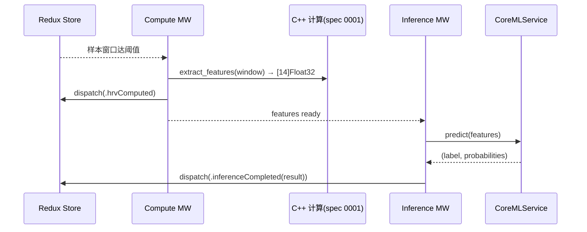

# 0002 · CoreML 推理管线（落地路线）

- **状态**: draft
- **作者**: TBD
- **创建日期**: TBD
- **关联文档**: [../06-coreml-and-compute.md](../06-coreml-and-compute.md)（§3.4 推荐路线）、[../04-app-clean-redux.md](../04-app-clean-redux.md)、[0001-cpp-compute-integration.spec.md](0001-cpp-compute-integration.spec.md)

> 本 spec 把 `06` §3.4 的"推荐路线"细化为可执行方案：**管线优先 → 特征对齐 → 占位模型 → 迭代替换**，并定义特征契约、CoreML I/O schema、转换流程、合规登记与验收标准。

## 1. 背景与问题

项目需要在实时心率/RR 数据上做端上推理（首选任务：**压力/状态二分类**，可扩展）。调研结论（`06` §3.4）：**无官方即插即用的 HR/HRV CoreML 模型**，社区资源需转换与合规核对。若等"完美模型"再接线，会阻塞整条链路。

**核心策略**：先用**占位模型**把 `原始数据 → 特征 → CoreML → 结果 → Redux` 全链路打通，把"模型质量"与"工程管线"解耦，后续只替换模型文件与（必要时）特征契约版本。

## 2. 目标 / 非目标

### 目标
- 定义稳定的 **HRV 特征契约**（训练/推理单一真相来源），先落 **14 特征**参考集。
- 定义 **CoreML 模型 I/O schema** 与版本策略。
- 定义 **占位模型** 的产出方式，保证 Day-1 即可端到端跑通。
- 定义 **模型迭代/替换** 流程与 **许可合规** 登记。
- 明确与 **C++ 计算层（spec 0001）** 和 **Redux Middleware（doc 04）** 的接口边界。

### 非目标
- 不定死最终模型结构 / 精度指标（随数据迭代）。
- 不做训练算法细节（另立训练仓库/文档）。
- 不做云端模型下发（本 spec 仅预留位）。

## 3. 方案

### 3.1 分阶段路线

| 阶段 | 交付 | 完成标志 |
| --- | --- | --- |
| 0 契约冻结 | 特征契约 v1 + CoreML I/O schema | 两端(C++/Swift)按同一契约编码 |
| 1 占位模型 | 一个可加载的 `.mlpackage` + 推理接线 | 模拟器数据 → UI 出现推理结果 |
| 2 真实模型 | 转换/自训模型 + 离线评估报告 | 指标达阈值，替换占位 |
| 3 迭代 | 版本化模型 + 回归 | 多版本可切换，回归通过 |

### 3.2 特征契约（v1，参考 Synheart 14 特征）

**唯一真相来源**：由 C++ 计算层（spec 0001）产出，训练与推理**共用同一实现**，避免 train/serve skew。

固定顺序的 14 维 `Float32` 特征向量：

| # | 名称 | 说明 |
| --- | --- | --- |
| 0 | RMSSD | 相邻 RR 差值均方根 |
| 1 | Mean_RR | 平均 RR 间期 |
| 2 | SDNN | RR 标准差 |
| 3 | pNN50 | 相邻 RR 差 >50ms 占比 |
| 4 | HRV_HF | 高频功率 |
| 5 | HRV_LF | 低频功率 |
| 6 | HRV_HF_nu | 归一化 HF |
| 7 | HRV_LF_nu | 归一化 LF |
| 8 | HRV_LFHF | LF/HF 比 |
| 9 | HRV_TP | 总功率 |
| 10 | HRV_SD1SD2 | Poincaré SD1/SD2 |
| 11 | HRV_SampEn | 样本熵 |
| 12 | HRV_DFA_a1 | 去趋势波动分析 α1 |
| 13 | HR | 心率 |

契约元数据（需固化，随模型一并版本化）：
- `featureContractVersion`（如 `1`）。
- 每维的**单位、归一化/标准化参数**（如 StandardScaler 的 mean/std，来自训练侧，随模型分发为 JSON）。
- 计算所需的**输入窗口**（时长/样本数）与更新步长（滑动窗口）。

> 备注：窗口大小、频域算法细节在 spec 0001（C++）定稿；本 spec 只约定"输出 14 维向量 + 标准化参数"这一契约。

### 3.3 CoreML 模型 I/O Schema

- **输入**：`features: MLMultiArray [14] Float32`（已按训练侧标准化参数处理；标准化在 Swift/C++ 侧做还是打进模型，二选一并固定——建议**打进模型前置层**以减少端侧口径漂移，若不行则在 C++ 侧统一处理）。
- **输出**（分类模型）：
  - `label: String`（如 `"Baseline"` / `"Stress"`）。
  - `probabilities: [String: Double]`（各类置信度）。
- **模型元信息**（写入 `.mlpackage` metadata）：`modelVersion`、`featureContractVersion`、任务名、训练数据集来源。
- **兼容基线**：iOS 17+（与 App 基线一致）。

### 3.4 占位模型（阶段1）

任选其一，目标是"能加载、能出结果"，**不追求精度**：
- **方式 A（自训，推荐起步）**：用 Create ML / `coremltools` 训一个极简分类器（如逻辑回归/小随机森林），用**模拟器合成数据 + 简单规则打标**生成训练集。产出 `.mlpackage`，天然满足 I/O schema。
- **方式 B（转换社区模型）**：将 Synheart HRV ONNX（14 特征、Baseline/Stress）用 `coremltools` 转 CoreML。**前提**：核对其许可允许使用（见 §合规）。

> 占位模型也必须遵守 §3.2/§3.3 的契约，才能保证后续无缝替换。

### 3.5 转换流程（coremltools，构建期）

- 工具：`coremltools`（BSD-3-Clause），仅在**离线/构建期**使用，不随 App 分发。
- ONNX → CoreML 或 PyTorch/sklearn → CoreML；导出为 `.mlpackage`。
- 写入元信息（版本/契约/来源）；用固定输入做**转换后一致性校验**（对齐源框架输出）。
- 脚本沉淀到训练/工具仓库或 `tools/`，可复现（建议 pin 版本，参考 Docker 化转换）。

### 3.6 与工程链路的集成（doc 04 / spec 0001）

- `CoreMLService`（在 `HRSenseData` 或独立包）：封装模型加载、`predict`、版本读取；对外暴露 `predict([Float]) -> InferenceResult` 窄接口。
- 触发时机、窗口、频率、节流由 **Inference Middleware** 控制（Reducer 只写结果）。
- `InferenceResult` 进入 `AppState.inference`（见 doc 04）。

### 3.7 模型资源管理
- 模型文件 `.mlpackage` 纳入版本管理；较大时用 Git LFS 或构建期下载（避免仓库膨胀）。
- 目录建议：`Apps/HRSenseApp/Resources/Models/`，或独立 `Models/` 包资源。
- 多版本共存：以 `modelVersion` 命名，运行时按需选择；预留（非本期）远程热更新位。

### 3.8 扩展任务：睡眠结构分析（JD 加分项）

> 复用同一管线（C++ 特征 → CoreML），新增一个**睡眠分期**任务，对应 JD "睡眠结构"。

- **任务**：夜间序列 → 分期 **Wake / Light / Deep / REM**（v1 可先简化为 Wake/Sleep 或三分类）。
- **输入特征**：在 14 维 HRV 基础上加入**长时窗趋势**（HR 下降趋势、HRV 昼夜变化、体动/接触状态），以更长窗口（如 30–300s 分段）聚合。
- **数据**：模拟器提供**整夜 replay 场景**（合成一夜 HR/RR/体动），App 产出**睡眠阶段带状图**（hypnogram）。
- **存储/可视化**：分期结果落 `SleepSession`（spec 0004），用 Swift Charts 画阶段带状图。
- **落地策略**：与主任务一致——先占位模型打通"夜间数据 → 分期 → 存储 → 图表"，再迭代精度。
- **状态**：作为 **post-占位** 的扩展任务，优先级 P2；契约/窗口沿用本 spec 框架（窗口更长）。
- **端到端原始序列模型（不做手工特征）**：省特征工程，但可解释性差、端侧成本高，且调研显示端到端在小样本 HRV 上易退化为随机猜测（PhysioTwin 经验）。→ **不作为首选**，先走"手工 HRV 特征 + 轻量分类器"。
- **标准化放模型内 vs 放 C++ 侧**：放模型内减少端侧口径漂移（推荐）；放 C++ 侧更灵活但需严格对齐参数。二选一并固定。
- **占位模型自训 vs 转换社区模型**：自训无许可负担、可控；转换省事但需合规核对。起步推荐自训。

## 5. 影响面
- **C++ 计算层（spec 0001）**：需产出符合 §3.2 的 14 维特征 + 标准化参数来源。
- **App（doc 04）**：新增 `CoreMLService` + Inference Middleware + `InferenceState`。
- **构建/资源**：模型文件管理（LFS/下载）、转换脚本。
- **合规**：`THIRD_PARTY_LICENSES.md` 登记模型/数据集来源与许可。

## 6. 测试策略
- **契约测试**：给定固定输入向量，`CoreMLService.predict` 输出稳定（golden）。
- **一致性测试**：转换后模型 vs 源框架，同输入输出误差在阈值内。
- **端到端**：模拟器合成"高压/基线"场景 → 断言 UI 推理结果符合预期（配合 doc 05 场景引擎）。
- **性能/功耗**：推理耗时、频率、内存、耗电初测（doc 06 §性能）。

## 7. 决策与开放问题（已固化）
- [x] **首选推理任务**：**压力/状态二分类（Baseline vs Stress）**；结构上可扩展多分类。
- [x] **特征窗口/步长**：**5 分钟滑动窗**（HRV 短时标准），**步长 30s**；窗口内 RR 数不足则该次推理跳过。
- [x] **标准化参数位置**：**打进模型前置层**（单一口径，避免端侧漂移）；C++ 侧只输出原始 14 维特征。
- [x] **外部模型许可策略**：**起步用自训占位模型**（无许可负担）；任何外部权重/数据集须先在 `THIRD_PARTY_LICENSES.md` 完成许可核对（含商用）后方可采用。
- [x] **模型文件分发**：**Git LFS** 管理 `.mlpackage`；预留构建期下载作为大模型备选。
- [x] **个性化基线**：v1 用**群体模型**；个人基线自适应（参考 PhysioTwin）列为 **post-v1** 增强，暂不做。

## 8. 里程碑 / 任务拆分
- [ ] 阶段0：冻结特征契约 v1（14 维）+ CoreML I/O schema + 元信息字段。
- [ ] 阶段1：产出占位 `.mlpackage`（自训极简分类器）+ 接线 `CoreMLService` + Inference MW，端到端跑通。
- [ ] 阶段2：转换/自训真实模型 + 离线评估 + 替换占位。
- [ ] 阶段3：模型版本管理 + 回归 +（可选）热更新预研。
- [ ] 全程：`THIRD_PARTY_LICENSES.md` 合规登记。
