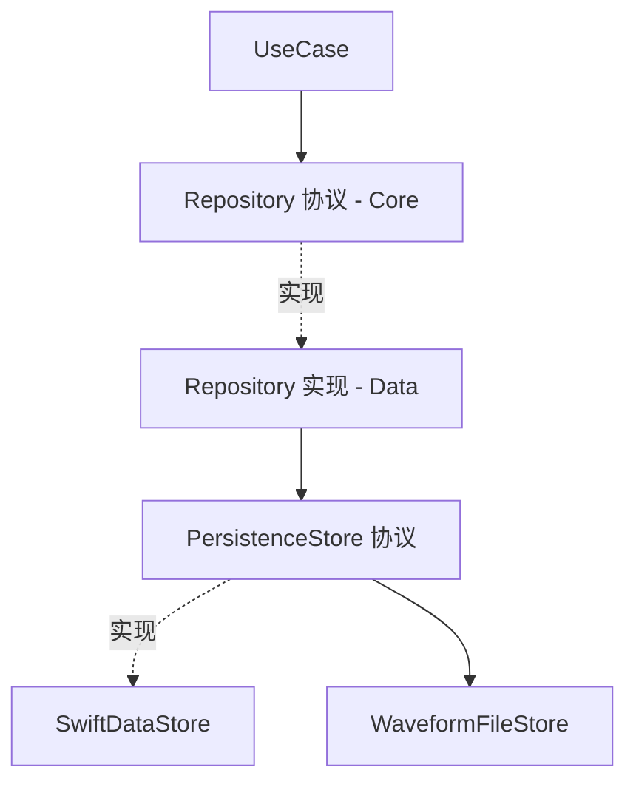

# 0004 · 本地存储与数据保留

- **状态**: draft
- **作者**: TBD
- **创建日期**: TBD
- **关联文档**: [../04-app-clean-redux.md](../04-app-clean-redux.md)、[../08-project-structure.md](../08-project-structure.md)、[../09-jd-coverage-analysis.md](../09-jd-coverage-analysis.md) §3.3、[0003-waveform-high-throughput.spec.md](0003-waveform-high-throughput.spec.md)

> 对应 JD "数据计算及可视化——本地存储"。现有设计只有内存环形缓冲，缺持久化。本 spec 定义本地存储选型、数据模型、分层接入与保留策略。

## 1. 背景与问题

健康数据需**长期留存 + 高效查询/聚合（日/周/月）**；波形等大块数据体量大、价值随时间衰减。需要一套既能结构化查询、又能容纳大块原始数据的本地存储方案，并明确保留/归档策略以控制体积。

## 2. 目标 / 非目标

### 目标
- 选定本地存储技术与数据模型。
- 定义"结构化指标 + 大块原始数据"的**混合存储**策略。
- 定义数据保留 / 降采样归档 / 清理策略。
- 明确在 Clean 分层中的位置与接口（可单测、可替换）。

### 非目标
- 不做云端同步 / 多端合并（预留位）。
- 不做加密合规细节（仅给方向，见 §7）。

## 3. 方案

### 3.1 技术选型（已定）
- **结构化数据 → SwiftData（iOS 17+ 基线一致）**：模型即代码、查询方便、与 SwiftUI 契合；如需更强 SQL 控制/性能可换 **GRDB(SQLite)**（保留为备选）。
- **大块原始数据（波形/整段采样）→ 文件**（如二进制/压缩），DB 只存**元数据 + 文件引用**。
- 理由：小而多的指标用 DB 查询聚合，大而重的波形用文件避免撑爆 DB。
- **迁移预留（固化）**：真实业务若进入**重数据量、强查询、复杂聚合**阶段，很多团队最终会落到 **SQLite/GRDB**。因此当前架构必须从第一天就按“**接口先行、实现可替换**”设计，而不是把 `SwiftData` 能力泄漏到上层。

### 3.2 数据模型（草案）

| 实体 | 关键字段 | 说明 |
| --- | --- | --- |
| `Session` | id, deviceId, startAt, endAt, fwVersion | 一次连接/监测会话 |
| `HeartRateSample` | sessionId, ts, bpm | 心率点（可按分钟聚合后再存以省空间）|
| `RRSample` | sessionId, ts, rrMs | RR 间期（HRV 输入）|
| `HRVMetricRecord` | sessionId, windowStart, sdnn, rmssd, … | 计算结果（spec 0002 特征/指标）|
| `InferenceRecord` | sessionId, ts, label, confidence, modelVersion | 推理结果 |
| `SleepSession` | id, date, stages[…] | 睡眠结构（见 spec 0002 睡眠任务）|
| `WaveformBlobRef` | sessionId, type, sampleRate, startTs, fileURL, checksum | 波形文件引用（原始数据在文件）|
| `EventRecord` | sessionId, ts, kind, payload | 设备事件/异常/OTA 记录 |

### 3.3 分层接入（Clean）

- `HRSenseCore` 定义 `PersistenceStore` 协议（save/query/aggregate/purge）。
- `HRSenseData` 提供 `SwiftDataStore`（结构化）+ `WaveformFileStore`（文件）实现。
- **写入走后台**（不阻塞 BLE/UI）；**批量写**（攒够一批或定时 flush），减少 IO。
- 读/聚合走查询接口，UI/图表按需拉取（配合 `04` 有界内存窗口）。
- **架构约束**：
  - 上层只依赖 `PersistenceStore` / Repository 协议，不得直接依赖 `SwiftData` 的 `@Model` / `ModelContext` / 查询 DSL。
  - `SwiftDataStore` 与未来 `GRDBStore` 必须复用同一组 Domain 实体、查询语义与聚合接口。
  - 波形文件格式与 `WaveformBlobRef` 元数据解耦于具体 DB 实现，确保替换结构化存储时无需迁移波形二进制格式。

### 3.4 保留 / 归档策略（已定）

| 数据 | 保留 | 策略 |
| --- | --- | --- |
| 波形原始 | 短期（如最近 N 天） | 过期文件清理；重要片段可标记保留 |
| 心率/RR 原始点 | 中期 | 过期后**降采样为分钟聚合**再长期保留 |
| HRV/推理/睡眠 记录 | 长期 | 体量小，长期保留 |
| 事件/OTA 记录 | 长期 | 审计/排障 |

- 后台维护任务：定期执行清理/降采样归档；容量上限保护（超限先删最旧波形文件）。

### 3.5 迁移
- SwiftData/GRDB 均支持 schema 版本迁移；模型变更走版本化迁移，避免破坏历史数据。
- 迁移默认路径：`SwiftDataStore -> GRDBStore`，保持 `PersistenceStore` 协议、Repository 接口、Domain 实体和 `WaveformFileStore` 不变。
- 触发迁移的典型信号：
  - 需要更复杂的 SQL 聚合、窗口函数、手写索引与 explain 调优。
  - 日/周/月查询与统计在真实数据量下出现不可接受的延迟。
  - 需要更强的跨平台一致性或导入/导出 SQLite 数据资产。
- 为控制迁移成本，禁止在上层编写任何绑定 `SwiftData` 的业务逻辑或谓词细节。

## 4. 备选方案与取舍
- **Core Data（未选为默认）**：成熟但样板多；SwiftData 更贴合 iOS 17 基线。
- **全量入 DB（含波形）（未采用）**：DB 膨胀、写入压力大 → 波形走文件。
- **GRDB（备选）**：需要精细 SQL/更高性能时切换，接口经 `PersistenceStore` 抽象，切换成本可控。
- **直接默认 SQLite（未选）**：能力最强，但当前阶段实现和样板成本更高；先用 SwiftData 打通闭环，同时保留明确迁移口。

## 5. 影响面
- `HRSenseCore`：新增 `PersistenceStore` 协议 + 存储相关实体。
- `HRSenseData`：SwiftDataStore + WaveformFileStore + 后台写/清理任务。
- `08` 结构：`Sources/HRSenseData/Persistence/`；文件存于 App 沙盒 `Application Support/`。
- 可观测性(`docs/10`)：写入耗时/失败、存储占用纳入指标。

## 6. 测试策略
- `PersistenceStore` 用内存/临时目录实现做单测（增删查聚合/迁移）。
- 保留策略：构造过期数据，验证清理/降采样正确。
- 大块文件：写入-读取-校验(checksum) 往返测试。

## 7. 风险与开放问题
- [x] 选型：SwiftData(结构化) + 文件(波形)，GRDB 备选。
- [x] 保留策略：波形短期、原始点降采样、指标长期。
- [x] 架构预留：上层只依赖 `PersistenceStore`，允许后续切换到 SQLite/GRDB。
- [ ] 是否需要**静态数据加密**（健康隐私）→ 评估 `FileProtection` / DB 加密（如 SQLCipher）。
- [ ] 是否需要导出（用户数据导出/分享）。
- [ ] 云同步预留（本期不做）。

## 8. 里程碑 / 任务拆分
- [ ] `PersistenceStore` 协议 + 实体定义。
- [ ] SwiftDataStore + WaveformFileStore 实现。
- [ ] 后台批量写 + 清理/归档任务。
- [ ] 查询/聚合接口供图表使用。
