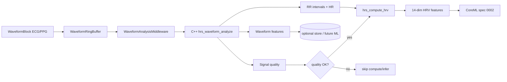

# 0005 · ECG / PPG 波形数据分析管道

- **状态**: draft → review（待评审）
- **作者**: HRSense / gstack-spec
- **创建日期**: 2026-07-07
- **关联文档**: [0001-cpp-compute-integration.spec.md](0001-cpp-compute-integration.spec.md)、[0002-coreml-inference-pipeline.spec.md](0002-coreml-inference-pipeline.spec.md)、[0003-waveform-high-throughput.spec.md](0003-waveform-high-throughput.spec.md)、[../06-coreml-and-compute.md](../06-coreml-and-compute.md)、[../gap-closure/m8-waveform-meaningfulness-and-coreml-boundary.md](../gap-closure/m8-waveform-meaningfulness-and-coreml-boundary.md)

> **决策摘要（Phase 1/2 已确认）**
> - **语言**：**C++** 实现重 DSP（滤波、峰值检测、RR 提取、波形域特征）；Swift 仅做编排与 Redux 接入（延续 spec 0001 C ABI）。
> - **v1 范围**：波形 → 预处理 → 峰值/搏动检测 → **RR/HR + 信号质量** → 接入现有 **HRV 14 维 + CoreML** 链；**额外输出波形域特征向量**（为后续 CoreML 预留，v1 不强制接模型）。
> - **非目标**：v1 不做「原始波形直接进 CoreML」；不做医疗级诊断结论。

---

## 1. 背景与问题

### 1.1 当前现状（代码已验证）

| 链路 | 现状 | 落点 |
| --- | --- | --- |
| **波形展示** | 已通：BLE → `WaveformRingBuffer` → `WaveformMiddleware` → UI | `Sources/HRSenseData/WaveformRingBuffer.swift`、`WaveformMiddleware.swift` |
| **HRV / CoreML** | 已通：但输入是 **设备侧 RR/HR**，不是 App 从波形算出的 RR | `ComputeMiddleware.swift` → `hrs_compute_hrv` |
| **C++ 计算** | 仅有 **RR → HRV 14 维**；**无波形 → RR** | `Sources/HRSenseComputeCxx/hrv.cpp`、`hrs_compute.h` |

**缺口**：`waveformSamplesReceived` 与 `hrvComputed` / `inferenceCompleted` **未连接**。模拟器可发 ECG/PPG 波形，App 能画出来，但**不能从波形独立推导 RR/HRV/推理**——与 JD「从原始信号到指标/推理」不符。

### 1.2 谁受影响 / 为什么现在做

| 问题 | 答案 |
| --- | --- |
| **Who** | 开发者（联调/验收）；最终用户（心率/HRV/压力/睡眠等依赖 RR 的指标） |
| **当前行为** | 波形只走展示链；HRV 依赖 BLE 侧已算好的 RR（或模拟器旁路注入） |
| **期望行为** | App 端从 ECG/PPG 波形**自主**完成：滤波 → 检峰 → RR/HR → 质量评估 →（可选）波形特征 → 现有 HRV/CoreML |
| **Why now** | M5/M8 波形链已通；JD 与 `11-delivery-plan` M8 要求 C++ 黄金值与特征契约；需在 M11 前闭合「波形有意义 → 指标有意义」 |
| **Done 定义** | 给定固定合成 ECG/PPG 块序列，C++ 管道输出 RR 序列 + HR + quality + 波形特征；与黄金值误差在阈值内；Redux 出现 `hrvComputed` / 可选 `waveformFeaturesExtracted` |

---

## 2. 目标 / 非目标

### 2.1 目标

- 定义 **ECG / PPG 双通道** 波形分析管道（算法分支不同，C API 统一）。
- 扩展 **`hrs_compute.h` C ABI**：波形块 in → 分析结果 out（POD，caller 分配缓冲）。
- **接入现有架构**：`WaveformRingBuffer` → 新 `WaveformAnalysisMiddleware`（或扩展 `ComputeMiddleware`）→ `ComputeRepository` → C++。
- **黄金值单测**：合成 ECG/PPG + 已知 RR → 对拍检峰与 HRV 中间量。
- **信号质量门控**：质量过低时不触发 HRV/CoreML，避免 garbage-in。

### 2.2 非目标（v1）

- 原始波形张量直接进 CoreML（保留 spec 0002 的 RR/HRV 特征链为主路径）。
- FDA/医疗级精度与临床认证。
- 多导联 ECG、运动伪差 ML 剔除（可 post-v1）。
- 在 macOS 模拟器侧做分析（分析在 **App/iOS** 端；模拟器只产波形）。

---

## 3. 方案

### 3.1 管道总览



**与现有链关系**（见 `m8-waveform-meaningfulness-and-coreml-boundary.md`）：
- **保留** 波形展示链不变。
- **新增** 分析链：从同一 `WaveformRingBuffer` 读窗口，**不**与 UI 降采样混用（分析用全分辨率窗口）。

### 3.2 分阶段处理（C++ 内部）

| 阶段 | ECG | PPG | 说明 |
| --- | --- | --- | --- |
| **S0  ingest** | i16[] + sampleRate + t0 | 同左 | 与 `WaveformBlock` 对齐（spec 0003） |
| **S1 预处理** | 带通 ~0.5–40Hz；基线 wander 抑制（高通/中值） | 低通 ~0.5–8Hz；去趋势 | 系数随 sampleRate 缩放 |
| **S2 检峰** | R-peak（Pan-Tompkins 简化或能量+自适应阈值） | 搏动峰（foot/peak，平滑后找极大） | 输出峰时刻 ms（相对窗口起点） |
| **S3 RR/HR** | 相邻 R-R → RR(ms)；HR=60000/mean(RR) | 相邻搏动间隔 → 伪 RR | 异常 RR 剔除（physiological limits） |
| **S4 质量** | SNR、检峰置信度、RR 合理性比例 | 灌注指数代理、波形幅度、周期性得分 | 合成 `qualityScore` 0..1 |
| **S5 波形特征** | QRS 宽度代理、RMSSD 前置统计窗口 | 上升时间、幅度变异、dicrotic 缺口代理 | 固定维度向量（见 §3.4） |
| **S6 下游** | RR → 现有 `hrs_compute_hrv` | 同左 | 不重复实现 HRV |

**窗口策略（固化）**：
- **分析窗口**：滑动 **30s**，**步长 5s**（与实时性平衡；可配置）。
- **最小 RR 数**：≥ 20 个有效 RR 才调用 `hrs_compute_hrv`（与 spec 0002 5min 窗可叠加：短窗先出 HR/质量，长窗出 HRV）。

### 3.3 C ABI 扩展（`hrs_compute.h`）

在现有接口之上新增（命名前缀 `hrs_waveform_`）：

```c
typedef enum {
    HRS_WAVEFORM_ECG = 1,
    HRS_WAVEFORM_PPG = 2
} hrs_waveform_type_t;

typedef struct {
    uint32_t peak_time_ms;  // 相对窗口起点
    uint16_t rr_ms;         // 与前一个峰的间隔（首个峰 rr_ms=0）
    float    confidence;    // 0..1
} hrs_peak_t;

typedef struct {
    float snr;
    float peak_confidence_mean;
    float rr_valid_ratio;   // 通过生理范围检查的 RR 占比
    float quality_score;    // 0..1 综合分
} hrs_signal_quality_t;

#define HRS_WAVEFORM_FEATURE_DIM 8  // v1 固定，见 §3.4

typedef struct {
    hrs_waveform_type_t type;
    uint16_t sample_rate_hz;
    uint32_t window_start_ms;
    size_t   peak_count;
    double   hr_bpm;
    hrs_signal_quality_t quality;
    float    waveform_features[HRS_WAVEFORM_FEATURE_DIM];
    // peaks 与 rr 由调用方缓冲接收，见 analyze 函数
} hrs_waveform_result_t;

/// 分析一段波形样本（caller 分配 peaks 缓冲）
/// @param samples      i16 样本数组
/// @param count        样本数
/// @param type         ECG 或 PPG
/// @param sample_rate_hz 采样率
/// @param out_peaks    caller 分配 hrs_peak_t 数组，容量 peak_capacity
/// @param peak_capacity  peaks 缓冲容量；out_result->peak_count 为实际写入数
/// @param out_result   caller 分配 hrs_waveform_result_t
/// @return 0 成功；负值错误码（见 §3.6）
int hrs_waveform_analyze(
    const int16_t *samples,
    size_t count,
    hrs_waveform_type_t type,
    uint16_t sample_rate_hz,
    hrs_peak_t *out_peaks,
    size_t peak_capacity,
    hrs_waveform_result_t *out_result
);

/// 从 analyze 得到的 RR 序列快速提取 uint16 RR 数组（供 hrs_compute_hrv）
int hrs_waveform_peaks_to_rr(
    const hrs_peak_t *peaks,
    size_t peak_count,
    uint16_t *out_rr_ms,
    size_t rr_capacity,
    size_t *out_rr_count
);
```

**线程 / 内存**（延续 spec 0001 §7）：
- 无状态、可重入；caller 分配所有 out 缓冲；`hrs_compute_init` 可预分配 FFT/滤波器状态（若需要）。

### 3.4 波形域特征向量（v1，8 维，预留 CoreML）

与 spec 0002 的 **14 维 HRV** 分离；v1 **不**并入 CoreML 输入，仅落库/调试面板展示。

| # | 名称 | ECG | PPG |
| --- | --- | --- | --- |
| 0 | mean_amplitude | ✓ | ✓ |
| 1 | std_amplitude | ✓ | ✓ |
| 2 | peak_count_per_min | ✓ | ✓ |
| 3 | rr_cv | ✓ | ✓ |
| 4 | qrs_width_proxy_ms | ✓ | — |
| 5 | st_segment_slope_proxy | ✓ | — |
| 6 | rise_time_ms | — | ✓ |
| 7 | perfusion_index_proxy | — | ✓ |

> 训练侧将来可扩展 `HRS_WAVEFORM_FEATURE_DIM` 或增新模型输入 schema；v1 维度冻结便于黄金值对拍。

### 3.5 Swift 层接入

| 组件 | 职责 |
| --- | --- |
| `ComputeRepository`（Core 协议） | 新增 `analyzeWaveform(samples:type:rate:) -> WaveformAnalysisResult` |
| `ComputeRepositoryImpl` | 调 `ComputeBridge` → C API |
| **`WaveformAnalysisMiddleware`**（新建） | 订阅 ring buffer；每 **5s** 取最近 **30s** 窗口；dispatch `waveformAnalyzed` / 质量不足则 `waveformQualityLow` |
| **`ComputeMiddleware`**（扩展） | 收到足够 RR 后**优先使用波形分析 RR**（若质量≥阈值），否则回退设备 RR |
| **State** | `WaveformState` 增 `lastAnalysis`、`qualityScore`；`MetricsState` 可标记 RR 来源（device vs derived） |

**质量门控（固化）**：
- `quality_score >= 0.5` → 允许 `hrs_compute_hrv` + CoreML。
- `< 0.5` → 仅展示波形 + 日志；UI 提示「信号质量弱」。

### 3.6 错误码（C API）

| 码 | 含义 |
| --- | --- |
| 0 | 成功 |
| -1 | 空指针 / 无效参数 |
| -2 | 样本数过少（< 1s 数据） |
| -3 | 不支持 sampleRate |
| -4 | 检峰失败（无峰） |
| -5 | 输出缓冲不足 |

### 3.7 文件组织（形态 A，见 `08-project-structure.md`）

```text
Sources/HRSenseComputeCxx/
├── include/hrs_compute.h          # 扩展 waveform API
├── hrv.cpp                        # 现有
├── waveform_ecg.cpp               # ECG 预处理 + R-peak
├── waveform_ppg.cpp               # PPG 预处理 + 搏动检测
├── waveform_common.cpp            # 质量、特征、RR 转换
└── dsp_filters.cpp                # 共享 biquad / 中值滤波

Sources/HRSenseCompute/
└── ComputeBridge.swift            # 扩展 waveform 桥接

Sources/HRSenseFeature/Middleware/
└── WaveformAnalysisMiddleware.swift

Tests/HRSenseComputeTests/
├── golden_ecg_rr.json             # 输入波形 + 期望 RR
├── golden_ppg_rr.json
└── WaveformAnalysisTests.swift    # 桥接 + 端到端
```

### 3.8 模拟器侧（无需改算法，需改数据语义）

| 项 | 是否需要改 | 说明 |
| --- | --- | --- |
| ECG/PPG 发生器 | **已有**，微调 | `WaveformGenerator` 保证 R-R 间隔与配置 HR **一致**（便于黄金值） |
| HR 旁路字段 | **可选 deprecate** | 联调阶段可「设备 RR + 波形 RR」对比；验收以 **波形推导 RR** 为准 |
| 故障注入 | **已有** | 噪声加大 → 质量分下降 → 验证门控 |

见 `05` §2.3：模拟器升级为「波形优先源」，**分析在 App 端**完成。

---

## 4. 备选方案与取舍

| 方案 | 结论 |
| --- | --- |
| **Swift + Accelerate 做 DSP** | ❌ 用户已选 C++；且与 spec 0001、跨平台、黄金值对拍不一致 |
| **波形直接进 CoreML** | ❌ v1 不采用；改动 spec 0002 契约大，与现有 HRV 链重复 |
| **仅 ECG，不做 PPG** | ❌ 协议与模拟器已双类型；PPG 用更简算法同级支持 |
| **C++ 分析 + Swift 编排** | ✅ 选用 |

---

## 5. 影响面

- **0001**：扩展 C API；`hrv.cpp` 不破坏现有签名。
- **0002**：v1 仍用 14 维 HRV 进 CoreML；波形 8 维仅预留。
- **0003**：无协议变更；消费侧用已有 `WaveformBlock`。
- **04 / Feature**：新 Middleware + State；`ComputeMiddleware`  RR 来源策略。
- **11-delivery-plan M8**：本 spec 为 M8「C++ 黄金值 + 特征契约」的**波形部分**交付依据。
- **模拟器**：发生器与 HR 一致性微调；**不需要**在 macOS 跑 C++ 分析。

---

## 6. 测试策略

### 6.1 C++ 单元测试（gtest 或 SwiftPM C++ test target）

- 合成正弦+尖峰 ECG：期望 RR 误差 **< 2%**（相对配置 HR）。
- 合成 PPG 脉搏波：期望 HR 误差 **< 3%**。
- 加高斯噪声：质量分单调下降。
- 空/短/非法 sampleRate：错误码覆盖。

### 6.2 黄金值（`tools/golden/` + JSON）

- 固定 int16 数组（base64）+ 期望 peaks/RR/HR/quality/features。
- CI：`hrs_waveform_analyze` 输出与 JSON 逐项比对（浮点 ε）。

### 6.3 集成测试

- 模拟器 ECG 模式 5min → App `waveformAnalyzed` → `hrvComputed` → UI 有 HRV。
- 切换 PPG：HR/波形形态变化；RR 来源标记为 `derived`。
- 故障注入高噪声：`quality_score < 0.5` 时不出现 `inferenceCompleted`。

### 6.4 性能（目标，可调）

- 30s @128Hz ECG 分析 **< 50ms**（iPhone 真机，Release）。
- 不在主线程调用 C API。

---

## 7. 风险与开放问题

- [x] 语言：C++。
- [x] 范围：RR/HR + 质量 + 8 维波形特征 + 接 HRV 链。
- [ ] Pan-Tompkins 完整版 vs 简化版：v1 用**简化可测**实现，文档标注与文献偏差。
- [ ] 默认 sampleRate：128Hz（与 spec 0003 模拟器默认对齐）。
- [ ] 设备 RR 与推导 RR 冲突时 UI 展示策略（双显 vs 仅推导）。
- [ ] PPG 在弱灌注下检峰失败率：需模拟器场景覆盖。

---

## 8. 里程碑 / 任务拆分（建议并入 M8）

| # | 任务 | 验收 |
| --- | --- | --- |
| 1 | 扩展 `hrs_compute.h` + 空实现编译通过 | `swift build` |
| 2 | `waveform_ecg.cpp` / `waveform_ppg.cpp` + 单元测试 | 黄金值 ECG/PPG 通过 |
| 3 | `ComputeBridge` + `ComputeRepository` 扩展 | 假缓冲往返测试 |
| 4 | `WaveformAnalysisMiddleware` + Redux State | 模拟器联调出现 `waveformAnalyzed` |
| 5 | `ComputeMiddleware` RR 来源 + 质量门控 | 质量低时不 infer |
| 6 | 模拟器 HR/RR 与波形一致性微调 | 推导 HR 与配置 HR 偏差 <5% |
| 7 | 文档：`06` / `0001` 交叉引用更新 | 评审通过 |

---

## 9. 验收标准（Definition of Done · 本 spec）

- [ ] C++ `hrs_waveform_analyze` 对 **ECG 与 PPG** 各至少 1 组黄金值通过。
- [ ] 真机 + 模拟器：ECG 模式 5min 内出现 **derived RR → hrvComputed**。
- [ ] PPG 模式：HR 与波形形态与 ECG 可区分，且推导 HR 合理。
- [ ] `quality_score` 可观测；低质量时不触发 CoreML（日志 + State 可证）。
- [ ] 波形 8 维特征写入 State 或调试面板（可不进 CoreML）。
- [ ] 分析耗时与线程约束满足 §6.4。
- [ ] 不破坏现有仅设备 RR 的回退路径。
