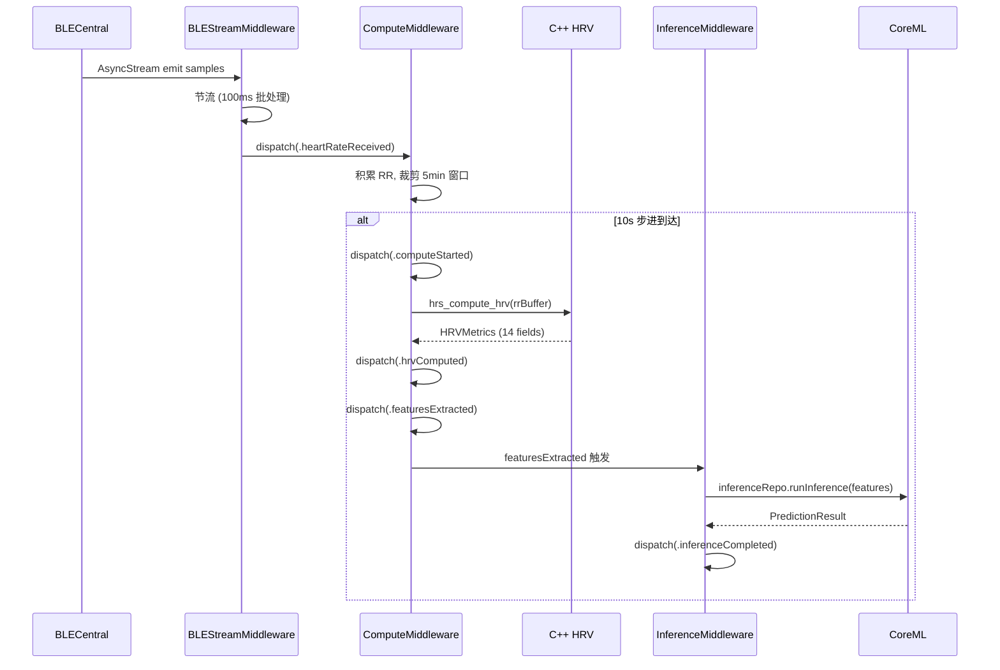

# 端到端数据流管线全景

> 本文档是数据流管线的总览入口，展示从 BLE 原始字节到 UI 渲染的完整路径。各链路细节在后续独立文档中展开。

---

## 管线总图

```
┌─────────────────────────────────────────────────────────────────────────────────┐
│                           BLE Peripheral (设备/模拟器)                           │
└─────────────────────────────────────┬───────────────────────────────────────────┘
                                      │ Notify (自定义协议帧)
                                      ▼
┌─────────────────────────────────────────────────────────────────────────────────┐
│  L1: BLECentralDataSource (CoreBluetooth)                                       │
│  ─ 发现服务 → CCCD 订阅 → 接收 notify → FrameAssembler 重组 → 解码              │
└─────────────────────────────────────┬───────────────────────────────────────────┘
                                      │ AsyncStream<DeviceSample> / AsyncStream<WaveformBlock>
                                      ▼
┌─────────────────────────────────────────────────────────────────────────────────┐
│  L2: BLEDataParser (协议层 → 领域层映射)                                        │
│  ─ t0 时间戳映射 → HeartRateSample / [WaveformSample]                           │
└────────┬──────────────────────────┬─────────────────────────────────────────────┘
         │                          │
    ┌────▼──────────┐     ┌────────▼──────────┐
    │ 链路 B        │     │ 链路 D            │
    │ HR + RR       │     │ 波形块             │
    │ → Redux       │     │ → Ring Buffer     │
    └────┬──────────┘     └────────┬──────────┘
         │                          │
         ▼                          ▼
┌────────────────────┐    ┌───────────────────────────┐
│ ComputeMiddleware   │    │ WaveformMiddleware         │
│ ─ 5min 滑动窗口    │    │ ─ 10Hz 轮询 Ring Buffer   │
│ ─ 10s 步进触发     │    │ ─ dispatch 最近 5s 窗口    │
└────────┬───────────┘    └────────┬──────────────────┘
         │                          │
         ▼                          ▼
┌────────────────────┐    ┌───────────────────────────┐
│ C++ HRV 计算        │    │ 波形 UI 渲染              │
│ hrs_compute_hrv()  │    │ (WaveformChartView)       │
│ → 14 维 HRVMetrics │    │                           │
└────────┬───────────┘    └───────────────────────────┘
         │
         ▼
┌────────────────────┐
│ CoreML 推理         │
│ ─ 14 features      │
│ ─ predict()         │
│ → 压力/睡眠分类     │
└────────┬───────────┘
         │
         ▼
┌────────────────────┐
│ 睡眠管线编排        │
│ ─ C++ sleep 特征    │
│ ─ 睡眠分期推理      │
│ ─ Session 合并持久化 │
└────────────────────┘
```

---

## 5 条核心链路索引

| 链路 | 从 → 到 | 关键组件 | 详细文档 |
|------|---------|---------|---------|
| **A: BLE → Redux** | 原始 notify 字节 → `HeartRateSample` | `FrameAssembler` → `BLEDataParser` → AsyncStream → Middleware | 见 [08-ble-cccd-flow](./08-ble-cccd-flow.md) |
| **B: RR → C++ HRV** | RR 间期 → 14 维 `HRVMetrics` | `ComputeMiddleware` → `ComputeBridge` → `hrv.cpp` | [12-cpp-compute-bridge](./12-cpp-compute-bridge.md) |
| **C: CoreML 推理** | 14 特征 → 压力/睡眠标签 | `InferenceMiddleware` → `CoreMLService` → fallback chain | [13-coreml-inference](./13-coreml-inference.md) |
| **D: 波形流** | 高频 ECG/PPG → UI 渲染 | `WaveformStreamer` → `WaveformRingBuffer` → 10Hz 轮询 | [14-waveform-pipeline](./14-waveform-pipeline.md) |
| **E: 睡眠管线** | HRV + C++ 特征 → 睡眠分期 | `SleepMiddleware` → `SleepStageService` → 持久化 | [15-sleep-pipeline](./15-sleep-pipeline.md) |

---

## 数据转换层次

```
Layer 1: BLE 原始字节 (Data)
    ↓ FrameAssembler.feed()
Layer 2: DecodedFrame.data(DeviceSample)  // HRSenseProtocol 层类型
    ↓ BLEDataParser.parseSample()
Layer 3: HeartRateSample  // HRSenseCore 领域实体，含绝对时间戳
    ↓ AsyncStream emit + Middleware dispatch
Layer 4: AppState.live.recentSamples  // Redux State
    ↓ ComputeMiddleware trigger
Layer 5: HRVMetrics (14 维)  // C++ 计算结果
    ↓ FeatureVector + InferenceMiddleware
Layer 6: InferenceResult  // CoreML 推理输出
    ↓ Reducer
Layer 7: AppState.inference / AppState.sleep  // UI 可观察状态
```

---

## 线程模型速查

| 线程/队列 | 运行的组件 |
|-----------|-----------|
| **MainActor** | `Store.dispatch()`, Reducer, SwiftUI, `BLEDataParser` |
| **CoreBluetooth Queue** | `CBCentralManagerDelegate` 回调, `FrameAssembler` |
| **Swift Task (后台)** | C++ `hrs_compute_hrv()`, CoreML `prediction()`, Persistence I/O |
| **DispatchQueue (模拟器)** | `WaveformStreamer` timer, Data Generator |

**规则**：`store.dispatch()` 必须在 MainActor 上调用。所有计算密集型操作在后台 Task 执行。

---

## Middleware 编排顺序

```swift
// AppComposition.swift 中的实际顺序
let middleware: [Middleware<AppState, Action>] = [
    makeBackgroundMiddleware(),      // 1. 后台策略过滤 (最先拦截)
    makeConnectionMiddleware(),      // 2. BLE 连接生命周期
    makeBLEStreamMiddleware(),       // 3. 心率数据节流
    makeComputeMiddleware(),         // 4. C++ HRV 计算
    makeInferenceMiddleware(),       // 5. CoreML 推理
    makeSleepMiddleware(),           // 6. 睡眠管线编排
    makeLoggingMiddleware(),         // 7. 状态转换记录 (最后, 可观察所有 action)
    makeWaveformMiddleware(),        // 8. 波形轮询
    makeOTAMiddleware(),             // 9. OTA 固件升级
]
```

**顺序设计原则**：
- `BackgroundMiddleware` 最先 — 在后台时直接拦截不需要的 action
- `LoggingMiddleware` 靠后 — 可记录所有经过的 action（含被前面中间件处理后产生的）
- 计算/推理中间件按数据流方向排列：BLE → Compute → Inference → Sleep

---

## 动作链时序：压力推理全流程


