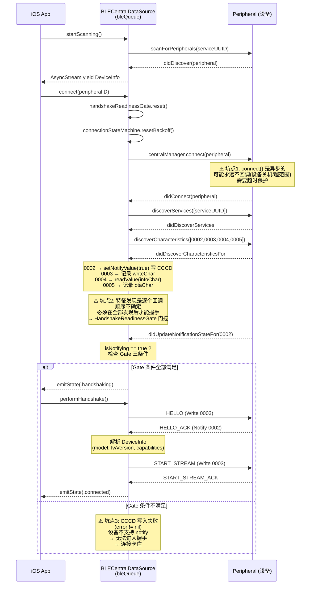
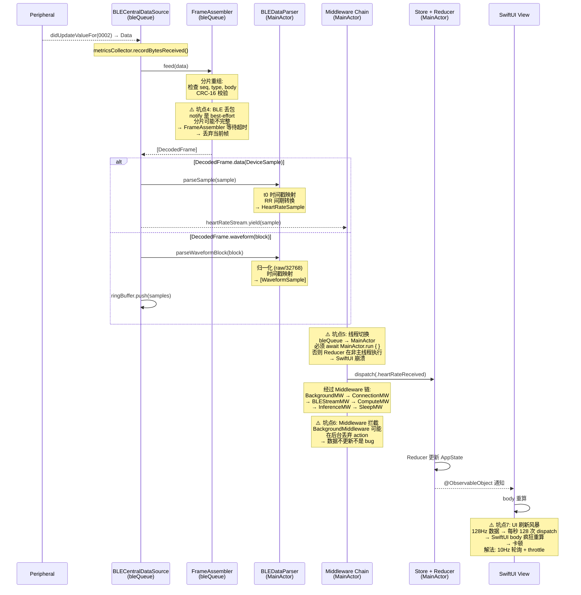
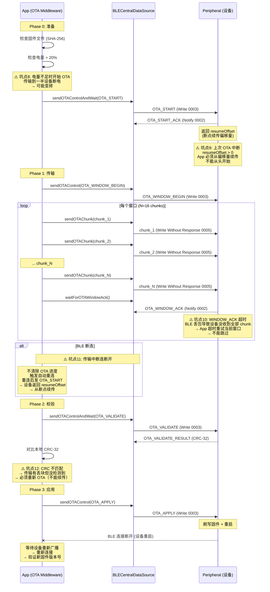
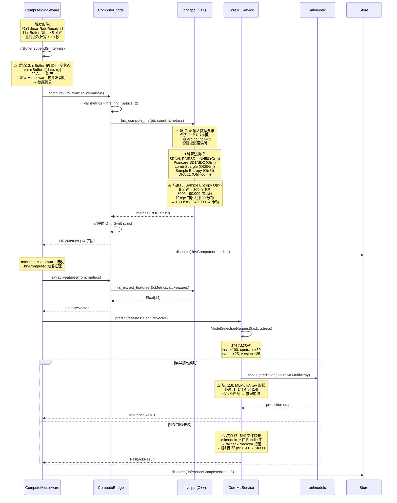
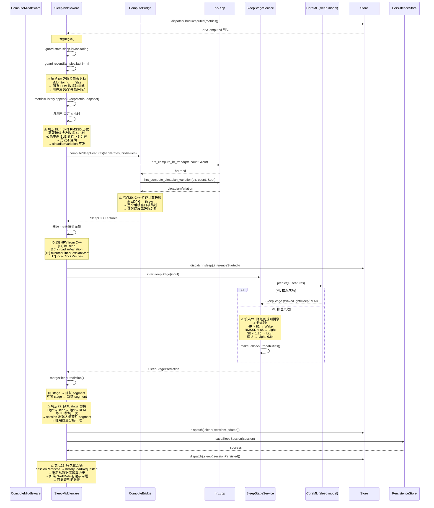
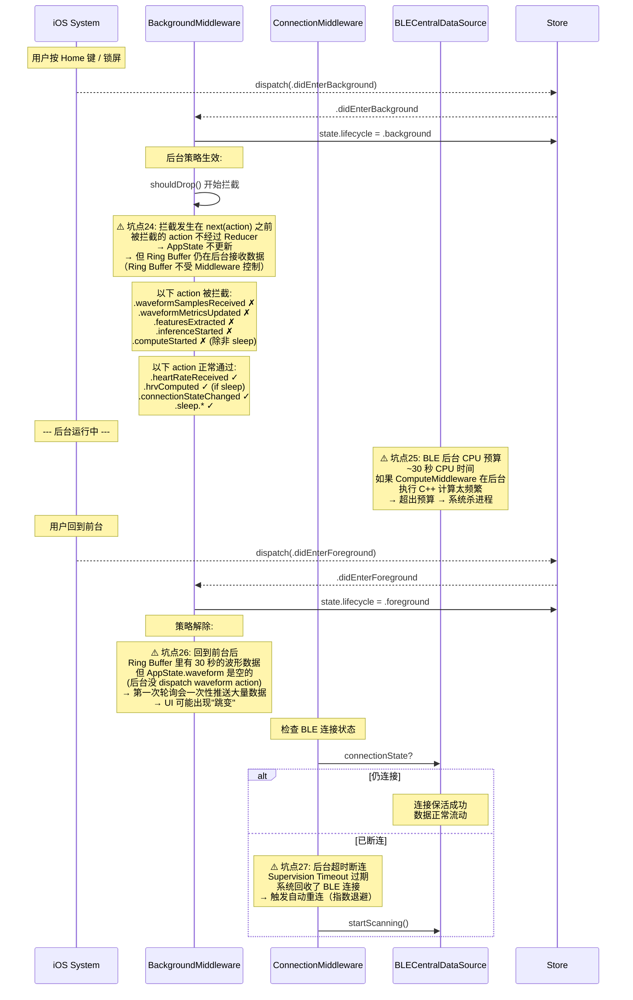
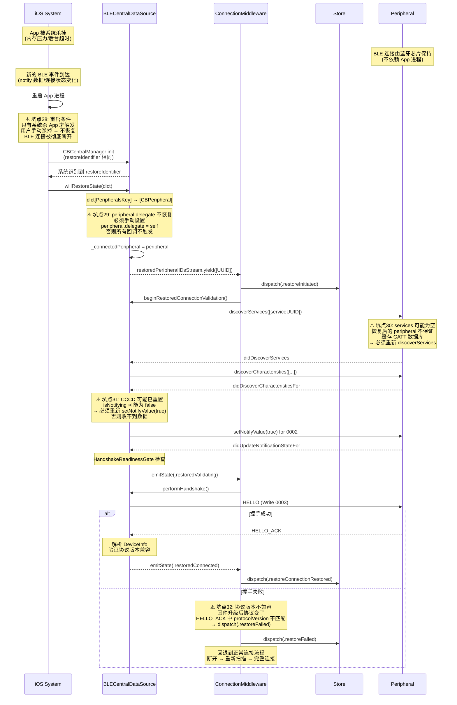

# 关键流程 Mermaid 图解与坑点标注

> 用 Mermaid 图可视化 HRSense 的 7 条关键流程，每张图标注 ⚠️ 坑点（常见故障 / 易踩的坑）。

---

## 1. BLE 连接 + CCCD + 握手流程

**坑点总结**：

| 坑 | 描述 | 后果 | 缓解 |
|----|------|------|------|
| ⚠️1 | `connect()` 无超时 | App 无限等待 | 添加 10s 超时 → `cancelPeripheralConnection` |
| ⚠️2 | 特征发现回调顺序不确定 | 0003 可能比 0002 先发现 | `HandshakeReadinessGate` 三条件门控 |
| ⚠️3 | CCCD 写入可能失败 | 握手永远不触发 | 监听 `didUpdateNotificationStateFor` 的 error 参数 |

---

## 2. 数据管线：notify 字节 → AppState

**坑点总结**：

| 坑 | 描述 | 后果 | 缓解 |
|----|------|------|------|
| ⚠️4 | BLE notify 丢包 | 帧重组不完整 | FrameAssembler 超时丢弃 + blockSeq 检测丢包率 |
| ⚠️5 | bleQueue → MainActor 线程切换 | Reducer 在非主线程执行 | 所有 dispatch 用 `await MainActor.run { }` |
| ⚠️6 | BackgroundMiddleware 拦截 | 后台数据不更新 | 设计意图——检查 `state.lifecycle` |
| ⚠️7 | 高频 dispatch 导致 UI 卡顿 | 128Hz action → 128Hz body 重算 | 波形用 10Hz 轮询，心率用 0.5s throttle |

---

## 3. OTA 固件传输流程

**坑点总结**：

| 坑 | 描述 | 后果 | 缓解 |
|----|------|------|------|
| ⚠️8 | 低电量 OTA | 传输中设备断电 → 变砖 | App + 设备双重电量检查 |
| ⚠️9 | resumeOffset 处理 | 从头传 → 浪费带宽 | 读取 ACK 中的 resumeOffset 续传 |
| ⚠️10 | WINDOW_ACK 超时 | 传输卡住 | 超时重试当前窗口（指数退避） |
| ⚠️11 | 传输中 BLE 断连 | 进度丢失 | 设备记住 offset，重连后续传 |
| ⚠️12 | CRC-32 不匹配 | 固件损坏 | 丢弃已传数据，从头重新 OTA |

---

## 4. C++ HRV 计算 + CoreML 推理管线

**坑点总结**：

| 坑 | 描述 | 后果 | 缓解 |
|----|------|------|------|
| ⚠️13 | 闭包可变状态无锁 | 数据竞争 | 迁移到 typed state 对象或 Swift 6 检查 |
| ⚠️14 | RR 间期不足 | C++ 返回错误码 | Swift 端 guard count >= 2 提前拦截 |
| ⚠️15 | Sample Entropy O(n²) | 大窗口计算慢 | 限制窗口大小或优化算法 |
| ⚠️16 | MLMultiArray 形状 | 推理崩溃 | 构造时确保 shape = [1, 14] |
| ⚠️17 | 模型文件缺失 | 无 ML 推理 | 三级降级: CoreML → 规则引擎 → 硬编码默认值 |

---

## 5. 睡眠分期管线

**坑点总结**：

| 坑 | 描述 | 后果 | 缓解 |
|----|------|------|------|
| ⚠️18 | 睡眠监测未启动 | HRV 数据全部丢弃 | UI 明确提示"请开始睡眠监测" |
| ⚠️19 | 4 小时历史不连续 | circadianVariation 不准 | BLE 断连后标记数据间隙 |
| ⚠️20 | C++ 特征计算失败 | 整个窗口跳过 | 重试或降级到上一次有效值 |
| ⚠️21 | ML 推理失败 | 降级到简单规则 | 4 条 fallback 规则 + 日志告警 |
| ⚠️22 | stage 频繁切换 | 碎片化 segment | 后处理平滑（最短持续时间过滤） |
| ⚠️23 | 持久化连锁 | 读到旧数据 | 持久化后不立即 reload，用内存中的 session |

---

## 6. 后台/前台切换流程

**坑点总结**：

| 坑 | 描述 | 后果 | 缓解 |
|----|------|------|------|
| ⚠️24 | 后台拦截 vs Ring Buffer | Ring Buffer 有数据但 UI 空 | 设计意图——回到前台后轮询立即填充 |
| ⚠️25 | 后台 CPU 预算超限 | 系统杀进程 | 后台暂停非核心计算 |
| ⚠️26 | 前台恢复数据跳变 | UI 突然出现 30 秒数据 | 轮询用 `readRecent(5s)` 限制窗口 |
| ⚠️27 | 后台超时断连 | 数据中断 | 自动重连 + 指数退避 |

---

## 7. State Restoration 恢复流程

**坑点总结**：

| 坑 | 描述 | 后果 | 缓解 |
|----|------|------|------|
| ⚠️28 | 用户手动杀 App | BLE 连接丢失，不恢复 | 文档告知用户不要手动杀 App |
| ⚠️29 | delegate 不自动恢复 | 所有回调不触发 | `willRestoreState` 中设置 delegate |
| ⚠️30 | services 缓存不可靠 | discoverServices 返回空 | 始终重新 discoverServices |
| ⚠️31 | CCCD 可能重置 | 收不到 notify 数据 | 始终重新 setNotifyValue(true) |
| ⚠️32 | 协议版本不兼容 | 握手失败 | 版本检查 + 降级到完整连接流程 |

---

## 坑点总索引

| 编号 | 流程 | 坑点 | 严重度 |
|------|------|------|--------|
| 1 | BLE 连接 | connect() 无超时 | 高 |
| 2 | BLE 连接 | 特征发现顺序不确定 | 中 |
| 3 | BLE 连接 | CCCD 写入失败 | 高 |
| 4 | 数据管线 | BLE notify 丢包 | 中 |
| 5 | 数据管线 | bleQueue → MainActor 线程切换 | 高 |
| 6 | 数据管线 | BackgroundMiddleware 拦截 | 低（设计意图） |
| 7 | 数据管线 | 高频 dispatch UI 卡顿 | 高 |
| 8 | OTA | 低电量 OTA | 严重 |
| 9 | OTA | resumeOffset 断点续传 | 高 |
| 10 | OTA | WINDOW_ACK 超时 | 中 |
| 11 | OTA | 传输中 BLE 断连 | 高 |
| 12 | OTA | CRC-32 不匹配 | 高 |
| 13 | 计算推理 | 闭包可变状态数据竞争 | 高 |
| 14 | 计算推理 | RR 间期不足 | 低 |
| 15 | 计算推理 | Sample Entropy O(n²) | 中 |
| 16 | 计算推理 | MLMultiArray 形状错误 | 高 |
| 17 | 计算推理 | 模型文件缺失 | 低（有降级） |
| 18 | 睡眠 | 监测未启动 | 低 |
| 19 | 睡眠 | 4 小时历史不连续 | 中 |
| 20 | 睡眠 | C++ 特征计算失败 | 中 |
| 21 | 睡眠 | ML 推理失败降级 | 低（有降级） |
| 22 | 睡眠 | stage 频繁切换碎片化 | 中 |
| 23 | 睡眠 | 持久化连锁读旧数据 | 中 |
| 24 | 后台 | 拦截 vs Ring Buffer 不一致 | 低（设计意图） |
| 25 | 后台 | CPU 预算超限被杀 | 严重 |
| 26 | 后台 | 前台恢复数据跳变 | 低 |
| 27 | 后台 | 超时断连 | 中 |
| 28 | 恢复 | 用户手动杀 App | 低 |
| 29 | 恢复 | delegate 不恢复 | 严重 |
| 30 | 恢复 | services 缓存不可靠 | 高 |
| 31 | 恢复 | CCCD 可能重置 | 高 |
| 32 | 恢复 | 协议版本不兼容 | 中 |
